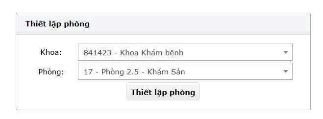
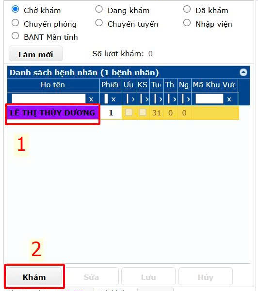
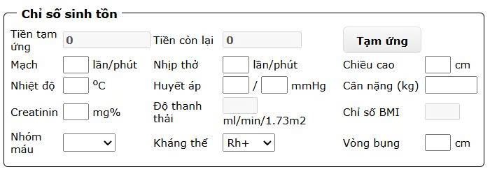
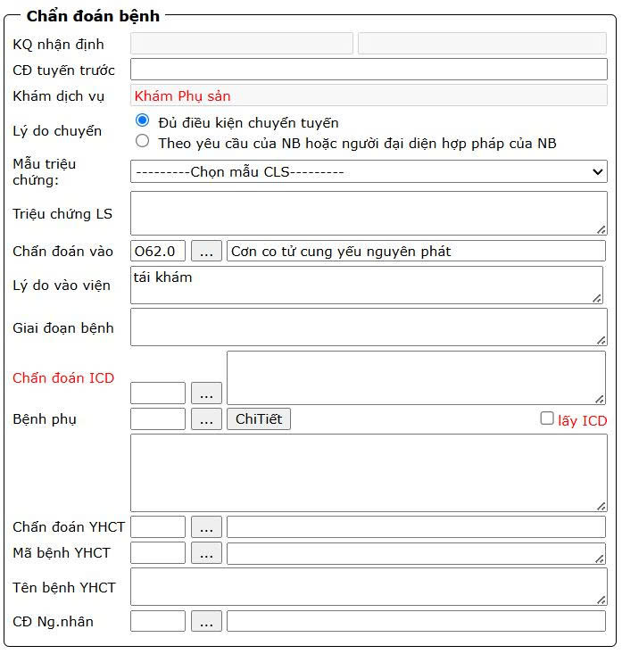
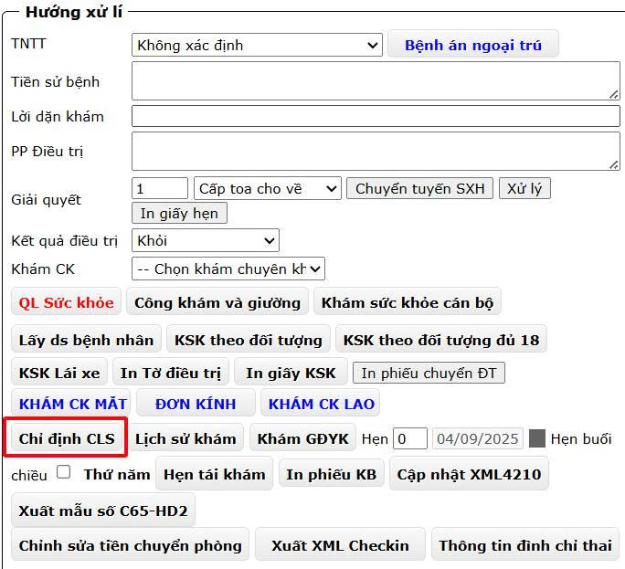
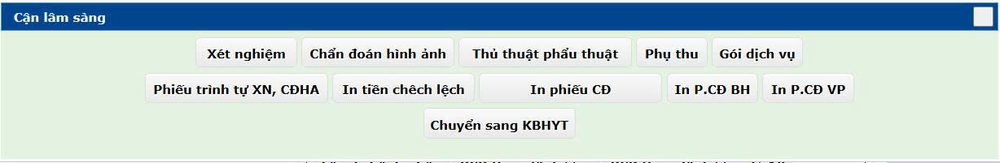
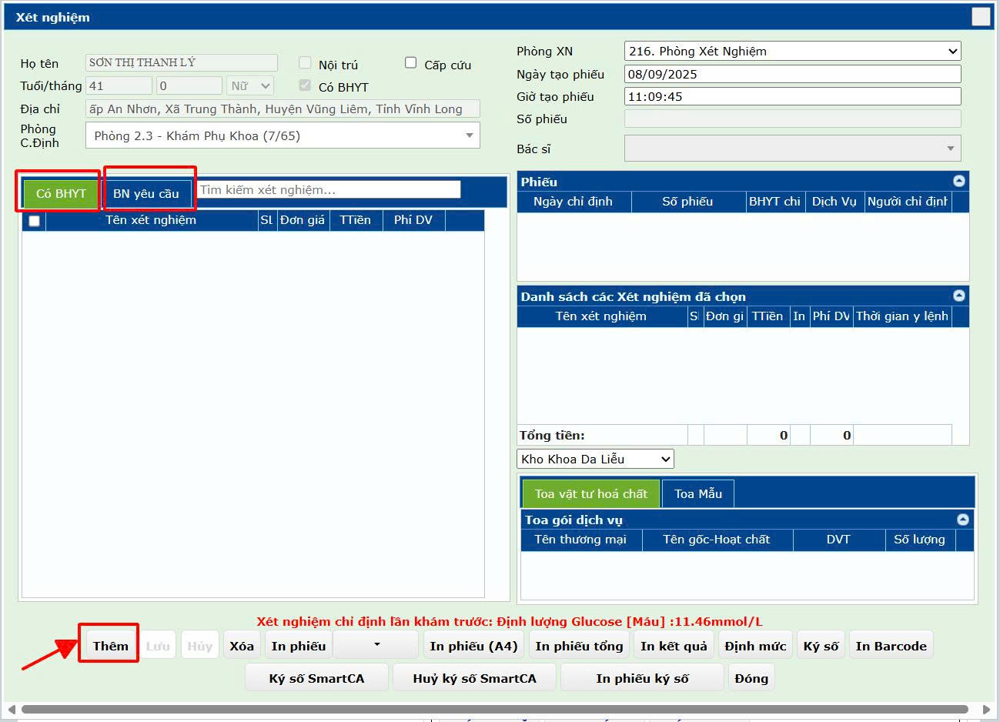
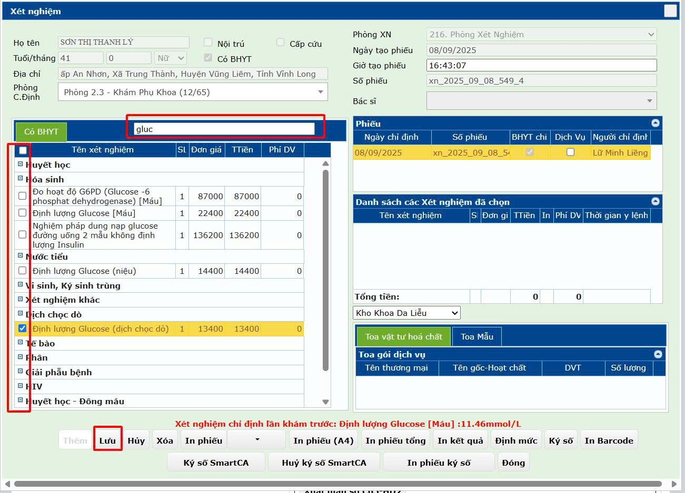
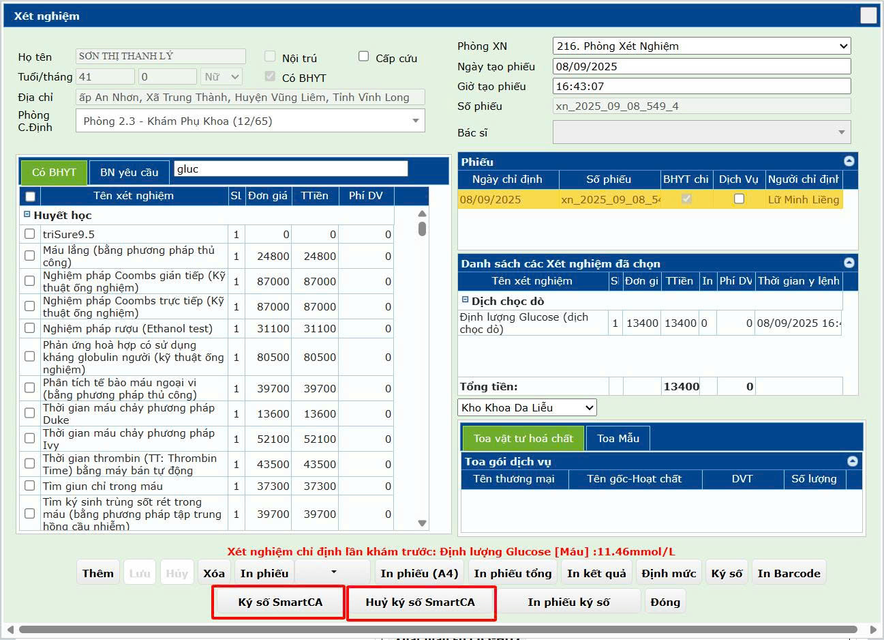

# 1. Khám bệnh Ngoại trú

**1.1 Khám bệnh và chỉ định**  
&nbsp;&nbsp;&nbsp;&nbsp;
**Bác sĩ** sau khi đăng nhập thiết lập phòng khám chuyên khoa để khám bệnh. 

&nbsp;&nbsp;&nbsp;&nbsp;
Sau đó vào menu **Khám bệnh -> Khám bệnh ngoại trú**. Ở màn hình khám bệnh chọn **Tên bệnh nhân** và nhấp nút **Khám**. 

  

&nbsp;&nbsp;&nbsp;&nbsp;
Tiến hành nhập **Chỉ số sinh tồn**.  

  

&nbsp;&nbsp;&nbsp;&nbsp;
**Chẩn đoán bệnh**. Lưu ý chỉ những bệnh YHCT ở phòng khám chuyên khoa YHCT thì mới nhập các trường **Chẩn đoán YHCT**, **Mã bệnh YHCT**, **Tên bệnh YHCT**  
  

&nbsp;&nbsp;&nbsp;&nbsp;
**Hướng xử lí** chọn nút **Chỉ định CLS** nếu trường hợp có chỉ định **Xét nghiệm**, **Chẩn đoán hình ảnh**, **Thủ thuật/phẫu thuật**.  

  

&nbsp;&nbsp;&nbsp;&nbsp;
Chọn **Xét nghiệm**, **Chẩn đoán hình ảnh**, **Thủ thuật/phẫu thuật** tương ứng  

  

&nbsp;&nbsp;&nbsp;&nbsp;
Chỉ định xét nghiệm, chẩn đoán hỉnh ảnh, Thủ thuật/Phẫu thuật: tùy theo trường hợp có thể chọn tab **Có BHYT** hoặc **BN yêu cầu** rồi nhấp **Thêm** để thêm mới phiếu chỉ định.  
  

&nbsp;&nbsp;&nbsp;&nbsp;
Nhập chỉ tên dịch vụ để tìm kiếm và tích vào ô checkbox để chọn dịch vụ. Lặp đi lặp lại cho đến khi check hết các dịch vụ cho bệnh nhân rồi nhấp nút **Lưu**.  
  

&nbsp;&nbsp;&nbsp;&nbsp;
Sau khi chỉ định đủ các dịch vụ thì tiến hành nhấp **Ký số SmartCA**. Sau khi ký số thành công phiếu chỉ định mới có hiệu lực và có giá trị pháp lý. Trường hợp muốn điều chỉnh dịch vụ hoặc xóa phiếu thì nhấp vào **Hủy ký số SmartCA**.  
  

&nbsp;&nbsp;&nbsp;&nbsp;
Trường hợp chỉ định **Chẩn đoán hình ảnh** và **Thủ thuật/Phẫu thuật** cũng thực hiện tư tượng.
