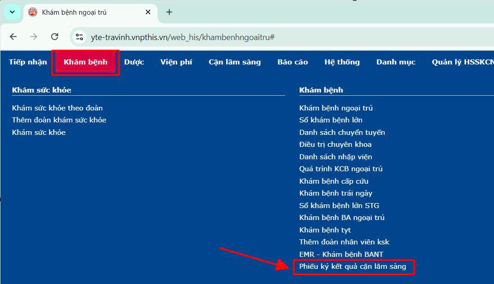

# 1. Khám bệnh Ngoại trú

**1.2 Xem và ký số/ký xem CLS**  
&nbsp;&nbsp;&nbsp;&nbsp;
Sau khi chỉ định Cận lâm sàng lên người bệnh, Bác sĩ truy cập menu **Khám bệnh -> Phiếu ký kết quả cận lâm sàng** xem kết quả cận lâm sàng của người bệnh để có đủ thông tin rồi đưa ra hướng xử lý tiếp theo.  
Khuyến cáo trên trình duyệt web mở 1 tab để khám bệnh và mở 1 tab thứ 2 để xem kết quả, ký số cận lâm sàng.  
  
Chọn từ ngày đến ngày chỉ định cận lâm sàng
