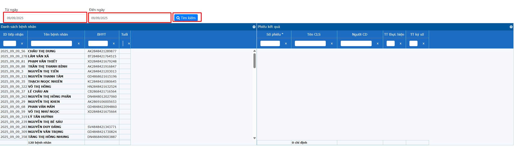
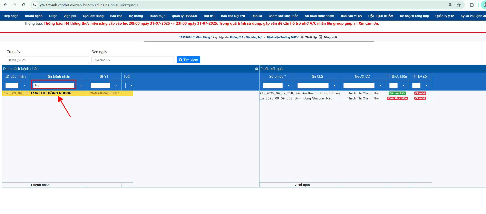
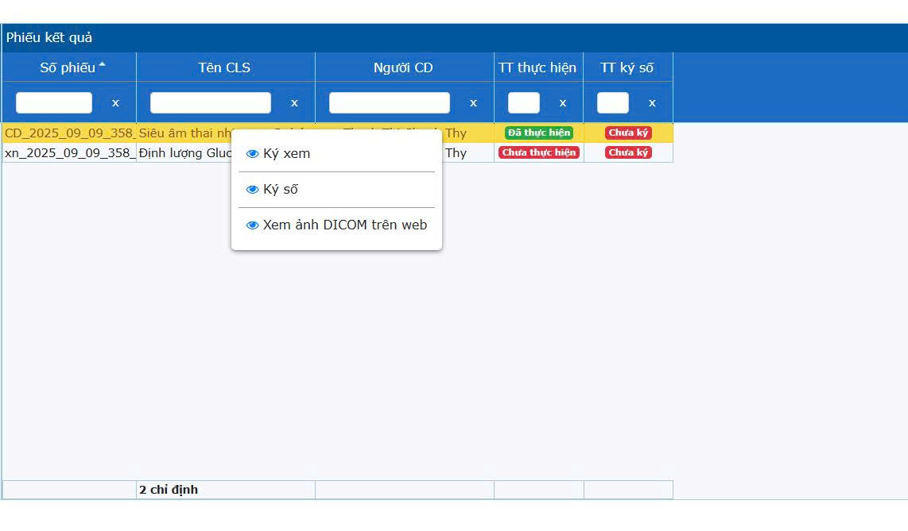
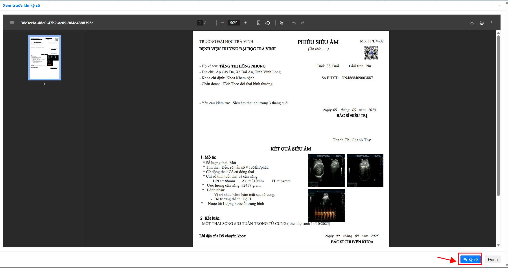

# 1. Khám bệnh Ngoại trú

**1.2 Xem và ký số/ký xem CLS**  
&nbsp;&nbsp;&nbsp;&nbsp;
Sau khi chỉ định Cận lâm sàng lên người bệnh, Bác sĩ truy cập menu **Khám bệnh -> Phiếu ký kết quả cận lâm sàng** xem kết quả cận lâm sàng của người bệnh để có đủ thông tin rồi đưa ra hướng xử lý tiếp theo.  
&nbsp;&nbsp;&nbsp;&nbsp;
Khuyến cáo trên trình duyệt web mở 1 tab để khám bệnh và mở 1 tab thứ 2 để xem kết quả, ký số cận lâm sàng.  
  

&nbsp;&nbsp;&nbsp;&nbsp;
Chọn **từ ngày**, **đến ngày** chỉ định cận lâm sàng nhấn nút tìm kiếm để phần mềm load danh sách người bệnh có chỉ định cận lâm sàng.  

  

&nbsp;&nbsp;&nbsp;&nbsp;
Nhập **tên bệnh nhân** để tìm kiếm. Nhấn chọn tên người bệnh điểm phần mềm kiểm tra và hiển thị thông tin bên cột **Phiếu kết quả**.

  

&nbsp;&nbsp;&nbsp;&nbsp;
Phiếu kết quả sẽ hiển thị thông tin phiếu, Bác sĩ lưu ý 2 cột: **TT thực hiện** sẽ hiển thị **Đã thực hiện** (xanh lá), **chưa thực hiện** (đỏ).  
    &nbsp;&nbsp;&nbsp;&nbsp;
    **- Đã thực hiện** (xanh lá): Bác sĩ có thể xem thông tin kết quả cận lâm sàng và ký số để xác nhận đã xem. Thực hiện như sau: **Bác sĩ nhấp phải chuột lên phiếu cận lâm sàng -> chọn ký số (nếu là người chỉ định) hoặc ký xem (nếu là người không chỉ định)**. Trường hợp chẩn đoán hình ảnh thì có thể chọn **Xem ảnh DICOM trên web** để tự xem hình ảnh y khoa rồi sau đó nhấn **Ký số** hoặc **Ký xem**.

  

Phần mềm load kết quả cận lâm sàng, Bác sĩ xem kết quả và nhấn Ký số để hoàn tất việc xem. Lúc này cột **TT Ký số** sẽ chuyển sang **Đã ký** (xanh lá)

  

&nbsp;&nbsp;&nbsp;&nbsp;
    **- Chưa thực hiện** (đỏ): đợi **TT thực hiện**  hiển thị **đã thực hiện** (xanh lá) để **Ký số** hoặc **Ký xem**.

