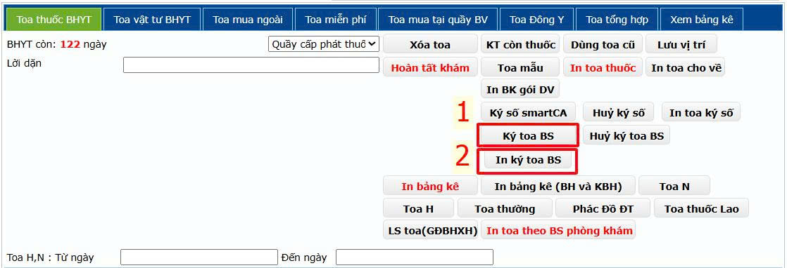
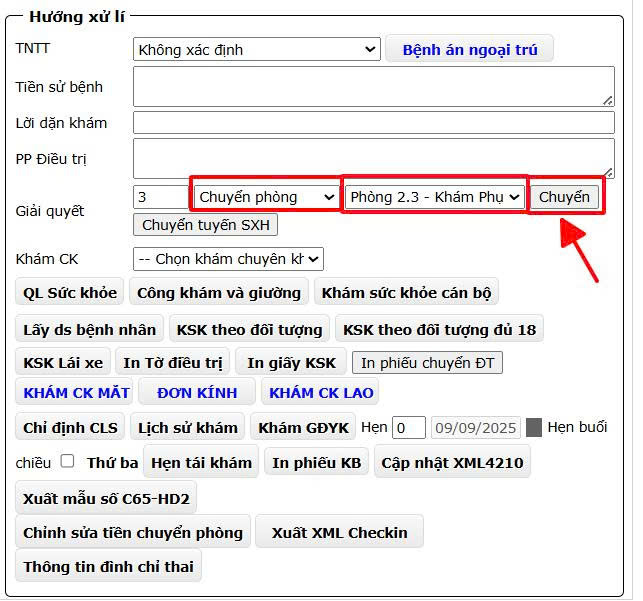
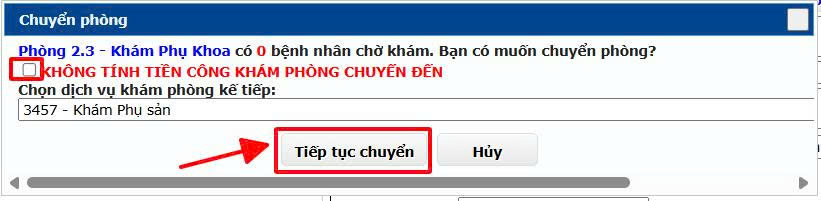

# 1. Khám bệnh Ngoại trú

**1.3.1. Chuyển phòng khám**  
&nbsp;&nbsp;&nbsp;&nbsp;
Tuy theo tình hình thực tế nếu có kê thuốc cho người bệnh thì Bác sĩ tiến hành kê toa thuốc. Sau khi kê toa tiến hành ký số toa thuốc mình kê bằng cách nhấn vào **Ký toa BS** để ký số và nhấn vào **In ký toa BS** để in toa thuốc của mình kê.

  
&nbsp;&nbsp;&nbsp;&nbsp;
Tiếp tục quay lại **Hướng xử lí** ở mục Giải quyết chọn **Chuyển phòng** -> **Chọn phòng** - Nhấn nút **Chuyển**. 

  
&nbsp;&nbsp;&nbsp;&nbsp;
Phần mềm sẽ hiển thị hộp thoại chuyển phòng. Không check vào KHÔNG TÍNH TIỀN CÔNG KHÁM PHÒNG CHUYỂN ĐẾN (chỉ check vào khi cùng dịch vụ khám. Ví dụ: **Phòng Nội tim mạch** chuyển phòng **Nội nhiễm - hô hấp** vì 2 phòng này cùng dịch vụ **Khám Nội tổng hợp**). **Tiếp tục chọn dịch vụ khám phòng kế tiếp -> Tiếp tục** chuyển là kết thúc.

    
