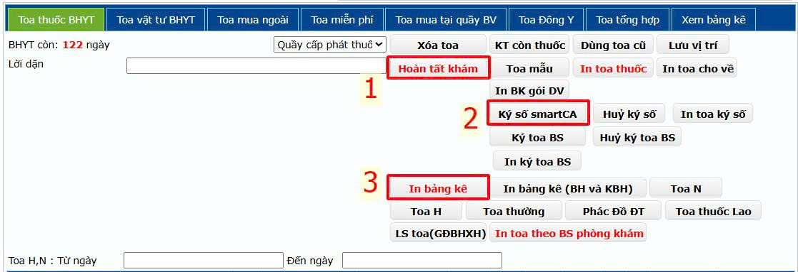
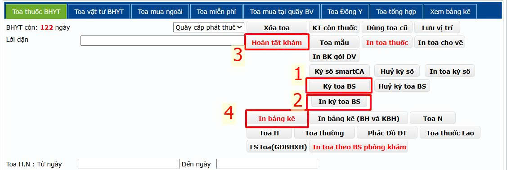

# 1. Khám bệnh Ngoại trú

**1.3.2. Cấp toa cho về**  
&nbsp;&nbsp;&nbsp;&nbsp;
- Trường hợp người bệnh được nhập từ tiếp nhận. Bác sĩ tiến hành kê toa thuốc. Sau khi kê toa nhấn **Hoàn tất khám** và **Ký số smartCA** để chứng thực hồ sơ bệnh án do mình khám bệnh, chữa bệnh. Sau khi **Ký số smartCA** phần mềm sẽ hiển thị toa thuốc đã kê có thể in cho bệnh nhân. Cuối cùng là **In bảng kê** để kết thúc.

    

&nbsp;&nbsp;&nbsp;&nbsp;
- Trường hợp người bệnh được chuyển từ phòng khám khác đến. Bác sĩ tiến hành kê toa thuốc. Sau khi kê toa tiến hành ký số toa thuốc mình kê bằng cách nhấn vào **Ký toa BS** để ký số và nhấn vào **In ký toa BS** để in toa thuốc của mình kê. Tiếp tục nhấn **Hoàn tất khám** và **In bảng kê** để kết thúc.  
  