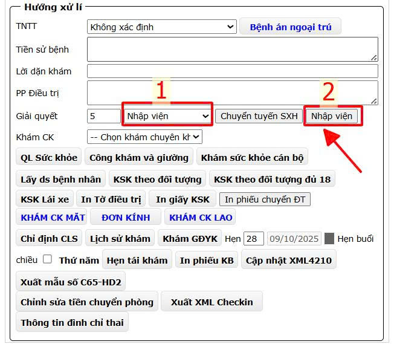
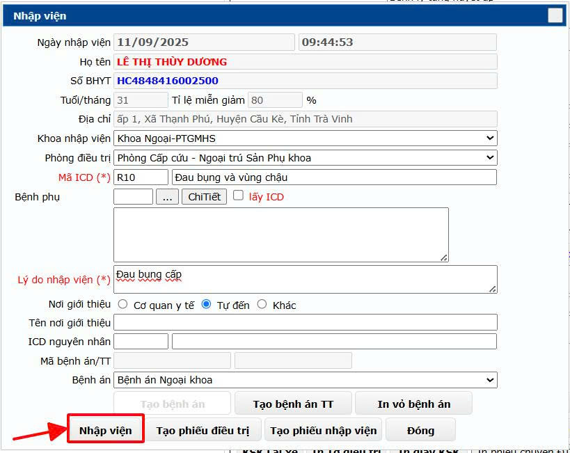
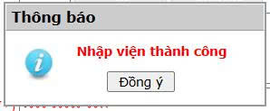
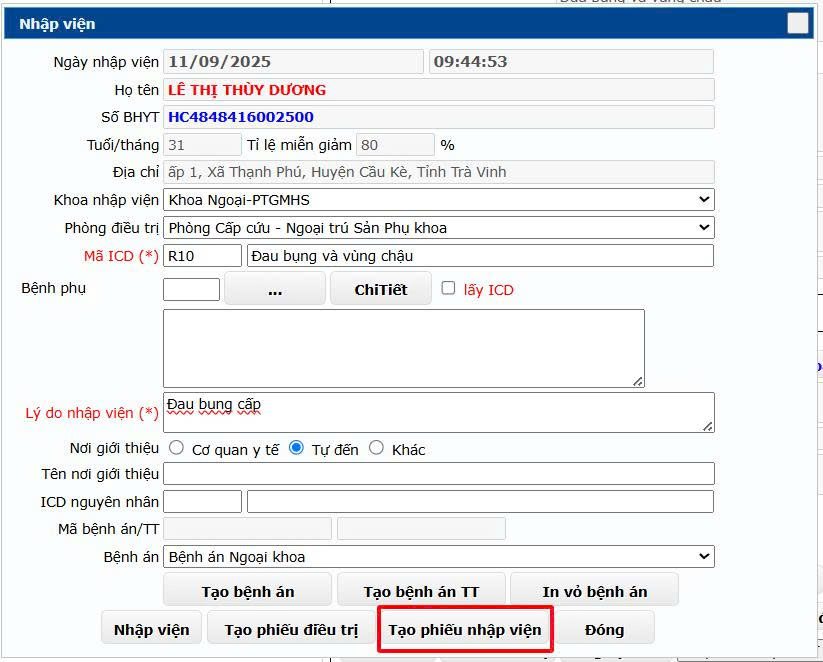
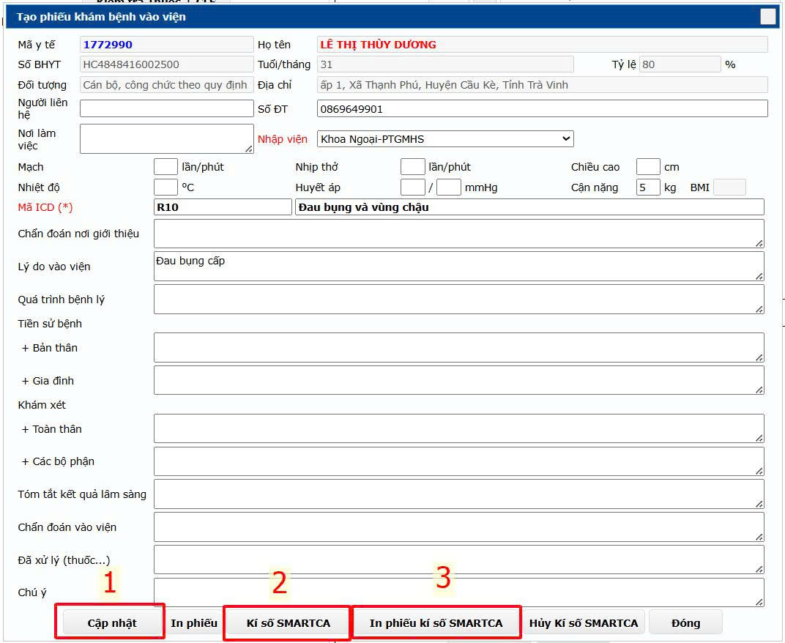

# 1. Khám bệnh Ngoại trú

**1.3.3. Nhập viện**  
&nbsp;&nbsp;&nbsp;&nbsp;
    Căn cứ tình hình thực tế sau khi có kết quả cận lâm sàng, Bác sĩ cho người bệnh nhập viện từ phòng khám. **Hưởng xử lý** chọn **Nhập viện** -> nhấn nút **Nhập viện**.

    

&nbsp;&nbsp;&nbsp;&nbsp;
    Hộp thoại **Nhập viện** mở lên Bác sĩ nhập thông tin cần thiết và nhấn **Nhập viện**.  Phần mềm thông báo Nhập viện thành công, sau đó nhấn **Đồng ý** và quay lại hộp thoại **Nhập viện**.
 
 

&nbsp;&nbsp;&nbsp;&nbsp;
Nhấn Tạo phiếu nhập viện. Phần mềm sẽ hiển thị hôp thoại **Tạo phiếu khám bệnh vào viện**. Bác sĩ nhập các thông tin cần thiết rồi nhấn **Cập nhật** -> **Kí số SMARTCA** -> **In phiếu kí số SMARTCA**. Nếu có sai sót có thể nhấn **Hủy kí số SMARTCA** để chỉnh sửa rồi tiến hành Cập nhật và Kí số lại.  

 
 

