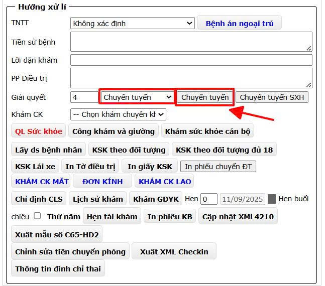
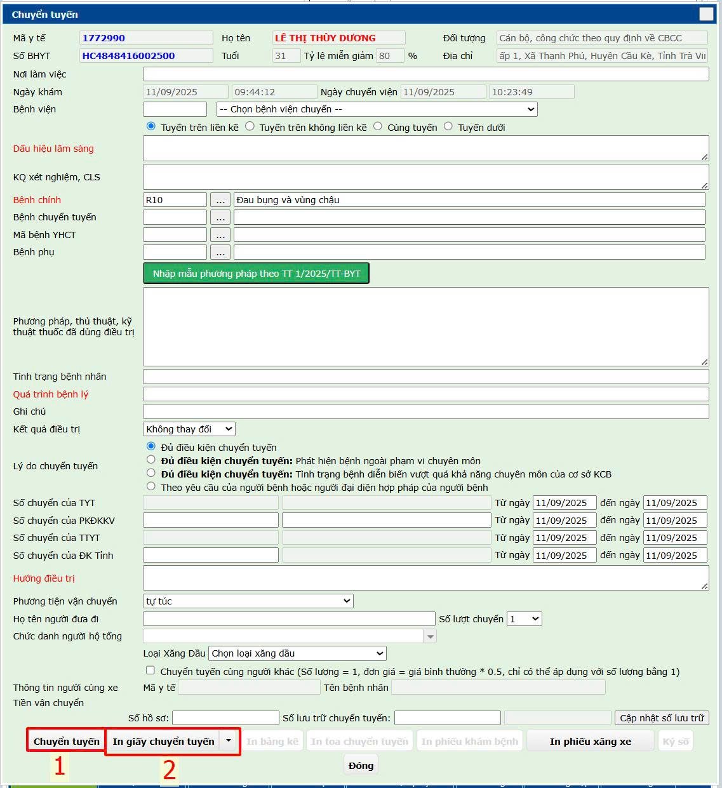

# 1. Khám bệnh Ngoại trú

**1.3.4. Chuyển tuyến**  
&nbsp;&nbsp;&nbsp;&nbsp;
    Tùy theo tình hình thực tế Bác sĩ có thể làm thủ tục chuyển người bệnh lên tuyến trên. **Hưởng xử lý** chọn **Chuyển tuyến** -> nhấn nút **Chuyển tuyến**. Phần mềm sẽ hiển thị hộp thoại **Chuyển tuyến**.

    

&nbsp;&nbsp;&nbsp;&nbsp;
    Hộp thoại **Chuyển tuyến** mở lên Bác sĩ nhập thông tin cần thiết và nhấn **Chuyển tuyến**.  **In giấy chuyển tuyến**.  
  

