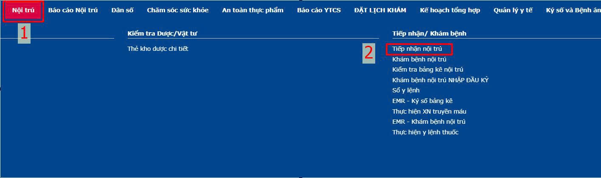
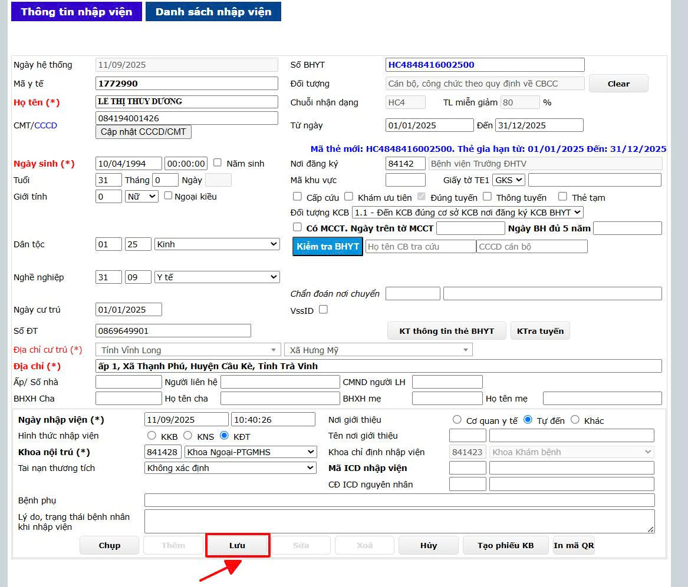
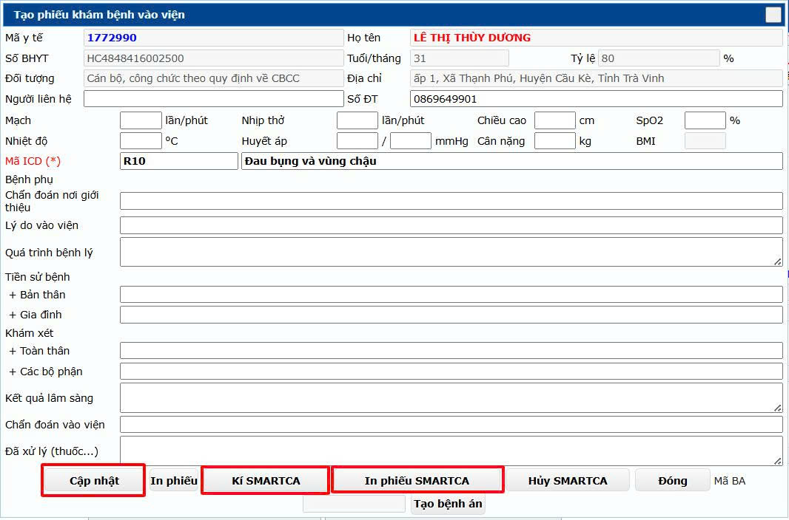
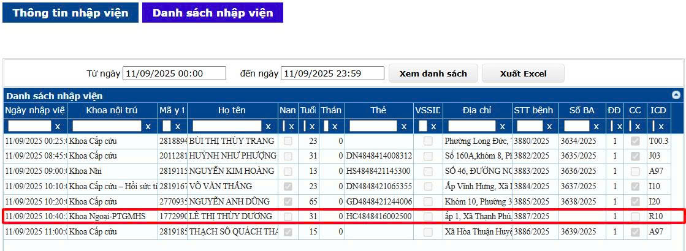
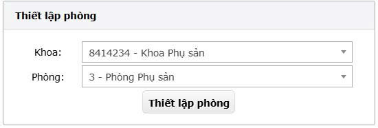
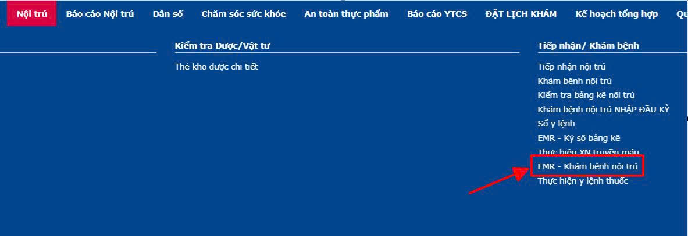
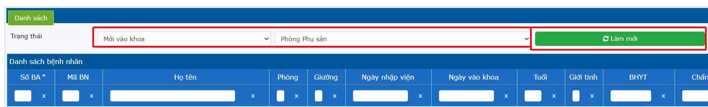
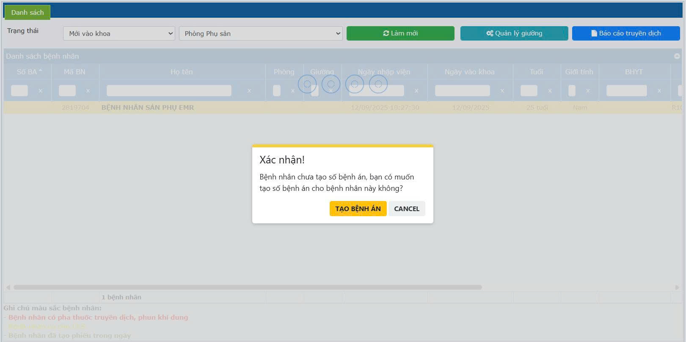
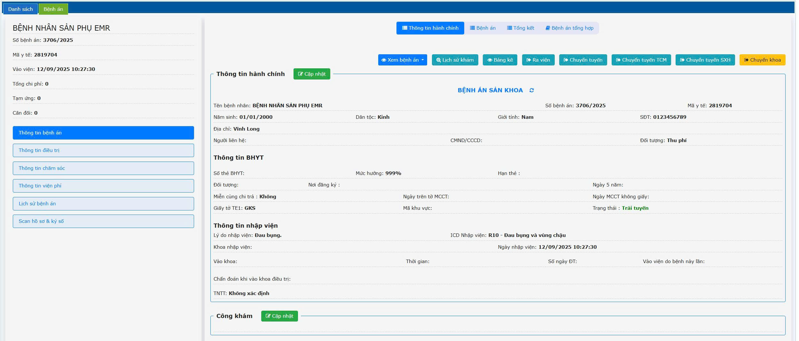

# 2. Điều trị Nội trú

**2.1 Tiếp nhận nội trú và tạo Bệnh án**  
&nbsp;&nbsp;&nbsp;&nbsp;
**- Tiếp nhận nội trú**  
&nbsp;&nbsp;&nbsp;&nbsp;
    Từ menu phần mềm vào menu **Nội trú** -> **Tiếp nhận nội trú**. Phần mềm sẽ hiển thị form nhập liệu thông tin tiếp nhận.  
      
&nbsp;&nbsp;&nbsp;&nbsp;
Nhập thông tin người bệnh và nhấn **Lưu**.  

  

&nbsp;&nbsp;&nbsp;&nbsp;
Nhấn **Tạo Phiếu KB** -> **Nhập đầy đủ thông tin** -> **Nhấn Cập nhật** -> **Kí số SMARTCA** -> **In phiếu ký số SMARTCA**.  
  
  
**- Tạo bệnh án**  
&nbsp;&nbsp;&nbsp;&nbsp;Thiết lập phòng bệnh đúng khoa phòng của người bệnh  
  

&nbsp;&nbsp;&nbsp;&nbsp;
Truy cập **EMR - Khám bệnh nội trú** trên thanh menu  
 

&nbsp;&nbsp;&nbsp;&nbsp;
Chọn **Trạng thái** -> Nhấn **Làm mới** để tìm danh sách người bệnh để tạo bệnh án. Phần mềm hiển thị danh sách người bệnh nhập viện từ phòng khám và người bệnh từ form tiếp nhận nội trú.  

 

&nbsp;&nbsp;&nbsp;&nbsp;
Nhấp Double click chuột trái vào tên người bệnh để vào sổ bệnh án. Khi bệnh nhân mới tiếp nhận vào khoa chưa có số bệnh án, hệ thống hiển thị form tạo số bệnh án trước khi vào sổ Chọn **Tạo bệnh án**.  

 

&nbsp;&nbsp;&nbsp;&nbsp;
Ở form Tạo bệnh án **chọn bệnh án -> Chọn Khoa -> Bác sĩ -> Nhấn Tạo bệnh án**.  

 

&nbsp;&nbsp;&nbsp;&nbsp;
Phần mềm hiển thị giao diện sau khi tạo bệnh án.  

