# 2.2 Thông tin bệnh án

**2.2.1 Thông tin hành chính**  
**a. Thay đổi tên vỏ bệnh án**  
&nbsp;&nbsp;&nbsp;&nbsp;
Nhấn chọn nút kế tên vỏ bệnh án -> Chọn lại tên BA, Khoa và Bác sĩ -> Nhấn tạo
**- Tiếp nhận nội trú**  
&nbsp;&nbsp;&nbsp;&nbsp;
    Từ menu phần mềm vào menu **Nội trú** -> **Tiếp nhận nội trú**. Phần mềm sẽ hiển thị form nhập liệu thông tin tiếp nhận.  
    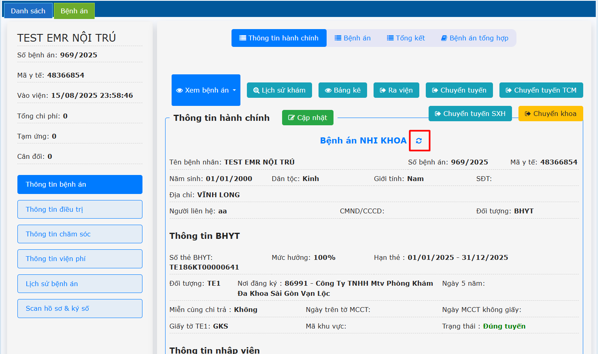  
    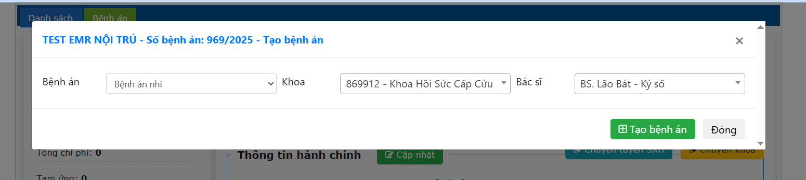  
**Lưu ý:** Khi thay đổi tên vỏ bệnh án, các thông tin dữ liệu của vỏ bệnh án sẽ bị xóa, các dữ liệu khác không bị ảnh hưởng.    
**b. Cập nhật thông tin hành chính**  
&nbsp;&nbsp;&nbsp;&nbsp;
Chọn **Cập nhật** để cập nhật thông tin hành chính .  
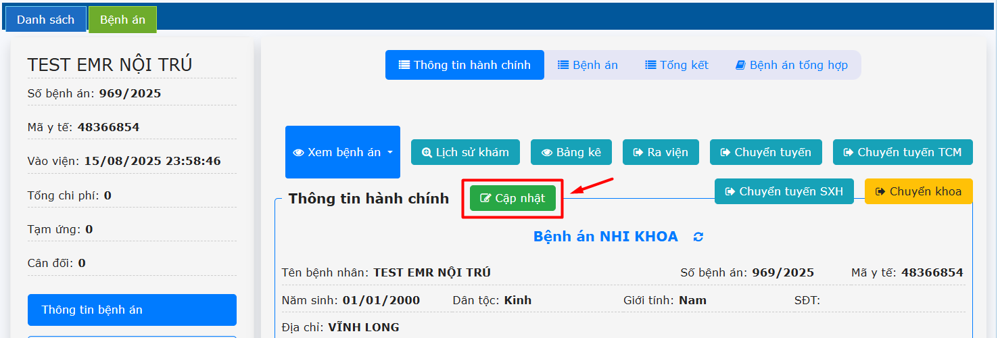  
&nbsp;&nbsp;&nbsp;&nbsp;
Điều chỉnh các **THÔNG TIN THẺ BẢO HIỂM VÀ THÔNG TIN HÀNH CHÍNH BỆNH NHÂN** cần điều chỉnh vào form -> Nhấn Lưu.  
&nbsp;&nbsp;&nbsp;&nbsp;
Có thể sử dụng nút **KIỂM TRA BHYT** để kiểm tra thông tin thẻ sau khi nhập.  
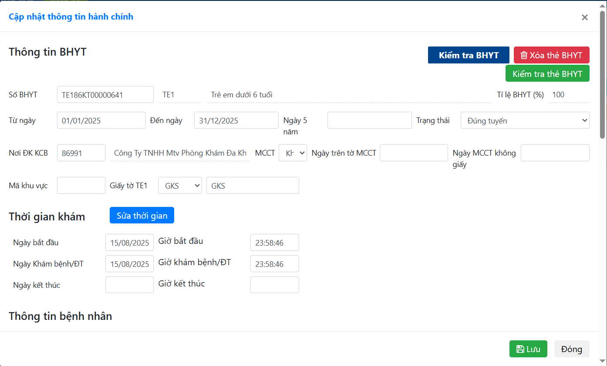  
**c. Cập nhật công khám**  
&nbsp;&nbsp;&nbsp;&nbsp;
Nhấn chọn **Cập nhật** để cập nhật công khám (nếu có).  
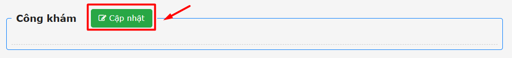  
&nbsp;&nbsp;&nbsp;&nbsp;
Chọn tên Khoa và Loại công khám -> Nhấn Lưu.  
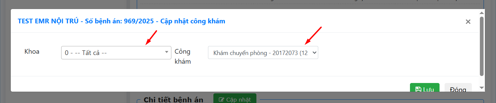  

**d. Chi tiết bệnh án**  
&nbsp;&nbsp;&nbsp;&nbsp;
Nhấn chọn **Cập nhật** để cập nhật các lần chuyển khoa của bệnh nhân.  
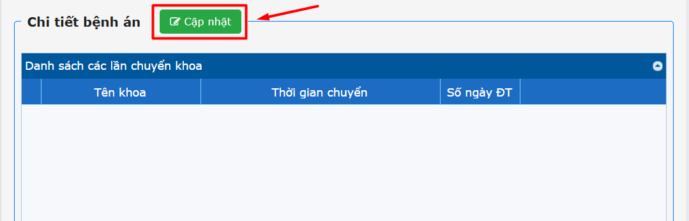  

&nbsp;&nbsp;&nbsp;&nbsp;
Chọn Thêm chuyển khoa -> Nhấn chọn đầy đủ thông tin Khoa, Thời gian, Số ngày điều trị -> Nhấn **Thêm mới**.  

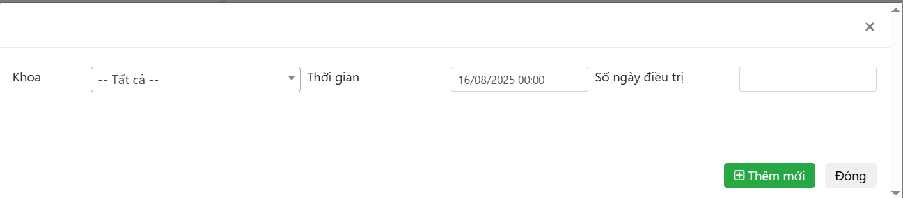  

&nbsp;&nbsp;&nbsp;&nbsp;
Nhấn **Lưu** để lưu thông tin chi tiết bệnh án để lưu lại thông tin theo dữ liệu chuyển khoa.  
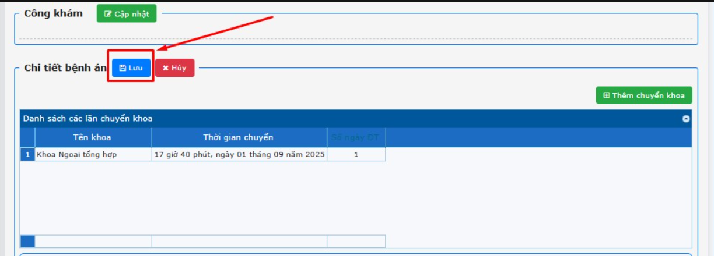  

**e. Quản lý người bệnh - Chẩn đoán - Tình trạng ra viện**  
&nbsp;&nbsp;&nbsp;&nbsp;
Điền đầy đủ thông tin bệnh nhân ở 3 tab này ⇒ các thông tin nhập tương tự như bìa bệnh án giấy.  
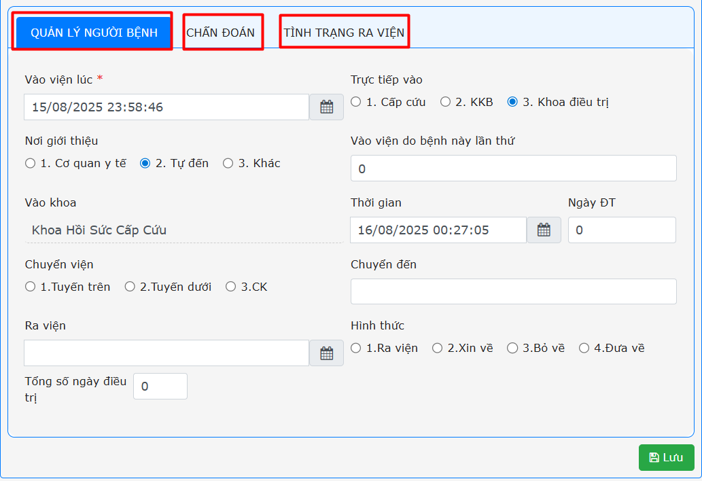  

**f. Xem bệnh án**  
&nbsp;&nbsp;&nbsp;&nbsp;
- Xem thông tin các trang bệnh án 1 2 3.  
&nbsp;&nbsp;&nbsp;&nbsp;
- Xem tổng hồ sơ bệnh án, tất cả các thông tin đã lập trên hồ sơ bệnh án (tương tự 1 cuốn hồ sơ giấy).  

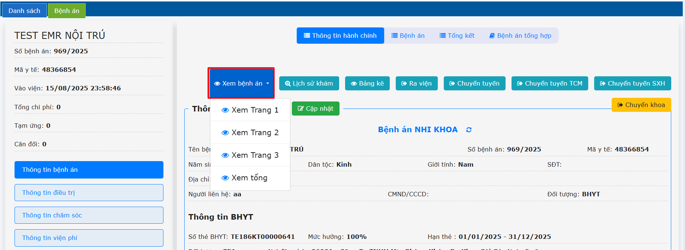  

**g. Lịch sử khám**  
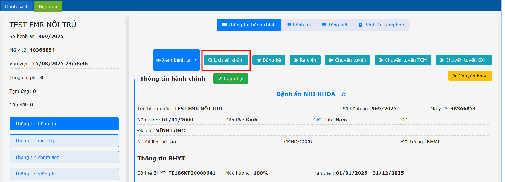  
**h. Bảng kê**  
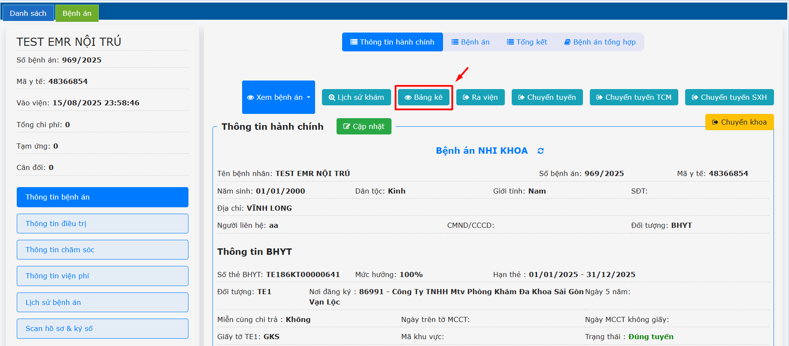  
&nbsp;&nbsp;&nbsp;&nbsp;
Nhấn xem các loại giấy tờ cần xem: **Bảng kê, Chuyển viện, TT50, Giấy ra viện, ...** → In nếu cần.  
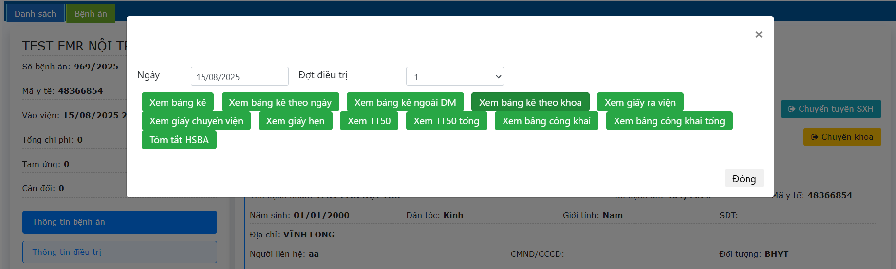  
**i. Ra viện**  
&nbsp;&nbsp;&nbsp;&nbsp;
**Lưu ý:** nhập đủ thông tin, bác sĩ ký số trang 1 2 3 trước khi xuất viện.  

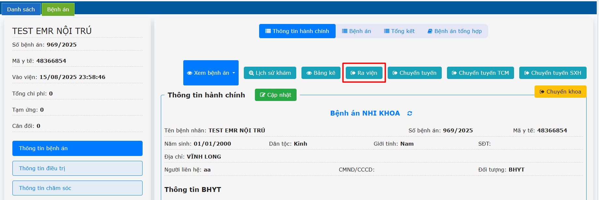  

Điền đầy đủ thông tin, tạo số lưu trữ, tạo số giấy hẹn.  
&nbsp;&nbsp;&nbsp;&nbsp;
- Giường bệnh: kiểm tra lại giường bệnh của bệnh nhân.  
&nbsp;&nbsp;&nbsp;&nbsp;
- Trích biên bản tử vong (nếu có).  
&nbsp;&nbsp;&nbsp;&nbsp;
- In toa ra viện: in toa thuốc ra viện cho bệnh nhân.  
&nbsp;&nbsp;&nbsp;&nbsp;
- Xuất viện: Xác nhận cho bệnh nhân xuất viện.  
&nbsp;&nbsp;&nbsp;&nbsp;
- Lưu thông tin: Lưu các thông tin đã nhập.  
&nbsp;&nbsp;&nbsp;&nbsp;
- Khác: Xem các thông tin khác (Bảng kê, TT50…) và in nếu cần.   

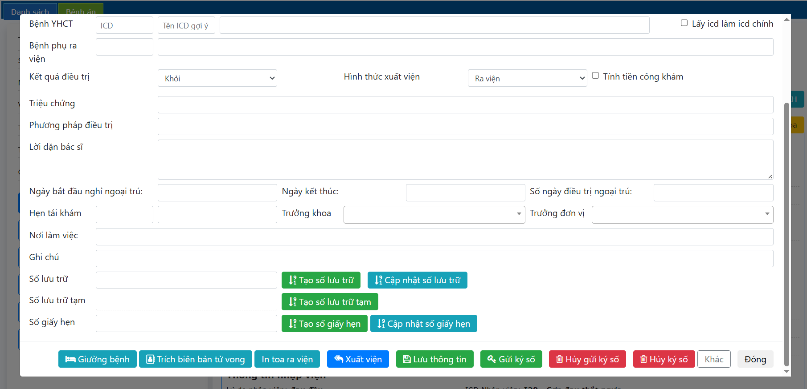  

**j. Chuyển tuyến, chuyển tuyến TCM, chuyển tuyến SXH**  
**Lưu ý:** nhập đủ thông tin, bác sĩ ký số trang 1 2 3 trước khi chuyển tuyến.  
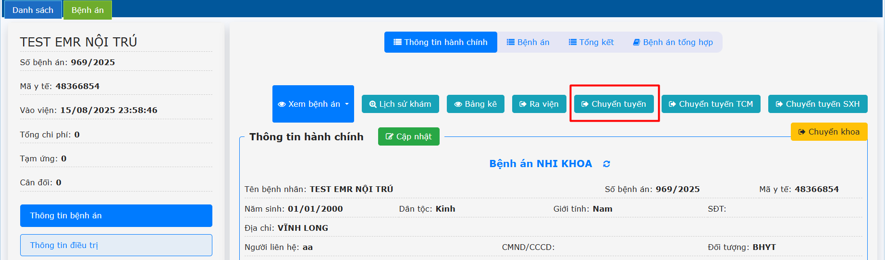  
&nbsp;&nbsp;&nbsp;&nbsp;
Điền đầy đủ thông tin, tạo số lưu trữ  -> Nhấn chọn **Chuyển tuyến**.  
Chọn nút Khác để xem và in các giấy tờ cần thiết.  
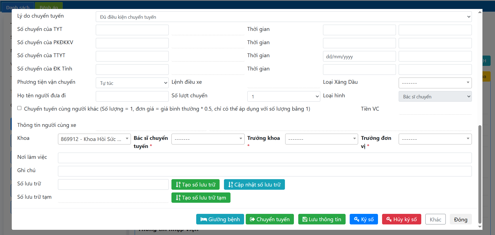  
**k. Chuyển khoa**  
&nbsp;&nbsp;&nbsp;&nbsp;
Nhấn chọn **Chuyển khoa** trên giao diện.  
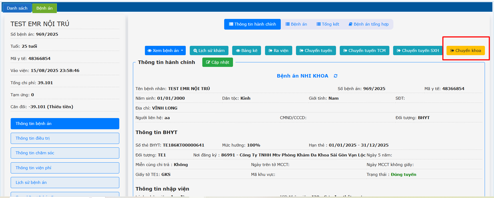  
&nbsp;&nbsp;&nbsp;&nbsp;
Nhập đầy đủ thông tin -> Nhấn chọn **Chuyển khoa**  
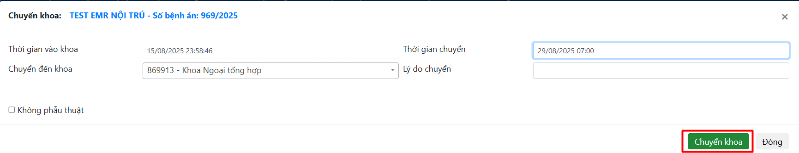  

&nbsp;&nbsp;&nbsp;&nbsp;
**Lưu ý:** Khi khoa chuyển bệnh nhân vào nhầm khoa -> cần gọi bệnh nhân lại.  
Chọn danh sách bệnh nhân trạng thái **Chuyển khoa** -> Nhấp chuột phải vào tên bệnh nhân -> Nhấn **Gọi lại HSBA**.  
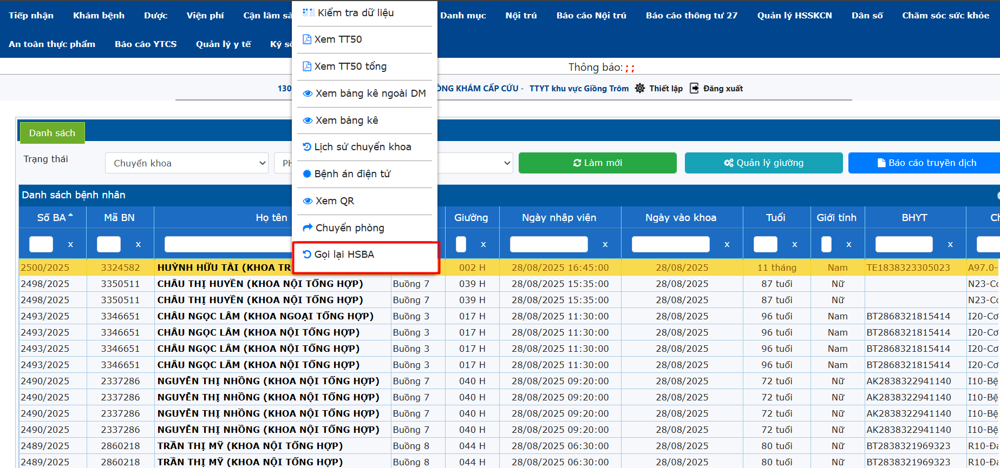  

Chỉnh sửa trạng thái danh sách bệnh viện là **Đang điều trị tại khoa** -> **Làm mới**.

**2.2.2 Bệnh án (Thông tin trang 2)**  
Bác sĩ nhập đầy đủ thông tin -> Nhấn Lưu -> Ký số.  
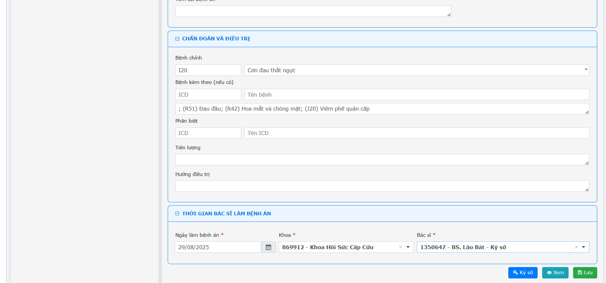  
**2.2.3 Tổng kết (Thông tin trang 3)**  
&nbsp;&nbsp;&nbsp;&nbsp;
Ở phần các cận lâm sàng, hệ thống sẽ tự động đếm số tờ theo quy trình của từng đơn vị  → Để đếm được toàn bộ hồ sơ trước khi ký số người giao hồ sơ ở menu EMR - Ký số bảng kê chọn mục **Xem tất cả** rồi mới ký số người giao hồ sơ.  
&nbsp;&nbsp;&nbsp;&nbsp;
Bác sĩ nhập đầy đủ thông tin -> Nhấn Lưu -> Ký số  
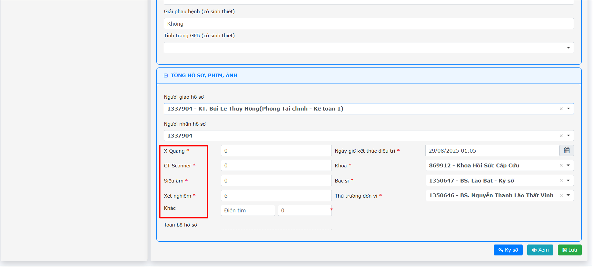  

