# 2.3 Thông tin điều trị

**2.3.1 Tạo tờ điều trị**   
**a. Điều trị:**  
- Chọn tab **Điều trị** -> Nhấn chọn **Khám bệnh** để tạo tờ điều trị mới.  
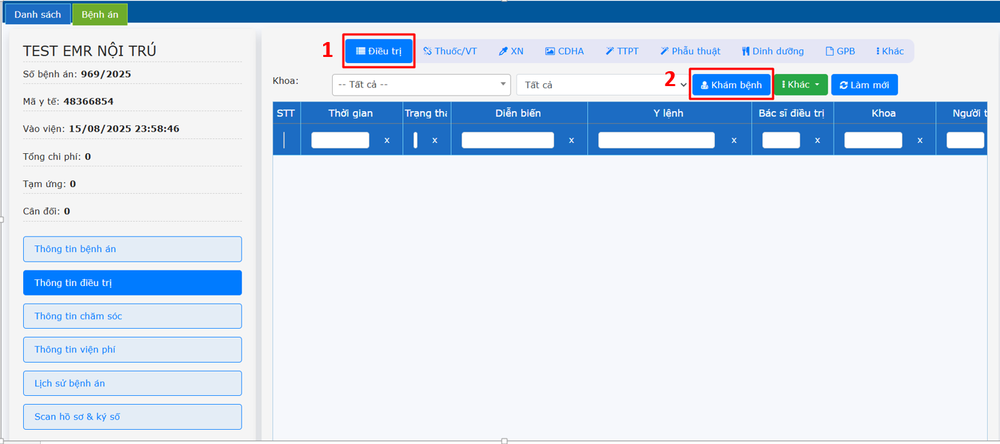  
- Chọn **Khoa điều trị**, Bác sĩ điều trị được load theo tài khoản đăng nhập, thời gian tạo tờ điều trị (có thể điều chỉnh theo nhu cầu) -> Nhấn **Tạo phiếu** để tạo tờ điều trị mới (**Lưu ý: Thời gian tạo tờ điều trị sau giờ nhập viện**).  
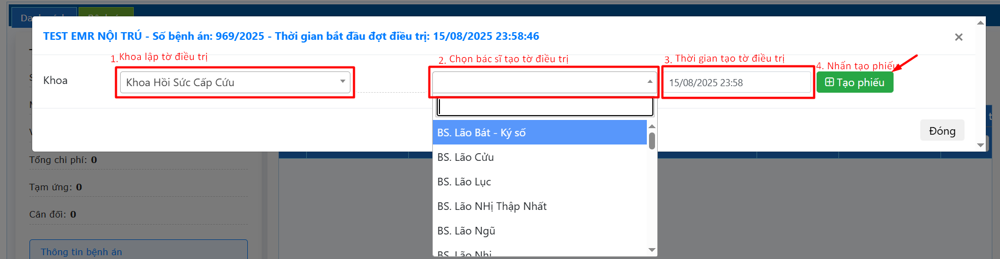  
  
**Tab Điều Trị nhập các thông tin:**  
**- Chỉ số sinh tồn.**  
**- Mã ICD bệnh nhân:** ICD đầu tiên là ICD chính, các ICD tiếp theo sẽ là ICD phụ.  
&nbsp;&nbsp;&nbsp;&nbsp;
+ Nhập mã ICD enter 2 lần -> ICD hiển thị ở danh sách.  
&nbsp;&nbsp;&nbsp;&nbsp;
+ Để thay đổi ICD chính -> Nhấp chuột phải ở hàng ICD đó -> Chọn **Đặt làm bệnh chính**.  
&nbsp;&nbsp;&nbsp;&nbsp;
+ Có thêm và tên ICD: Gõ ICD cần nhập enter lần 1 sau đó chọn vào tên ICD nhập dữ liệu cần thêm xong nhấn phím **Enter** lần 2 xuống bảng ICD.  
&nbsp;&nbsp;&nbsp;&nbsp;
+ Xóa: chuột phải vào hiển thị nút xóa.  
 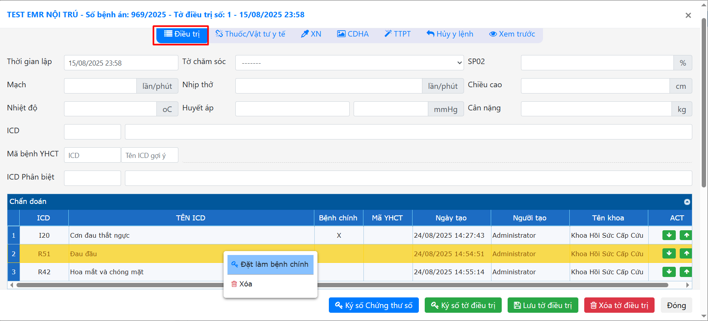 
**- Diễn biến:** nhập thông tin diễn biến Bác sĩ khám cho bệnh nhân, các thông tin về sinh hiệu và ICD sẽ được lấy từ phần sinh hiệu và ICD đã nhập phía trên vào tờ điều trị lúc xem.  
**- Y lệnh:** chỉ ghi các thông tin mô tả (ví dụ: chăm sóc cấp 2 3, ăn cơm cháo, …, thay đổi tốc độ truyền dịch, chuyển khoa, nhận BN vào khoa, … ), các thông tin y lệnh như thuốc, cận lâm sàng, TTPT khi thực hiện tại các chức năng chỉ định sẽ tự hiển thị trên tờ điều trị theo quy định.  
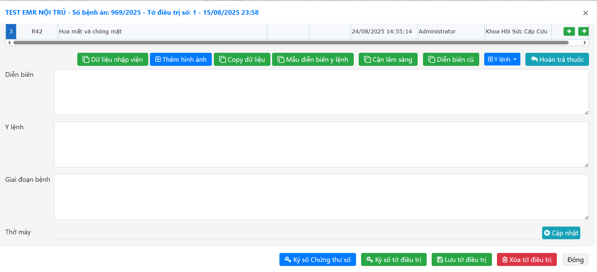  

**Nút Thêm mẫu Diễn Diến Y Lệnh:** Tạo mẫu diễn biến y lệnh dành cho những bệnh nhân có diễn biến và y lệnh tương tự nhau. Mỗi Bác sĩ có các cách ghi diễn biến và y lệnh cho những bệnh tương tự nhau khi thêm mẫu sẽ sử dụng lại cho những lần sau.  
**+ Thêm:** Chọn **Mẫu diễn biến y lệnh** -> Thêm mẫu diễn biến, y lệnh -> Nhập đầy đủ thông tin -> Nhấn **Lưu**.  
**+ Copy:** Chuột phải vào tên mẫu -> Chọn **Copy diễn biến y lệnh** để lấy dữ liệu ra tờ điều trị (Lưu ý: Sau khi copy vẫn có thể chỉnh sửa diễn biến, y lệnh theo nhu cầu).  
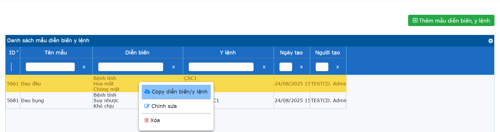  
Nút **Diễn biến cũ**: Đối với tờ điều trị số 2 trở về sau, Bác sĩ có thể copy diễn biến cũ (Chỉ số sinh tồn, diễn biến, y lệnh) ở các tờ điều trị trước.   
**+ Copy diễn biến Cũ:** Nhấn phải chuột vào diễn biến cũ của tờ điều trị cần sao chép -> Chọn **Copy diễn biến/ y lệnh** (Lưu ý: Sau khi copy vẫn có thể chỉnh sửa diễn biến, y lệnh theo nhu cầu).   
 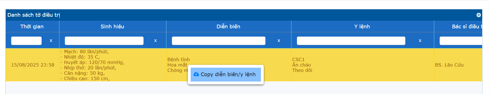  
**Lưu ý: Đối với tờ điều trị số 1 thông tin được tự động lấy vào từ phiếu vào viện**.  
**b. Thuốc/Vật tư y tế:**  
- Chọn **Nghiệp vụ**, **Kho** để lấy thuốc/vật tư.  
- Nhập thuốc, liều lượng nhấn phím **Enter** cho thuốc hiển thị ở danh sách.  
 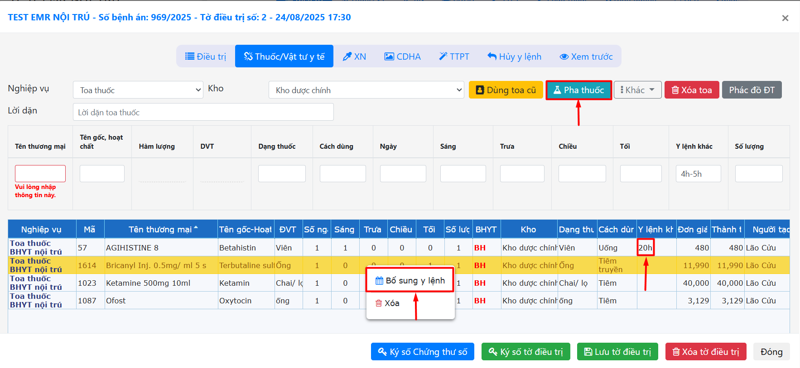  
**- Đối với các thuốc/vật tư:** Bác sĩ cần nhập ghi chú cho bệnh nhân.  
Nhấn trái chuột vào cột y lệnh khác -> Nhập nội dung -> Nhấn Enter.  
- Đối với 1 loại thuốc tiêm/ truyền dịch không pha (sử dụng 1 loại để tiêm/truyền) cho bệnh nhân:  
+ Thuốc tiêm: Chuột phải -> Bổ sung y lệnh -> Bác sĩ chọn Loại **Thuốc** , chọn thời gian thực hiện y lệnh tiêm & ghi chú (nếu có) -> Chọn **Thêm mới**.  
 
 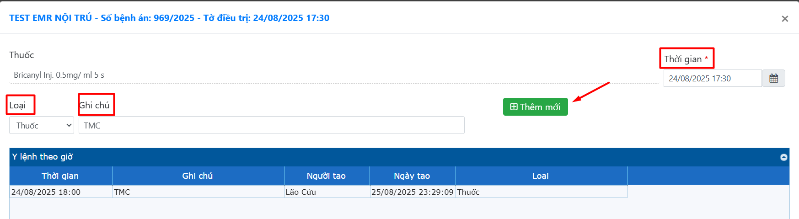  
+ Thuốc truyền dịch: Chuột phải -> Bổ sung y lệnh -> Bác sĩ chọn loại **Truyền dịch**, nhập thời gian thực hiện y lệnh truyền, Tốc độ, Số ml, ghi chú -> Chọn thêm mới.  
 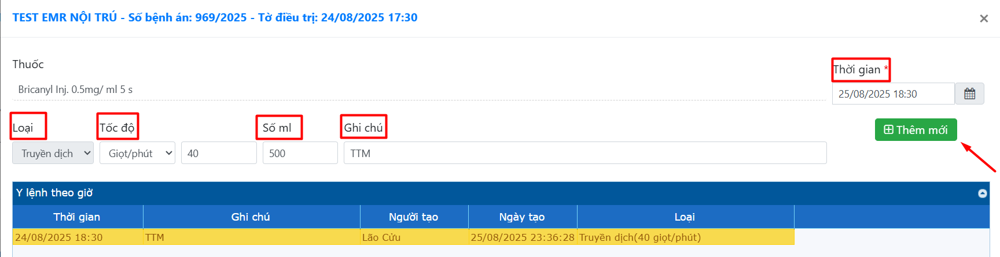  
Lưu ý: Bác sĩ cần copy y lệnh -> Chuột phải **Copy dữ liệu** -> Chỉnh sửa thông tin -> Nhấn chọn **Thêm mới**.  
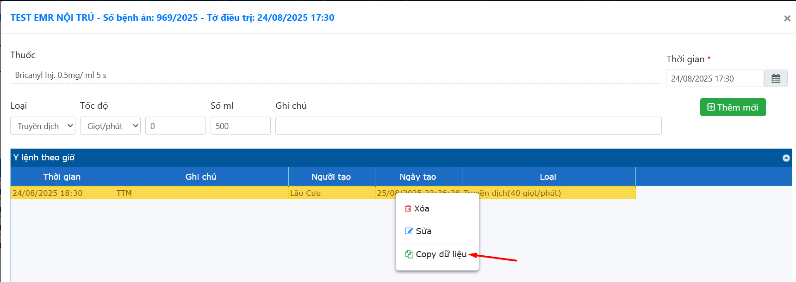  
**- Đối với loại thuốc pha:** Chọn **Pha thuốc** trên giao diện ->  Check chọn các loại thuốc cần pha -> Nhập số lượng pha từng loại -> Chỉnh sửa tên thuốc pha, số lô, ghi chú (nếu cần) -> Chọn loại y lệnh (Thuốc tiêm/ Truyền dịch) và nhập thông tin y lệnh -> Nhấn **Pha thuốc**.
 
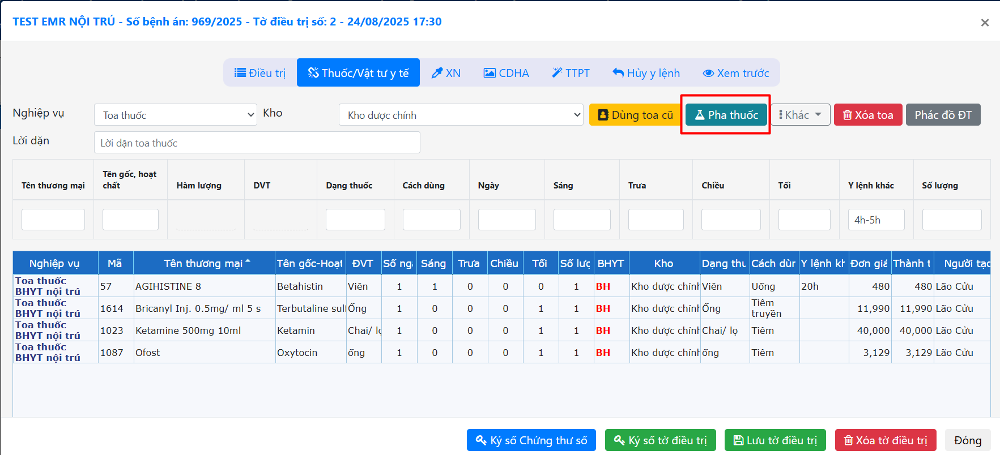  
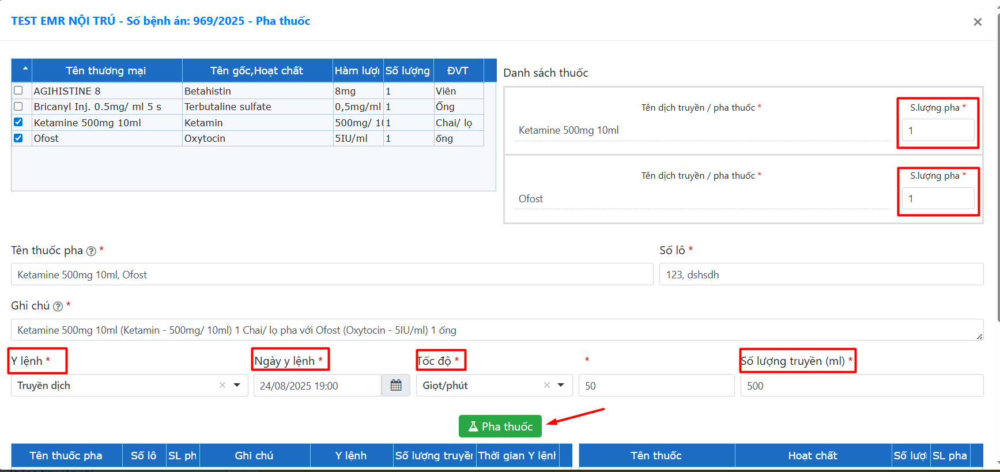  
 
Bác sĩ muốn copy chỉ định pha thuốc. Tại dòng thuốc vừa pha -> Chuột phải -> Copy dữ liệu -> Chỉnh sửa thông tin -> Nhấn chọn **Pha thuốc**.  

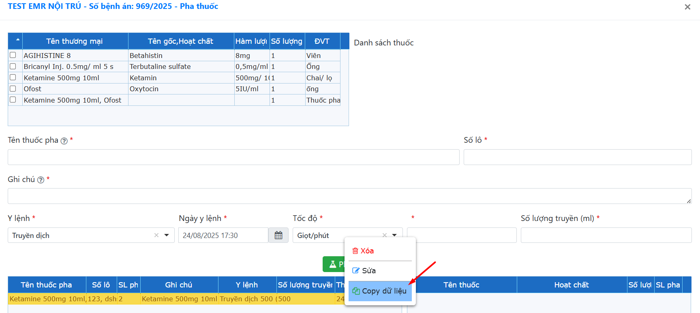  
**- Sử dụng lại thuốc đã kê ở tờ điều trị khác:** Nhấn chọn **Khác** trên giao diện -> Chọn **Bổ sung y lệnh TĐT khác** -> Chọn Thuốc trên tờ điều trị cần sử dụng lại, Thời gian, Loại thuốc, ghi chú (nếu có) -> Nhấn **Thêm mới**.  
 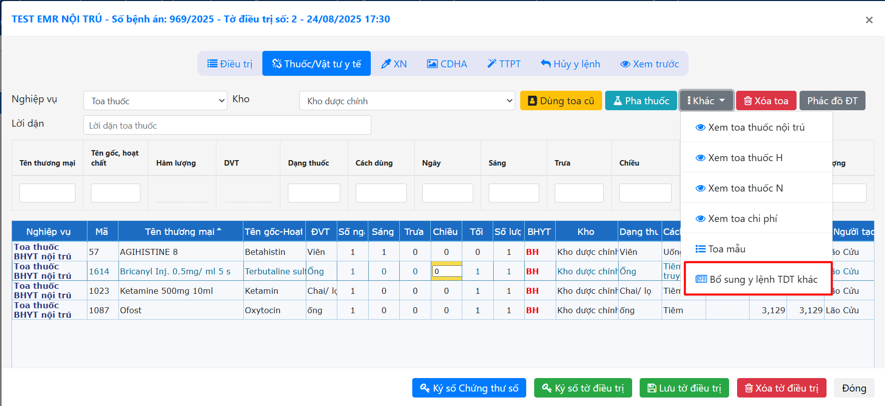  
 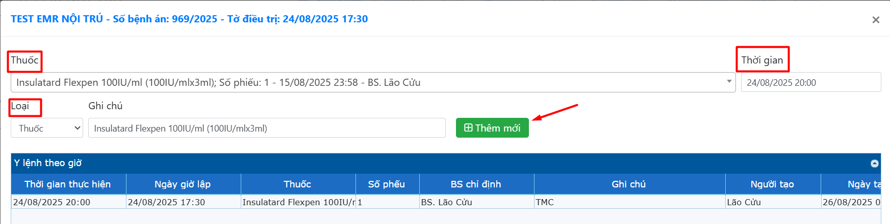   
**- Dùng toa cũ**: (Nút này có tác dụng kể từ tờ điều trị thứ 2). Nhấn chọn **Dùng toa cũ** trên giao diện -> Chọn **Tờ điều trị** -> Nhấn **Lưu toa**.  
 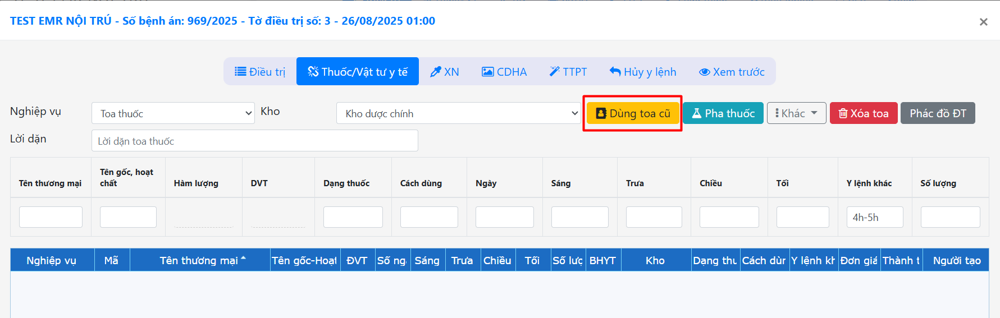  
 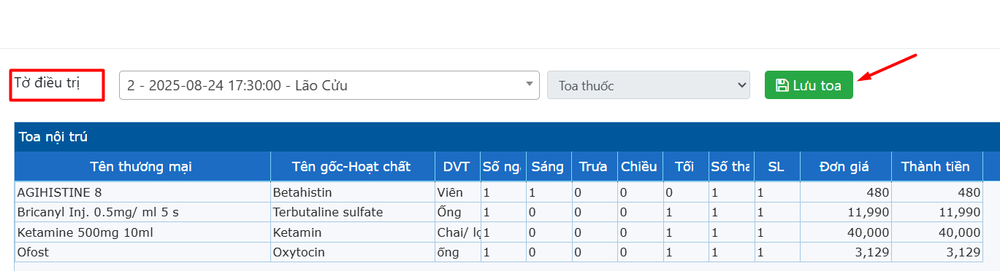   
**- Toa mẫu:** Nhấn chọn **Khác** trên giao diện -> Chọn **Toa mẫu** -> Chọn toa mẫu cần sử dụng -> Nhấn **Lấy toa mẫu**.  
 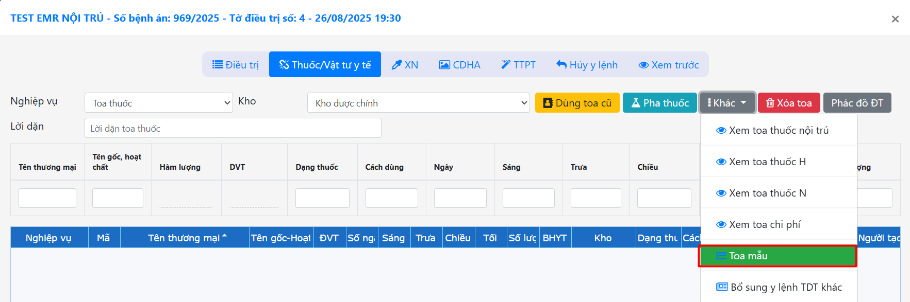  
 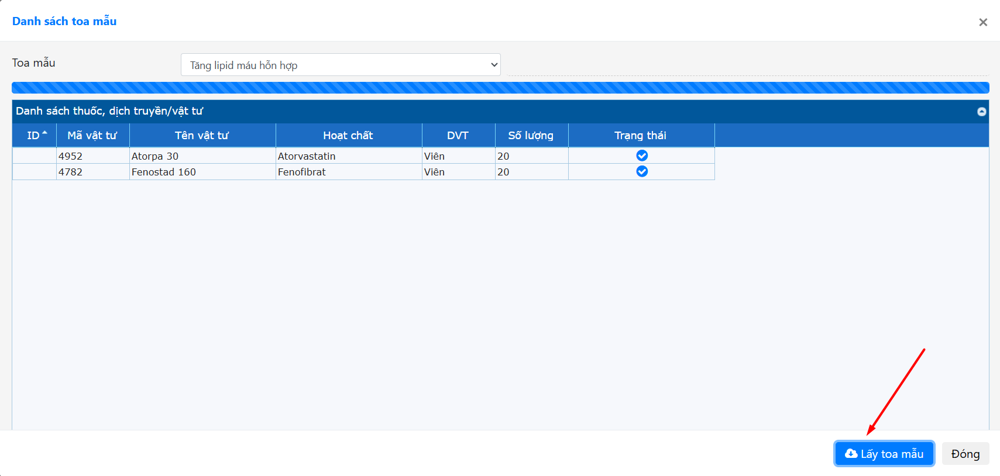   
Để tạo toa mẫu vào menu **Danh mục** -> **DM-Toa thuốc mẫu** -> Nhập các thông tin -> Nhấn **Lưu**  
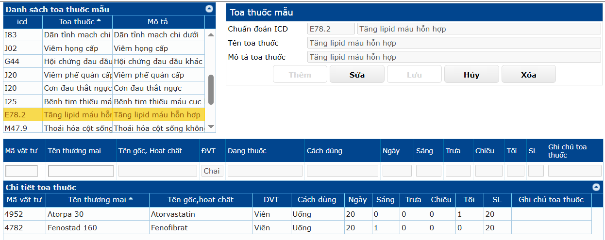  
**- Phác đồ điều trị:** Tùy vào nghiệp vụ chuyên khoa, bệnh viện sẽ ban hành phác đồ điều trị cho phù hợp → Sau khi nghiệp vụ nhập phác đồ lên thì Bác sĩ nhấn vào nút **Phát đồ điều trị** có thể nhìn thấy được thông tin.  

**c. Xét nghiệm**  
**- Cho chỉ định Xét nghiệm:** Nhấn chọn các thông tin.
+ Hình thức (BHYT hoặc Thu phí), Trạng thái (Bình thường hoặc Cấp cứu), Phòng XN.
+ Ngày giờ chỉ định (sửa giờ chỉ định nếu cần cho đúng thời gian y lệnh Bác sĩ cần cho).
Lưu ý: Ngày giờ cho chỉ định cận lâm sàng phải sau giờ tạo tờ điều trị.
+ Check chọn các loại xét nghiệm -> Nhấn chọn **Thêm mới**  
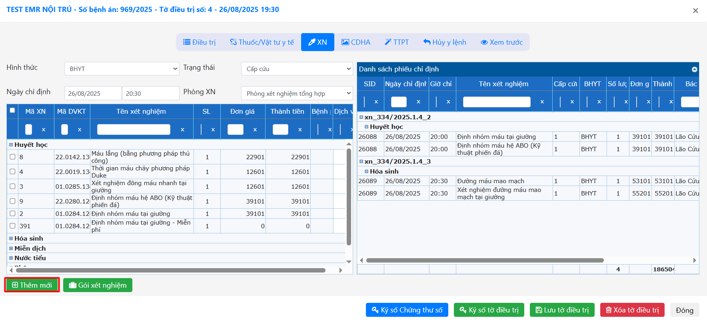  
**Lưu ý:** Khi chỉ định Xét nghiệm được chọn ở trạng thái **Cấp cứu**, khi đó giao diện hiển thị ở ngoài của tờ điều trị đó có chữ **Cấp cứu** màu đỏ.  
 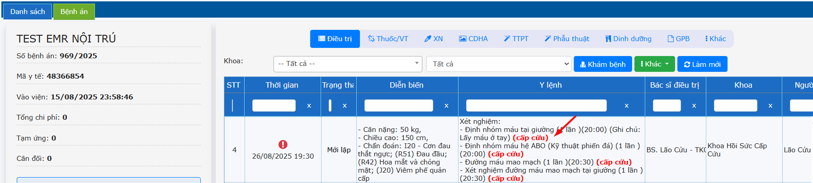  
**- Sửa chỉ định Xét nghiệm:** Click phải chuột vào chỉ định Xét nghiệm cần chỉnh sửa -> Cập nhật lại thông tin -> Nhấn **Lưu**.  
 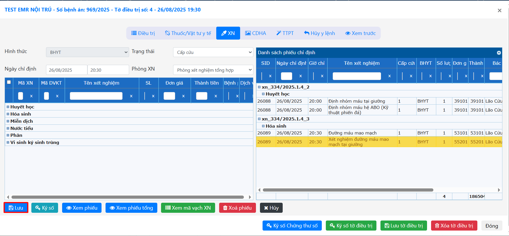  
**- Xóa 1 chỉ định trong phiếu chỉ định Xét nghiệm:** Nhấn phải chuột vào 1 chỉ định xét nghiệm cụ thể -> Nhấn xóa.  
 
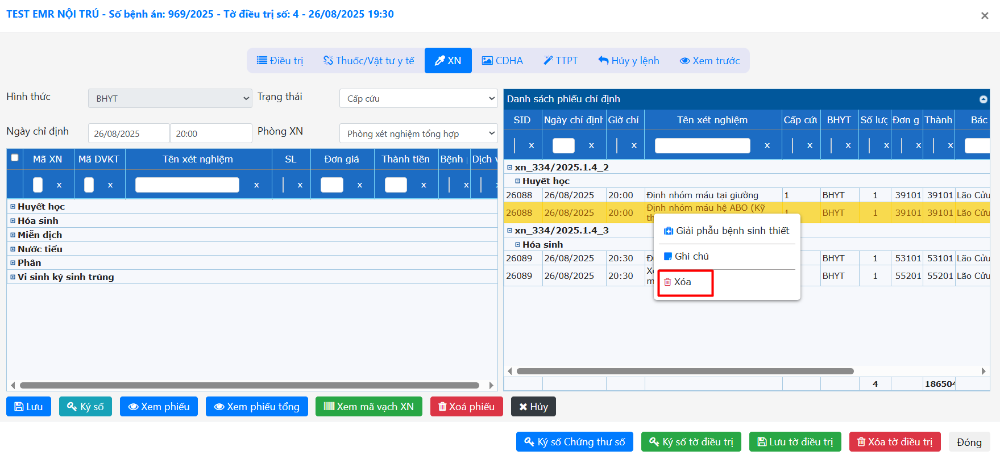  
**- Xóa phiếu chỉ định Xét nghiệm:** Chọn vào phiếu xét nghiệm cần xóa -> Nhấn **Xóa phiếu**.  
 
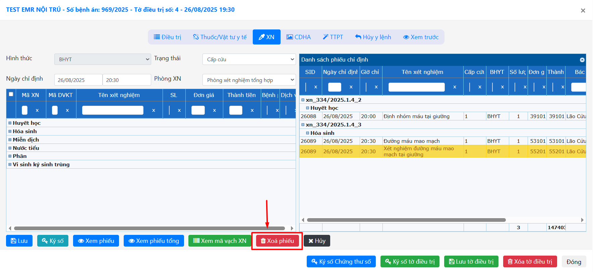  
**- Thêm ghi chú cho chỉ định Xét nghiệm:** Nhấn chuột phải vào chỉ định Xét nghiệm cần nhập ghi chú -> Chọn **Ghi chú** -> Nhập thông tin -> Nhấn **Cập nhật**.  

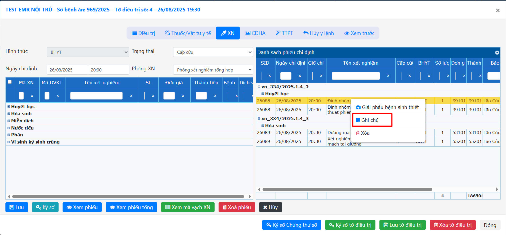  
Nhấn **Xem phiếu** để xem ghi chú chỉ định Xét nghiệm được thể hiện trên tờ điều trị.  
 
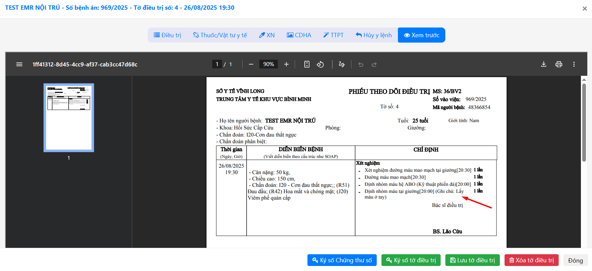  
**- Xem mã vạch:** Có chức năng in mã vạch của bệnh nhân dán lên ống xét nghiệm.  
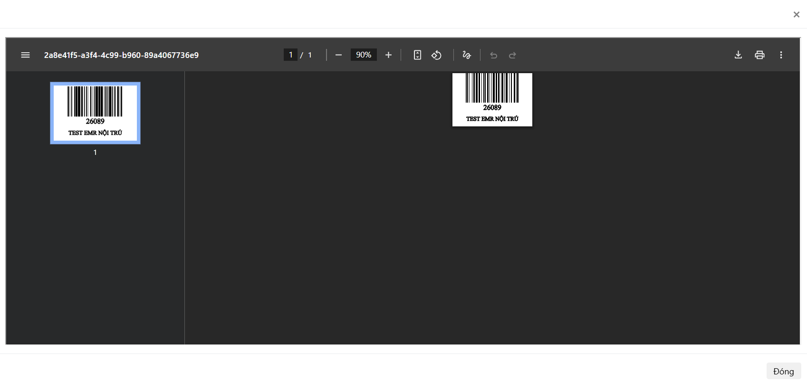   
**- Ký số chỉ định:** Sau khi cho chỉ định xét nghiệm, Bác sĩ nhấn **Ký số** phiếu chỉ định.  
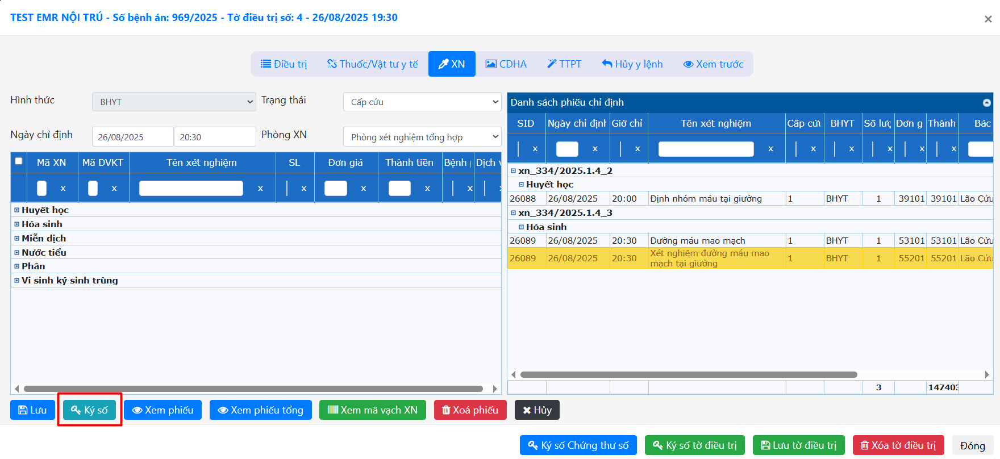   
Phiếu chỉ định sau khi được ký số  
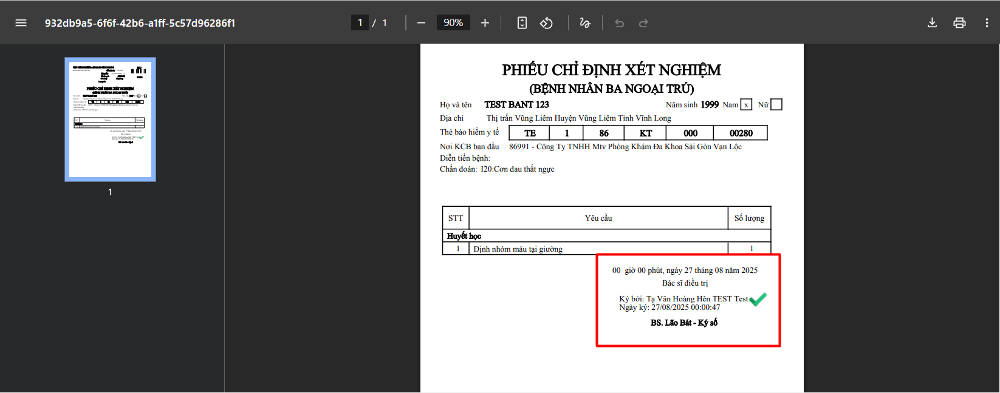  

**d. Chẩn đoán hình ảnh**: Chỉ định chẩn đoán hình ảnh thực hiện tương tự như chỉ định Xét nghiệm.  
**e. Thủ thuật/Phẫu thuật**: Chỉ định TTPT thực hiện tương tự như chỉ định Xét nghiệm.
**f. Hủy y lệnh (các tờ điều trị đã được ký số)**  
Khi Bác sĩ muốn hủy y lệnh: kê thuốc, cận lâm sàng nếu tờ điều trị trước đó đã ký số thì ko thể chỉnh sửa. Mà phải thực hiện như sau:  
Tạo tờ điều trị mới (Ở tab Điều trị nhấn chọn **Khám bệnh** -> Tạo phiếu) -> Chọn nút Hủy y lệnh  
&nbsp;&nbsp;&nbsp;&nbsp;
**- Hủy y lệnh thuốc:** Chọn tờ điều trị đã kí số cần hủy y lệnh thuốc -> Check chọn thuốc -> Nhấn **Lưu**  
 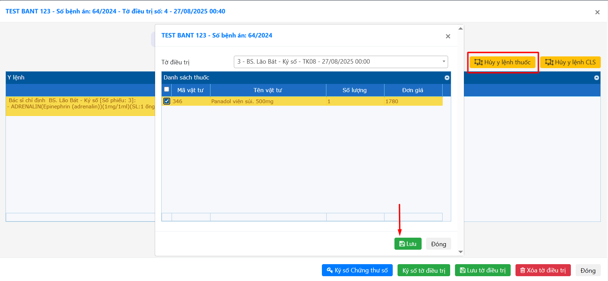  
&nbsp;&nbsp;&nbsp;&nbsp;
**- Hủy y lệnh CLS:** Chọn tờ điều trị đã ký số cần hủy y lệnh CLS -> Check chọn CLS -> Nhấn **Lưu**.  

 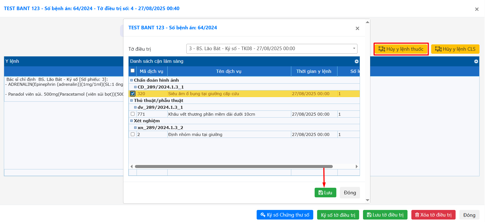  
Danh sách y lệnh đã được hủy  
 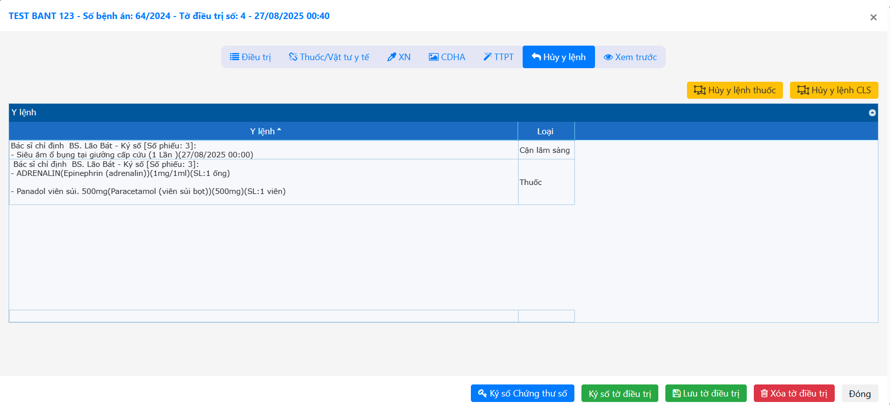  

**f. Hoàn trả thuốc**  
Đối với tờ điều trị trước đó ở trạng thái là **Đã lãnh thuốc** (phiếu đã tổng hợp dự trù), Bác sĩ cần hoàn trả thuốc trong tờ điều trị đó về kho.  
Nhấn phải chuột vào tờ điều trị cần hoàn trả -> Chọn **Cập nhật hoàn trả**.  
 
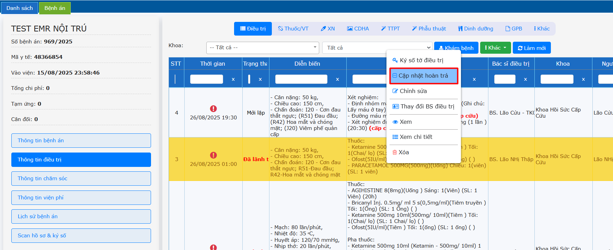  
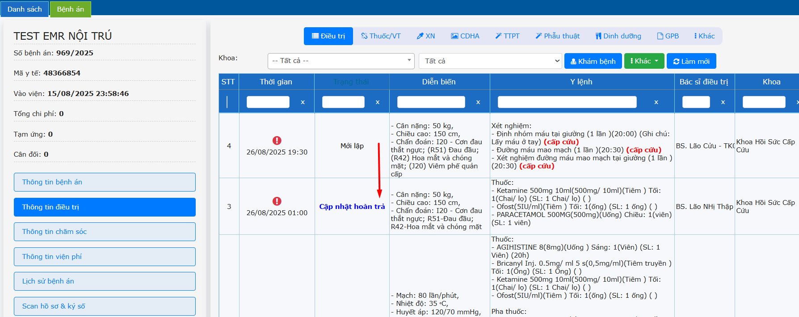  
- Tạo tờ điều trị mới -> Nhấn chọn **Hoàn trả thuốc**  
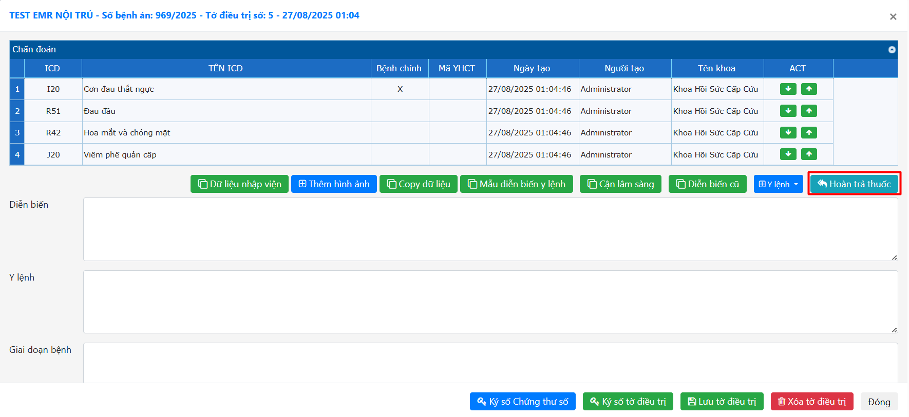  
- Chọn tờ điều trị đã cập nhập trạng thái hoàn trả thuốc -> Nhập tên thuốc, số lượng cần hoàn trả -> Nhấn **Enter** cho thuốc rớt xuống danh sách thuốc/vật tư hoàn trả.  
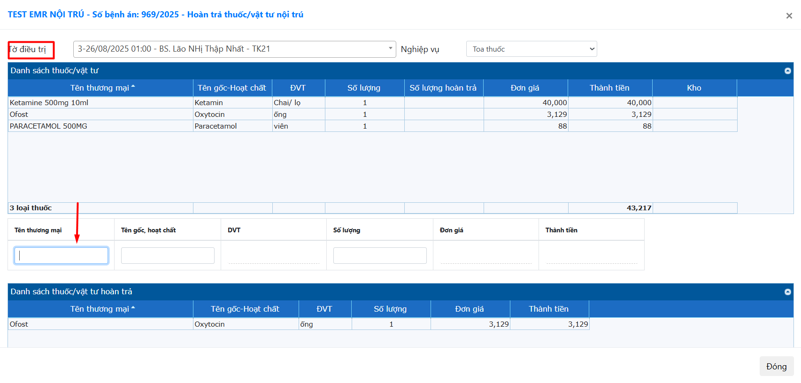  
- Tờ điều trị mới được hiển thị sau khi được hoàn trả.  
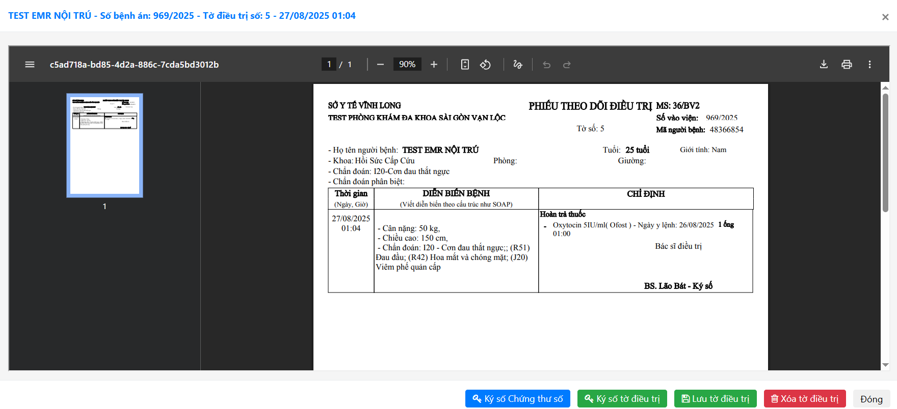  
-	Tổng hợp hoàn trả thực hiện như cũ.  
**g. Xem trước**  
- Xem trước tờ điều trị hiện tại, in hoặc tải xuống ở tờ điều trị đó.  
- Ký số tờ điều trị.  
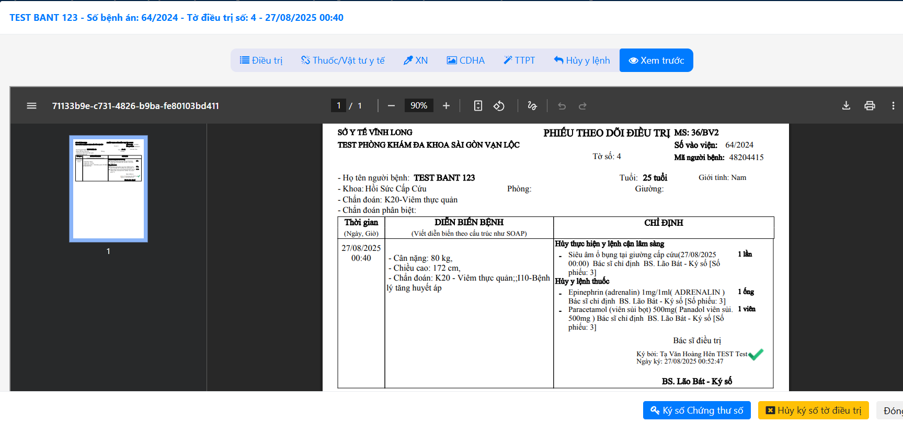   
**Lưu ý:** Tờ điều của Bác sĩ nào tạo thì Bác sĩ đó ký số.  
**h. Xem tờ điều trị tổng của bệnh nhân:**  
Ở tab Điều trị -> Nhấn chọn **Khác** -> **Tờ điều trị tổng**.  
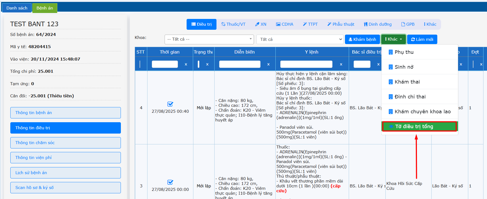  
Chọn ngày bắt đầu và ngày kết thúc tờ điều trị -> nhấn **Xem phiếu**.  
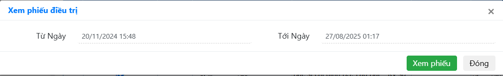  
Giao diện tờ điều trị tổng.  
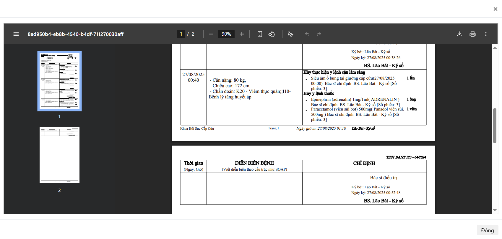  

