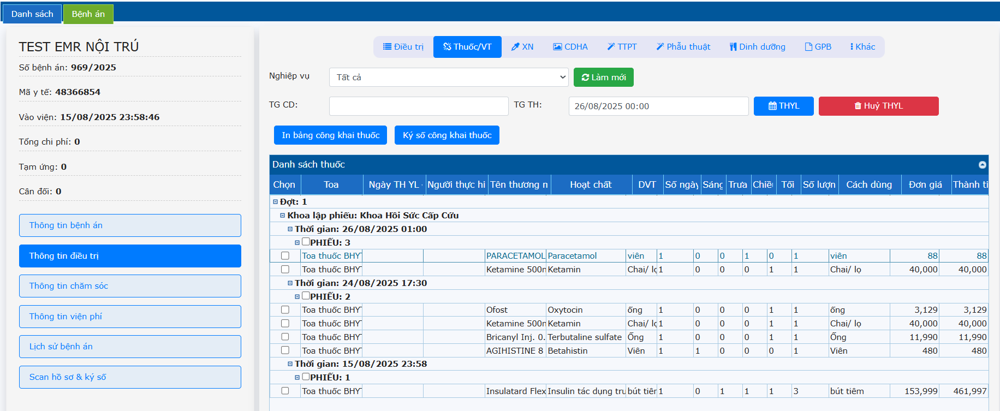
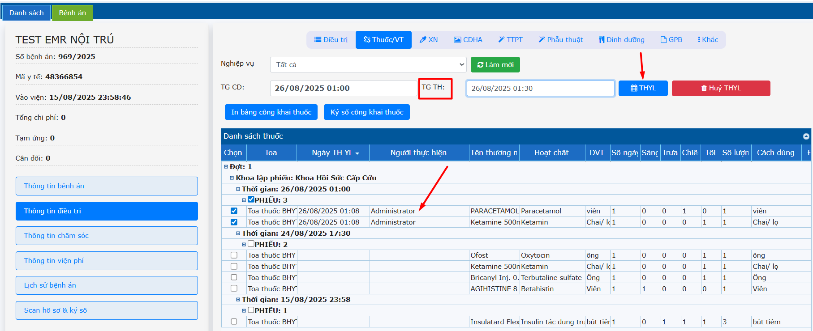
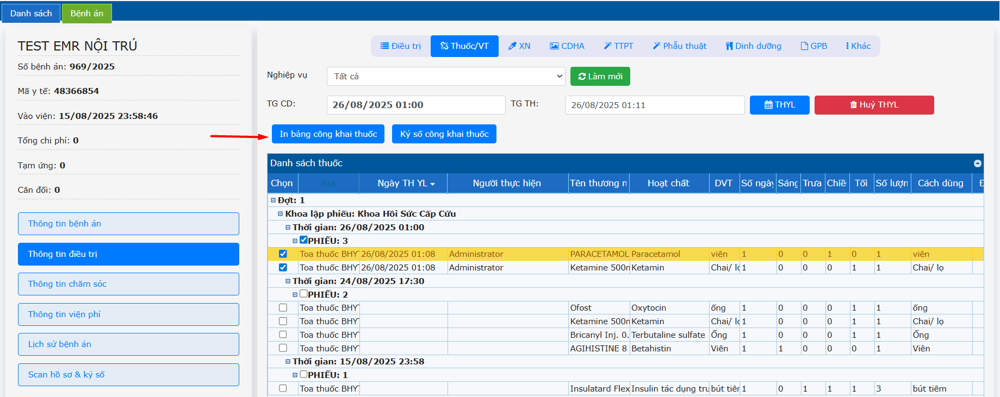
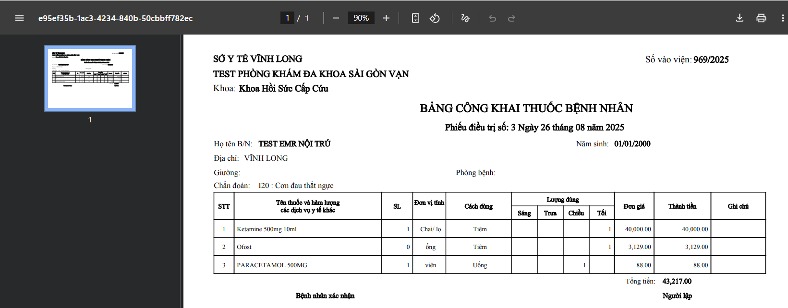
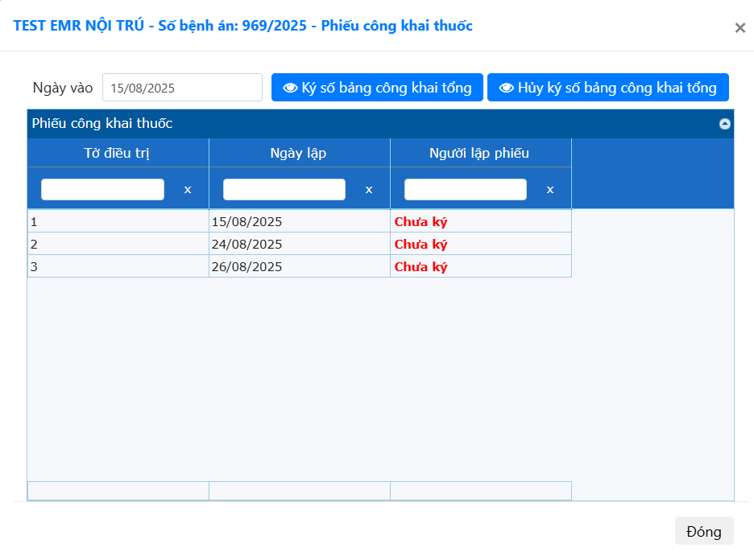

# 2.3 Thông tin điều trị
**2.3.2 Thuốc/Vật tư**    
**a. Thực hiện y lệnh thuốc** (Điều dưỡng)  
Sau khi Bác sĩ đã kê toa thuốc, vật tư ở từng tờ điều trị. Tab **Thuốc/VT** sẽ hiển thị các danh sách thuốc/vật tư theo ngày và theo số phiếu điều trị.  
   
- Điều dưỡng check chọn các thuốc hoặc các phiếu -> Điều chỉnh giờ thực hiện (nếu có) -> Nhấn **THYL**.  
   
Tên điều dưỡng được cập nhật vào trường **Người thực hiện**.  
  	
**b. In bảng công khai thuốc**  
Chọn phiếu cần in phiếu công khai thuốc -> Nhấn chọn **In bảng công khai thuốc**.  
  
**c. Ký số bảng công khai thuốc (ký scan)**  
Chọn **Ký số bảng công khai thuốc** -> Chọn **Ngày vào** -> **Ký số bảng công khai tổng** (Ký số Người lập phiếu) hoặc Nhấp chuột phải vào tờ điều trị -> Nhấn **Ký số người lập phiếu** → Chọn  file đã ký tươi và scan lên nhấn **Ký số**.  
  