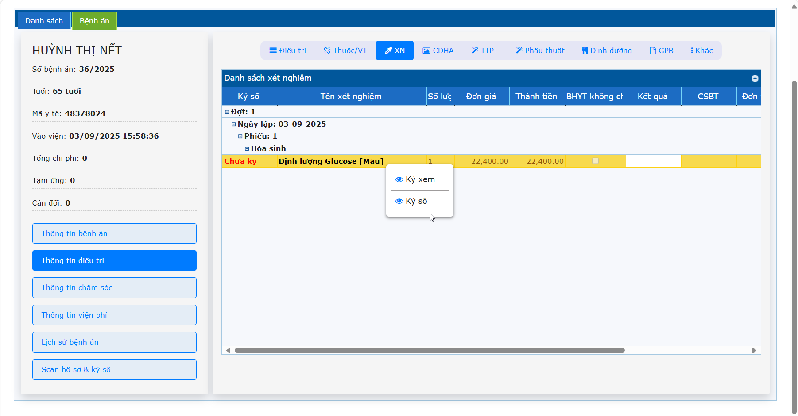

# 2.3 Thông tin điều trị
**2.3.3 Xét nghiệm**    
Khi Kỹ thuật viên/Bác sĩ đã thực hiện xét nghiệm bên phần mềm LIS (đã ký số và gửi kết quả về HIS).  
Ở Menu Thông tin điều trị -> Tab XN:  
- Trường hợp Bác sĩ cho chỉ định xét nghiệm và đồng thời cũng là người đọc kết quả xét nghiệm đó thì **Ký số** như sau: Nhấn phải chuột vào phiếu xét nghiệm đã có kết quả -> Nhấn chọn **Ký số**.  
- Trường hợp Bác sĩ cho chỉ định xét nghiệm ra trực, Bác sĩ khác vào trực xem kết quả xét nghiệm đó, Bác sĩ vào trực cần thao tác như sau: Nhấn phải chuột vào phiếu xét nghiệm đã có kết quả -> Nhấn chọn **Ký Xem**.  
   
