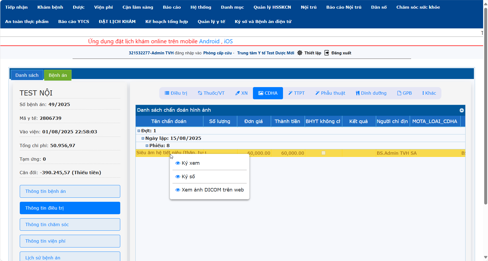

# 2.3 Thông tin điều trị
**2.3.4 Chẩn đoán hình ảnh**    
Ở Menu Thông tin điều trị -> Tab CĐHA:  
- Trường hợp Bác sĩ cho chỉ định CĐHA và đồng thời cũng là người đọc kết quả CĐHA đó thì **Ký số** như sau: Nhấn phải chuột vào phiếu CĐHA đã có kết quả -> Nhấn chọn **Ký số**.
- Trường hợp Bác sĩ cho chỉ định CĐHA ra trực, Bác sĩ khác vào trực xem kết quả CĐHA đó, Bác sĩ vào trực cần thao tác như sau: Nhấn phải chuột vào phiếu CĐHA đã có kết quả -> Nhấn chọn **Ký Xem**.  
- Bác sĩ cần xem hình ảnh chuẩn đoán được trả về kết quả về HIS: Nhấn phải chuột vào phiếu CĐHA đã có kết quả -> Nhấn **Xem ảnh DICOM trên web**.   
   
