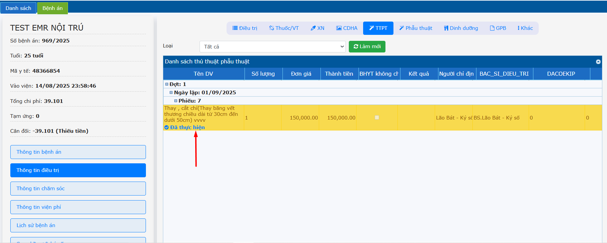

# 2.3 Thông tin điều trị
**2.3.5 TTPT**    
- Sau khi Bác sĩ đã cho chỉ định TTPT trong **Tờ điều trị**. Bác sĩ thực hiện thao tác **Cập nhật kết quả thủ thuật - phẫu thuật** ở menu **Cận lâm sàng -> Thủ thuật phẫu thuật -VLTL**.  
- Khi TTPT đã có kết quả, phần mềm sẽ hiển thị **Đã thực hiện**.  
   
   
