# 2.3 Thông tin điều trị
**2.3.6 Phẫu thuật**     
Bác sĩ cho chỉ định phẫu thuật vào tờ điều trị. Sau đó sang tab Phẫu thuật -> Thêm mới để thêm cuộc phẫu thuật.  
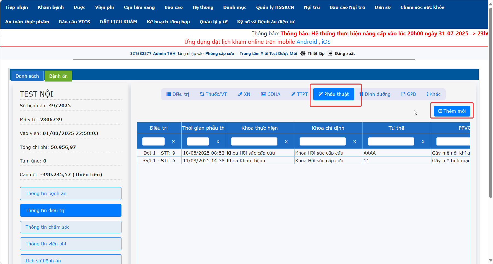   
Nhập tên ekip → **Thêm mới**  
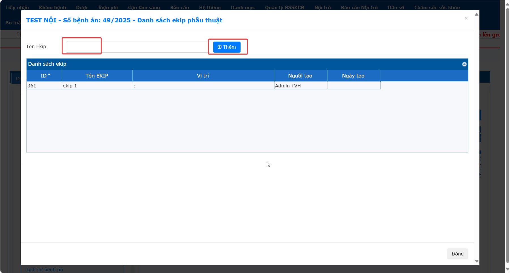  
Để nhập chi tiết ekip Bác sĩ nhấn phải chuột vào tên ekip chọn **Chi tiết EKIP**. Hoặc chọn **Xóa** nếu muốn xóa ekip.  
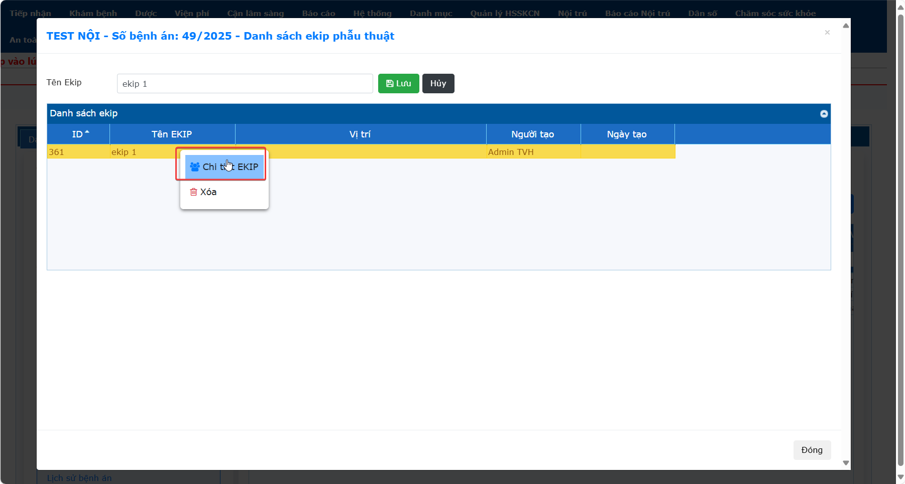  
Nhập ekip vào phần mềm -> nhấn **Lưu**  
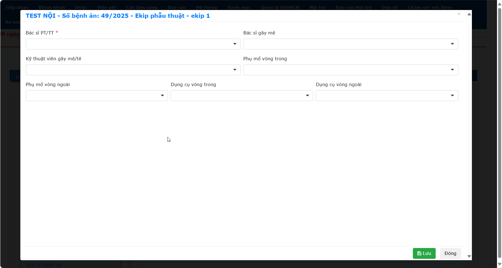  
**a. Thông tin**  
Nhập thông tin phẫu thuật -> nhấn **Lưu thông tin chung**.  
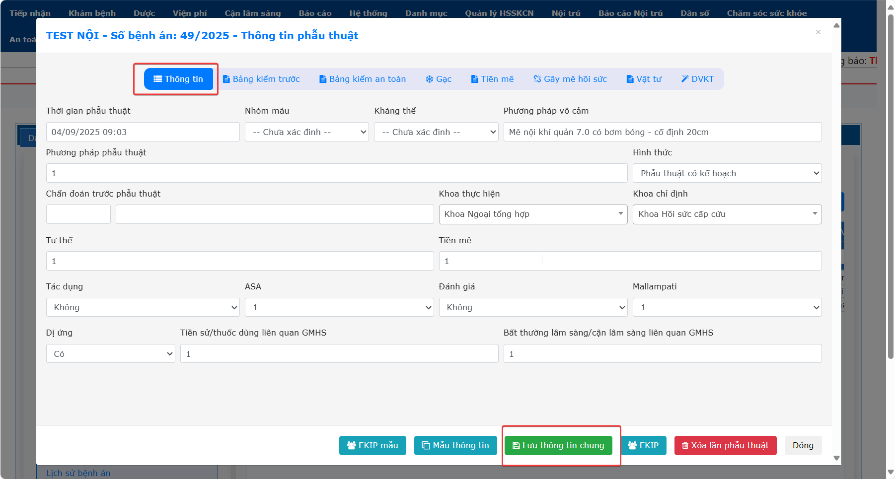  
**b. Bảng kiểm trước, Bảng kiểm an toàn**  
Nhập thông tin theo mẫu hồ sơ phẫu thuật của của bệnh viện -> **Thêm phiếu**.  
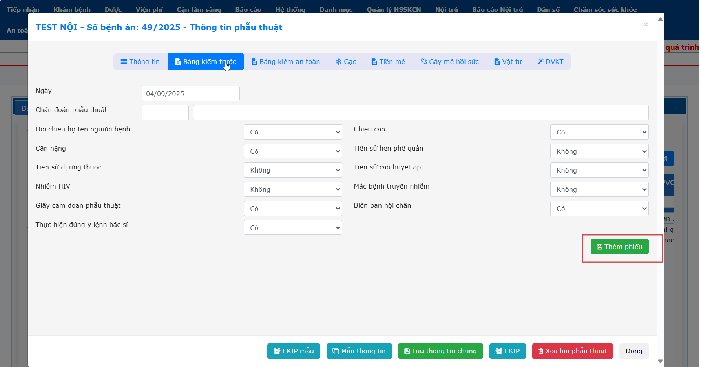  
**c. Gạc**  
Nhấn **Thêm phiếu** sau đó mới nhập thông tin.  Sau đó nhập **Tổng trước**, **Tổng sau** và **Kiểm gạc**.  
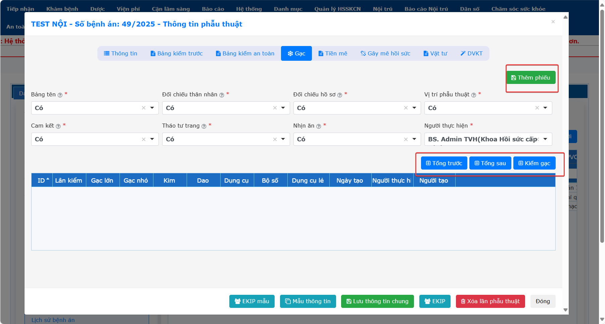  
**d. Tiền mê**  
Nhập tiền mê (nếu có).  
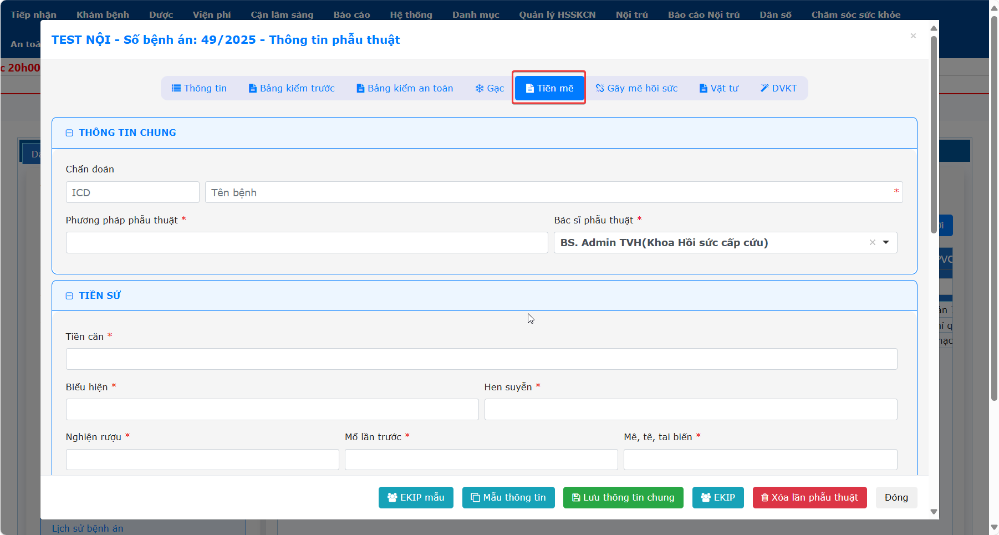  
**Lưu ý:** Sang tab **DVKT** đồng bộ dữ liệu từ tờ điều trị Bác sĩ đã cho chỉ định trước đó vào cuộc phẫu thuật.  
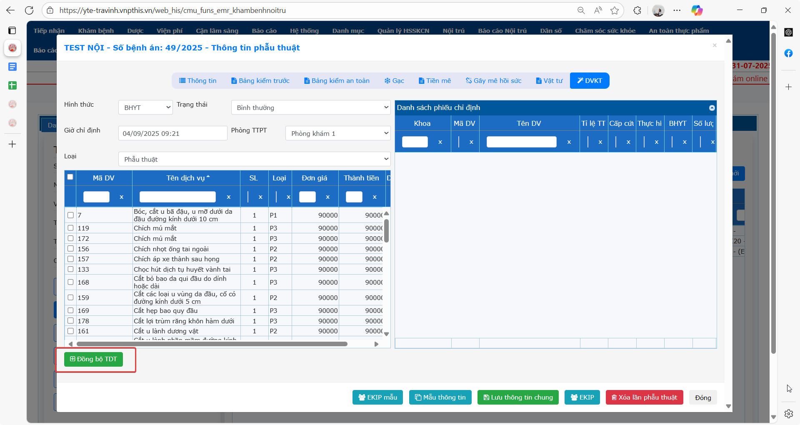  
**e. Gây mê hồi sức**  
Sang tab Gây mê hồi sức → nhấn **Thêm mới**.  
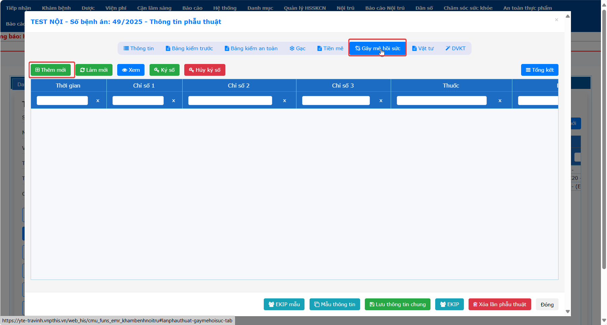  
Nhập thông tin và chọn hoạt động theo quy trình (theo dõi, bắt đầu mổ, đặt nội khí quản, ...).  
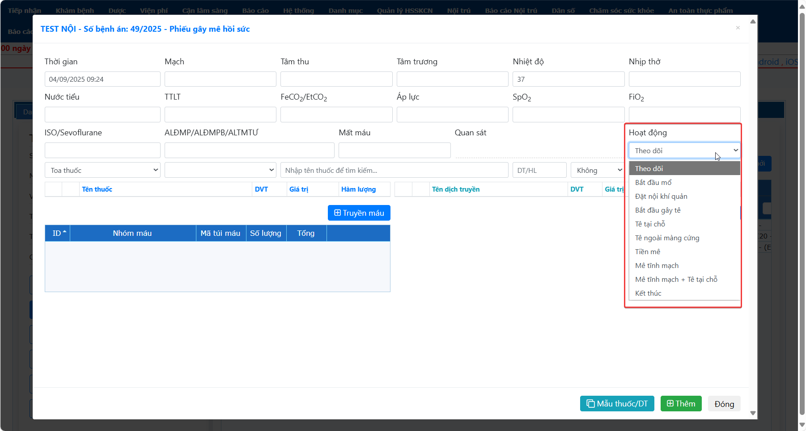  
Thêm phiếu tương tự theo hoạt động của phẫu thuật đang thực hiện.  
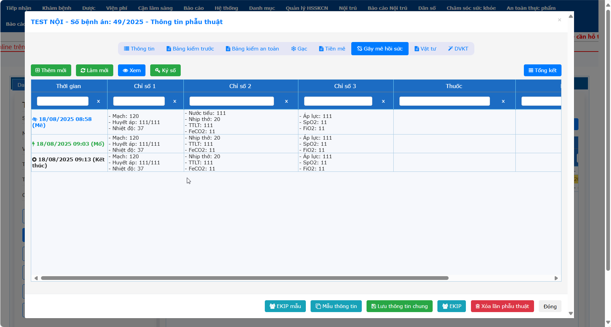  
Nhập tổng kết.  
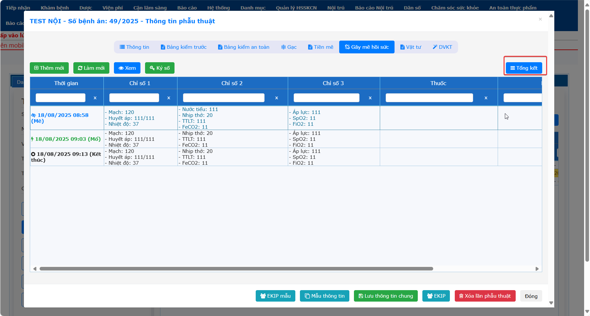  
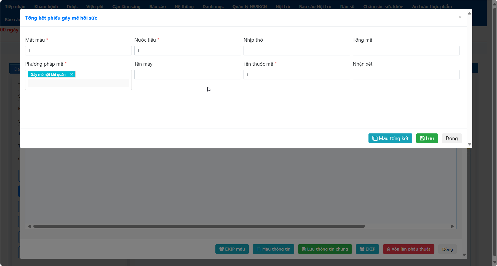  
**f. Vật tư**  
Nhập dược/vật tư nếu có trong phẫu thuật.  
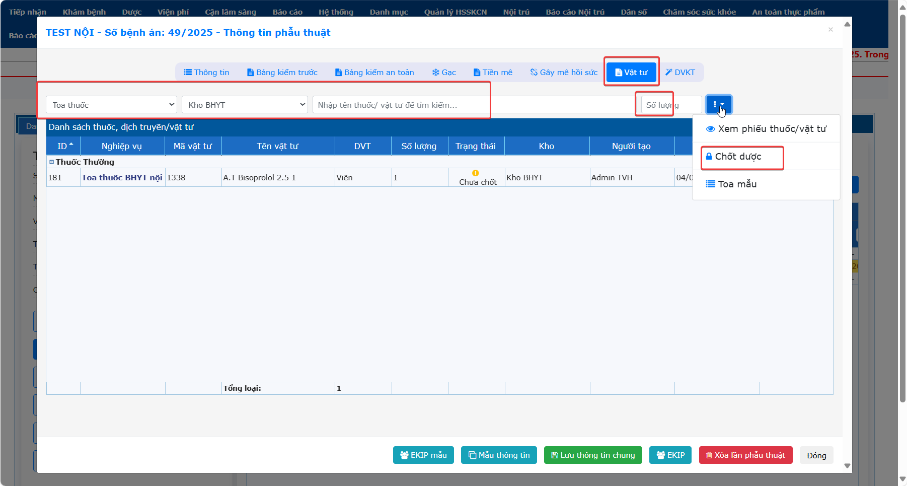  
**g. DVKT**  
Ở tab DVKT chọn Ekip và nhập tường trình TTPT bằng cách sau: Nhấn phải chuột vào chỉ định chọn **Ekip**  
  
Chọn ekip đã tạo trước đó rồi nhấn **Copy Ekip** và nhấn **Lưu**.  
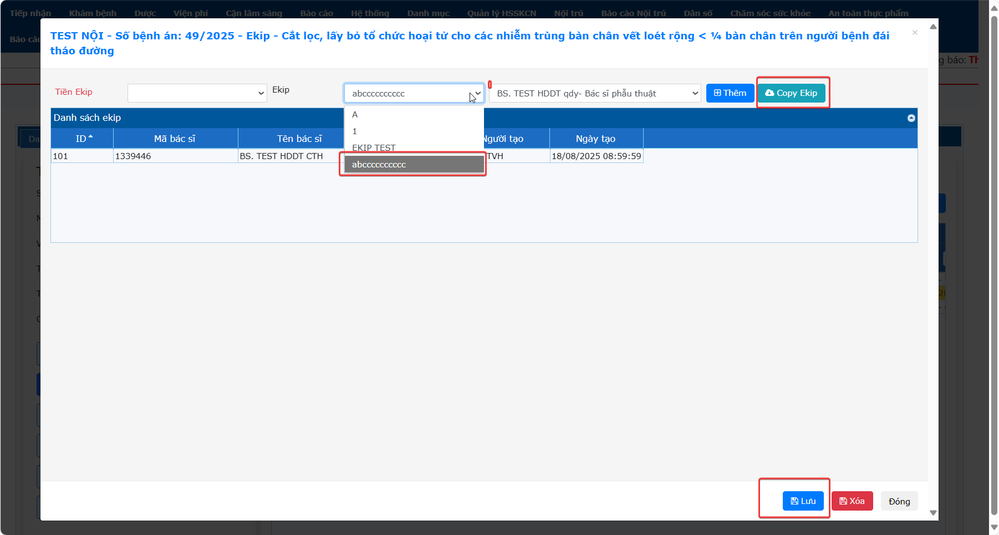  
Nhấn phải chuột vào chỉ định chọn **Tường trình**.  
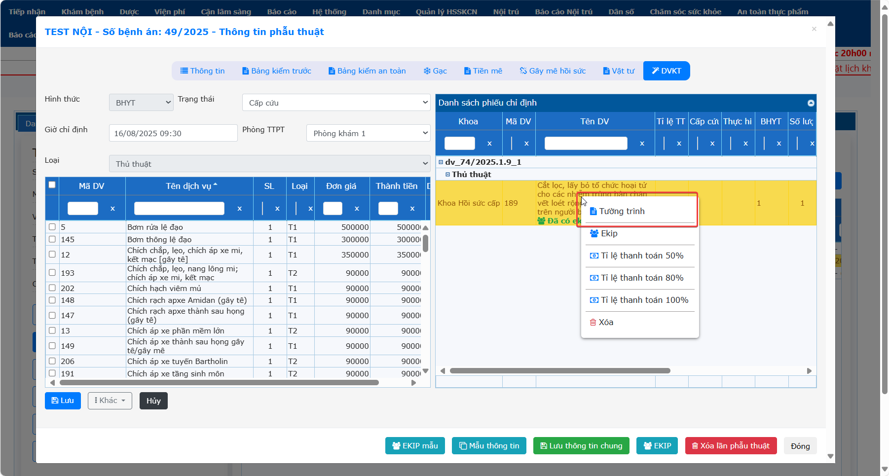  
Nhập  thông tin tường trình phẫu thuật -> Lưu.  
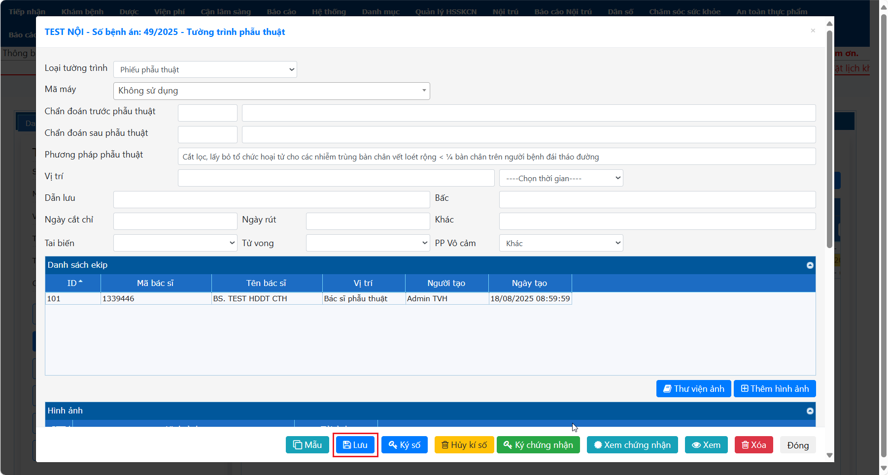  

