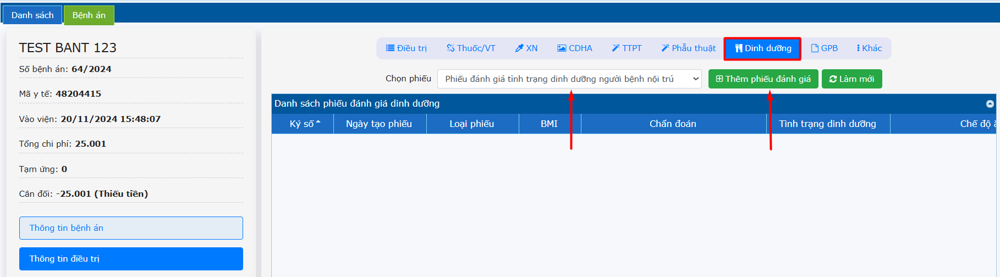
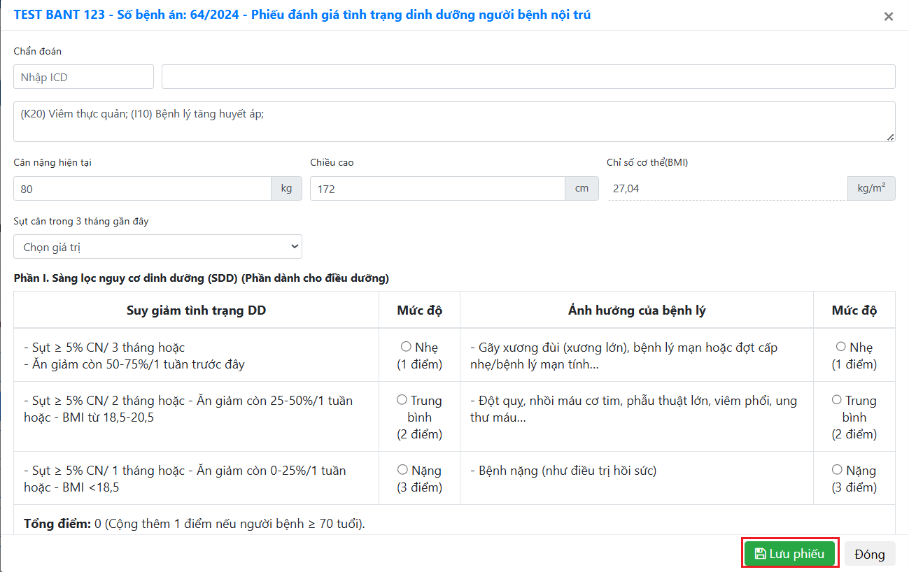
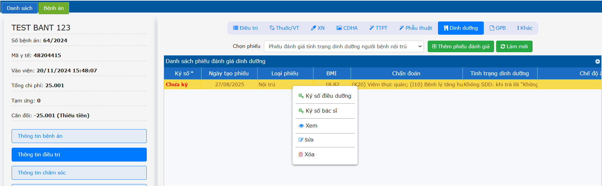

# 2.3 Thông tin điều trị
**2.3.7 Dinh dưỡng**     
Bác sĩ tạo phiếu đánh giá dinh dưỡng cho bệnh nhân. Ở tab **Dinh dưỡng** -> Chọn phiếu -> **Thêm phiếu đánh giá**.  
   
Nhập đầy đủ thông tin -> Nhấn **Lưu Phiếu**.  
   
Phiếu đã được thêm ở trạng thái chưa ký số. Tiến hành ký số như sau: Nhấn phải chuột phiếu đánh giá dinh dưỡng chọn:  
- Bác sĩ nhấn **Ký số bác sĩ**.    
- Điều dưỡng nhấn **Ký số điều dưỡng**.  
   
