# 2.3 Thông tin điều trị
**2.3.8 Khác**     
Ở phần này, ngoài các tờ chăm sóc, chỉ định CLS của Bác sĩ, sẽ có thêm các phiếu theo Thông tư **32/2023/TT-BYT ngày 31/12/2023**. Ví dụ : Phiếu cam kết chấp thuận phẫu thuật, thủ thuật và gây mê hồi sức, Phiếu sơ kết 15 ngày điều trị, Phiếu hội chẩn, ...  
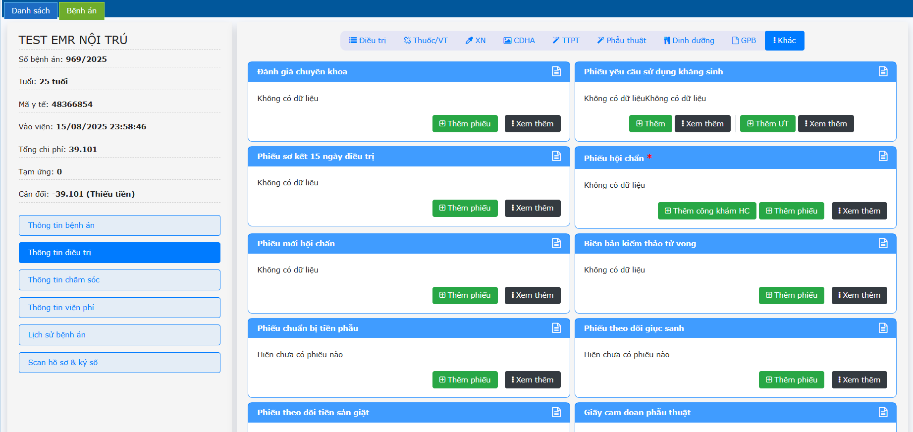   
- Đối với các phiếu này, Nhấn chọn **Thêm phiếu** -> Nhập đầy đủ thông tin -> Nhấn **Lưu**.  
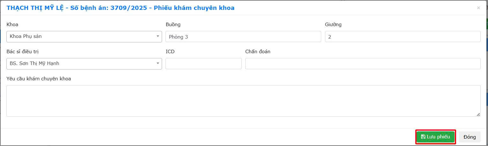   
- Để xem lại phiếu nhấn **Xem thêm**.  
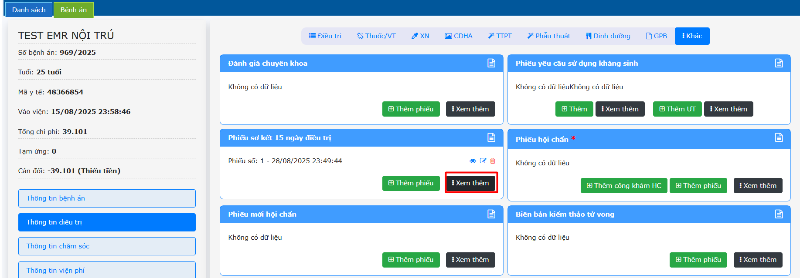   
- Nhấn phải chuột tên phiếu chọn **Ký số** đối với các phiếu trong form in có chữ ký (ví dụ: Phiếu bàn giao, Phiếu sơ kết 15 ngày điều trị, ...).  
- Ở từng phiếu sẽ có người ký khác nhau, người dùng cần đăng nhập đúng tài khoản và nhấn chọn vị trí ký cho phù hợp (ví dụ: Ký số trưởng khoa, Ký số bác sĩ, Ký số điều dưỡng, ...).  
- Đối với các phiếu cam đoan cần chữ ký của bệnh nhân hoặc người nhà bệnh nhân. Bác sĩ tạo phiếu  -> Điền đầy đủ thông tin -> In phiếu -> Bệnh nhân/Người nhà bệnh nhân/Bác sĩ/Điều dưỡng, ... ký tay -> Ký số & Scan phiếu.  
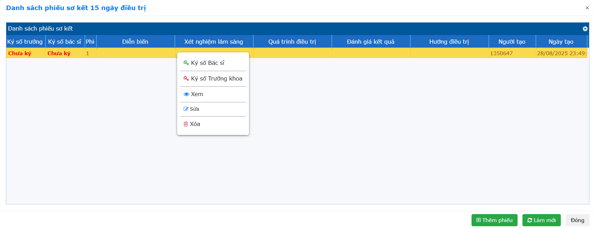   
**Lưu ý:** Các phiếu được tạo này chỉ được chỉnh sửa khi là tài khoản người tạo phiếu đó, các tài khoản còn lại chỉ có quyền xem hoặc ký số.  
**Phiếu bàn giao người bệnh chuyển khoa (dành cho Bác sĩ)**  
Tại Phiếu bàn giao người bệnh chuyển khoa (dành cho bác sĩ) nhấn **Thêm phiếu**.  
 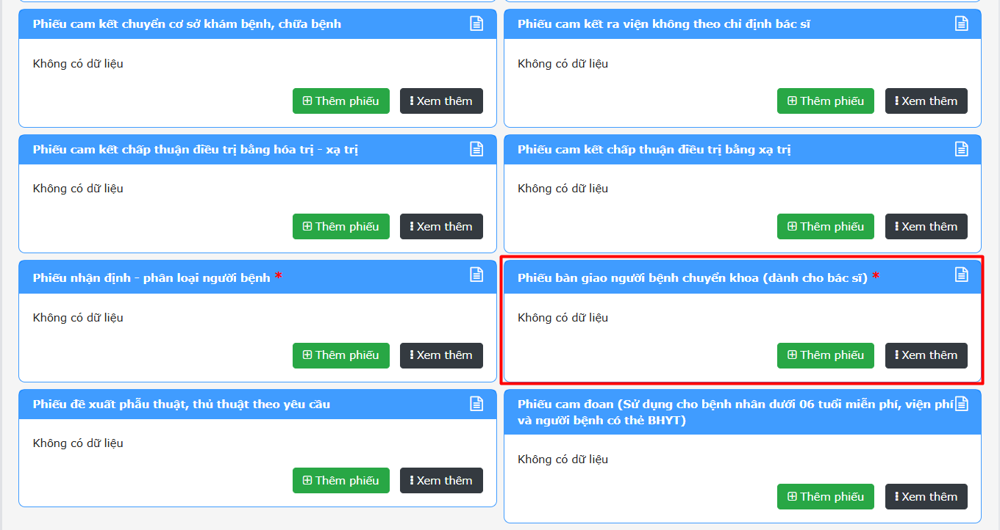  
**Trường hợp 1:** Bác sĩ khoa giao **đã chọn Bác sĩ khoa nhậ**n -> Bác sĩ khoa nhận chỉ cần vào phiếu bàn giao bác sĩ -> Ký số.  
- Bác sĩ bàn giao:  Nhập thông tin (có chọn tên Bác sĩ nhận) -> Nhấn **Lưu phiếu**.  
 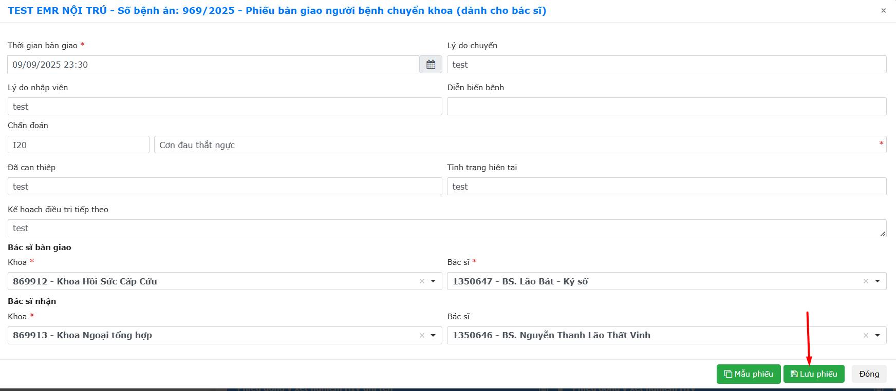  
Nhấn phải chuột vào phiếu -> Nhấn chọn **Ký số BS bàn giao**  
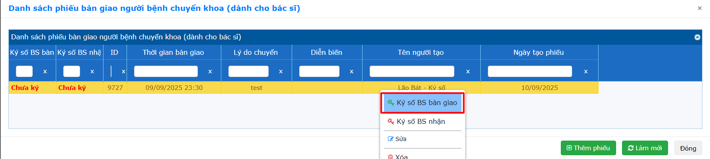  
- Bác sĩ nhận: Đăng nhập vào tài khoản bác sĩ nhận đã được chỉ định bàn giao -> nhấn phải chuột vào phiếu -> Ký số Bác sĩ nhận.  
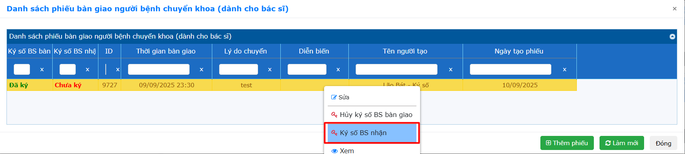  
**Trường hợp 2:** Bác sĩ khoa giao **chưa chọn Bác sĩ khoa nhận**  
- Bác sĩ bàn giao: Nhập thông tin (chưa biết Bác sĩ nào nhận nên chưa chọn) -> Nhấn **Lưu phiếu**.   
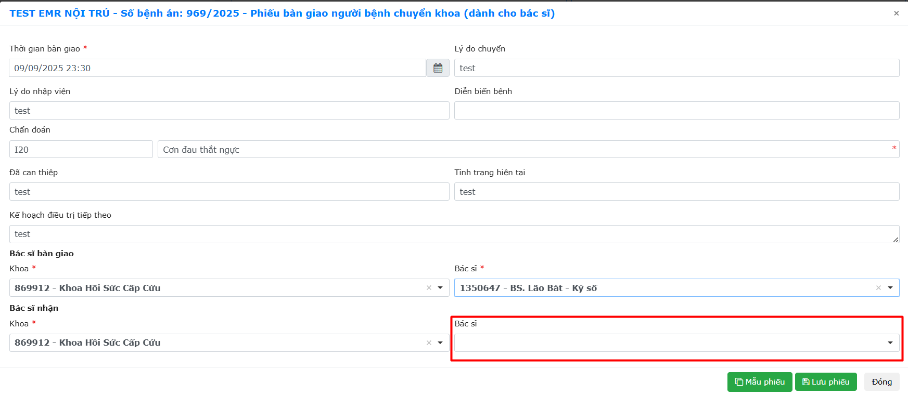  
Nhấn phải chuột vào phiếu -> Nhấn chọn **Ký số BS bàn giao**.  
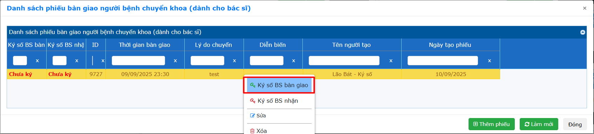  
- Bác sĩ nhận: Vào phiếu bàn giao -> Nhấn phải chuột vào phiếu -> Sửa -> Chọn tên Bác Sĩ nhận -> Lưu.  
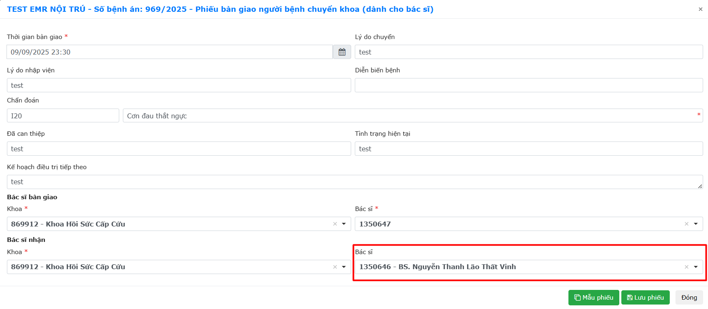  
Nhấn phải chuột vào phiếu -> **Ký số BS nhận**.  
  

