# 2.4 Thông tin chăm sóc
**2.4.1 Chăm sóc Cấp 2-3**     
Ở tab **CSC 2-3 mới** -> Nhấn chọn **Thêm** ở giao diện  
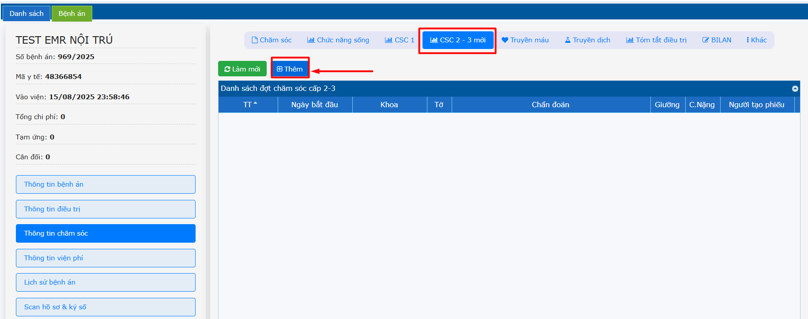  
Chọn ngày giờ bắt đầu cho lần chăm sóc 2-3 -> Nhấn **Tạo**  
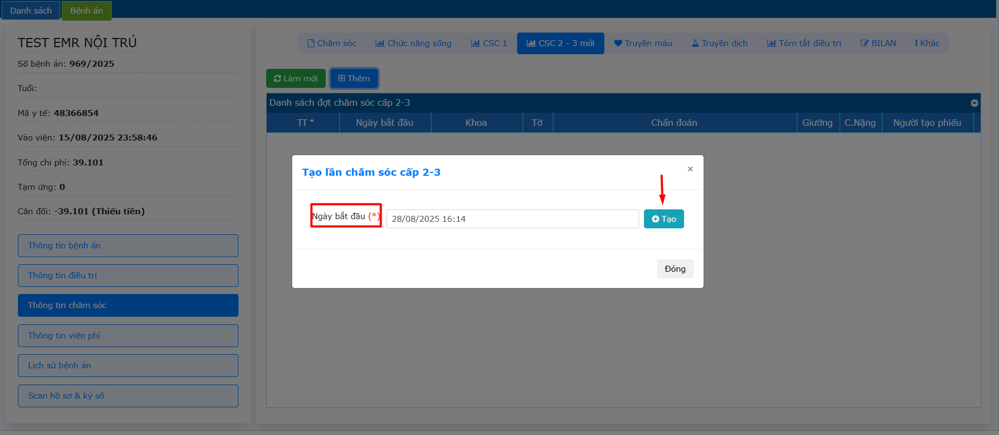  
**Thêm chi tiết:** Chọn tờ điều trị -> Lấy các thông tin sinh hiệu từ tờ điều trị qua.  
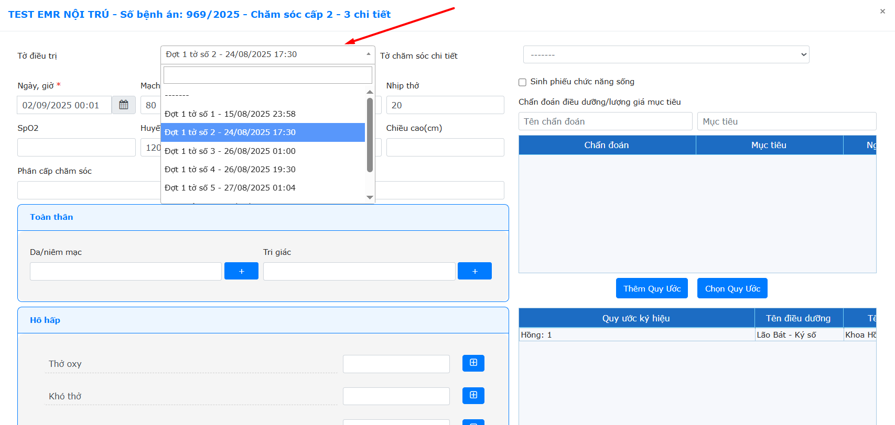  
Nhấn chọn các thông tin ở các ô (dấu cộng)  
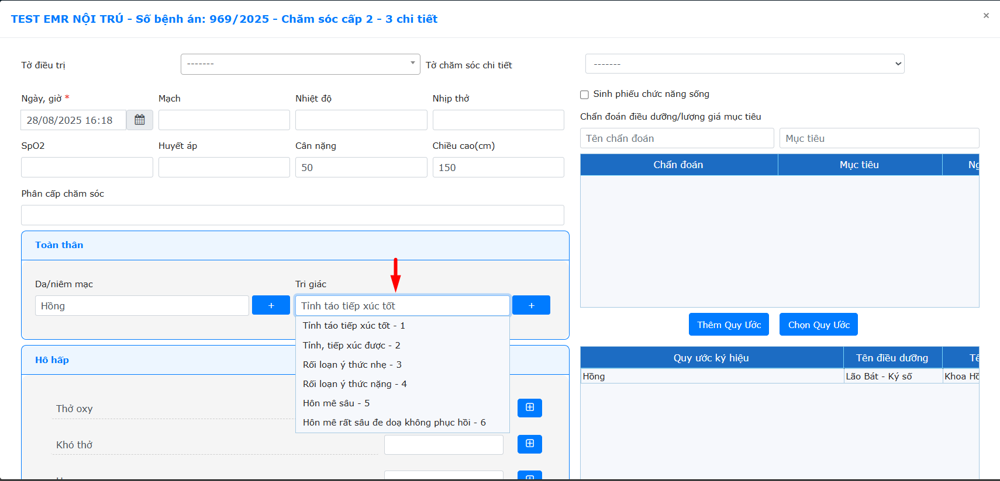  
Đối với các ô Nhập thông tin -> Nhấn **Thêm** -> Điền thông tin con (nếu có)  
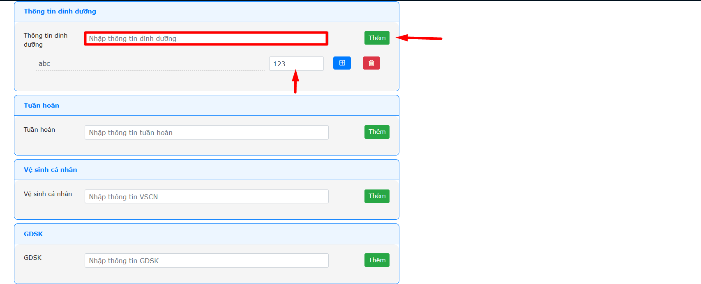   
**Chọn Quy Ước:** Chọn các quy ước theo quy trình -> Nhấn **Lưu**  
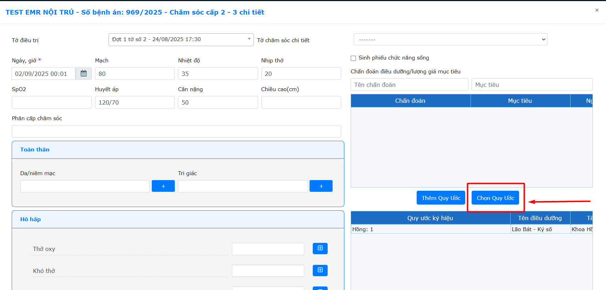    
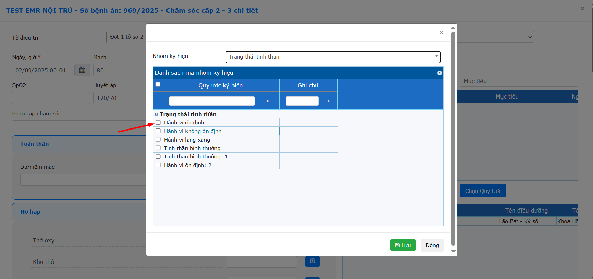    
Nhập Chẩn đoán và mục tiêu (nếu có) -> Nhấn **Enter** để thông tin được hiển thị dưới danh sách.  
**Lưu ý:** 1 chẩn đoán có thể có 1 hoặc tối đa 2 mục tiêu.  
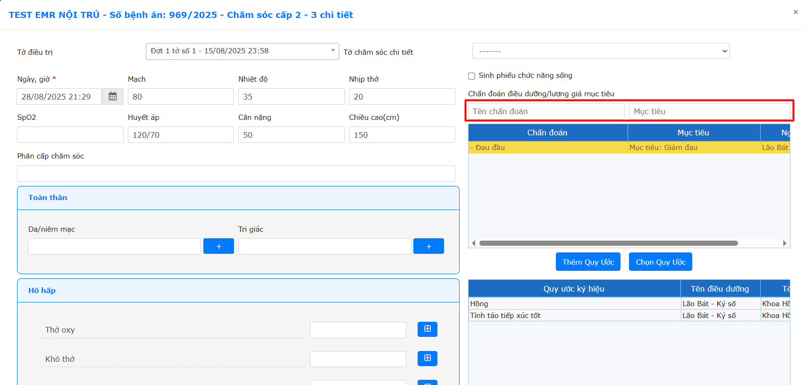    
Nhập Ghi chú và Thời gian (nếu có) -> Nhấn **Enter** để thông tin được hiển thị dưới danh sách.  
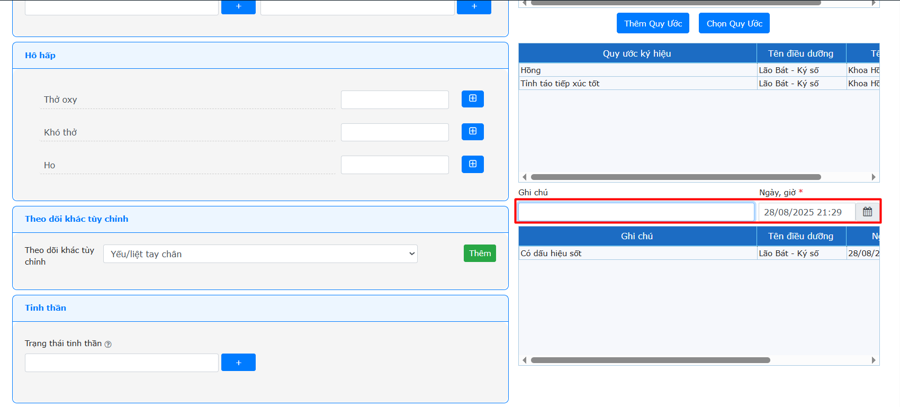    
Nhấn chọn **Thêm** hoặc **Thêm & ký số**  
Sau khi được thêm chi tiết, giao diện được hiển thị như hình, nhấn **Ký số** nếu thông tin chi tiết phiếu chăm sóc được điền đầy đủ và chưa được điều dưỡng chăm sóc ký.  
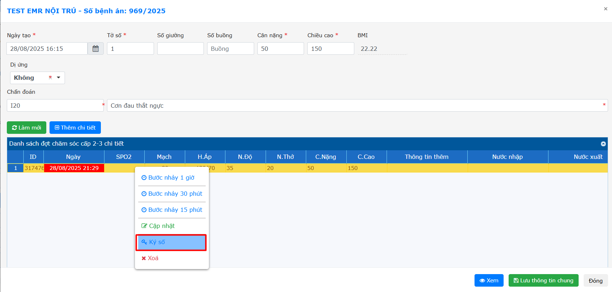  
Để có thể copy dữ liệu chi tiết và tự tính thời gian, hệ thống có chức năng **Bước nhảy 1 giờ**, **Bước nhảy 30p**, **Bước nhảy 15p**.  
Nhấn chọn bước nhảy -> Sửa lại thông tin chi tiết chăm sóc -> Nhấn **Thêm** hoặc **Thêm và ký số**.
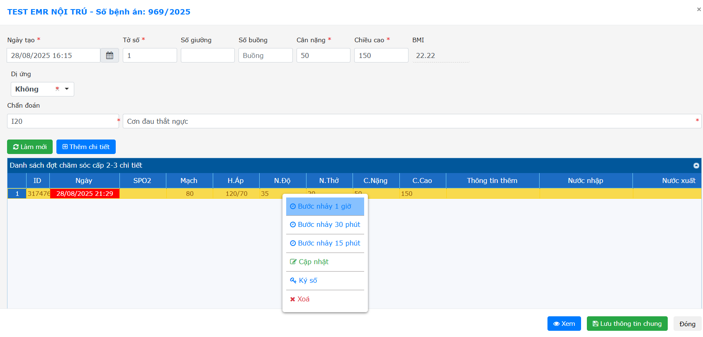  
Tùy vào quy trình có thể quy ước 3 chi tiết hoặc 6 chi tiết hiển thị cho 1 tờ chăm sóc.  
Sau khi nhập đủ 3 hoặc 6 chi tiết -> Nhấn **Lưu thông tin chung**.  
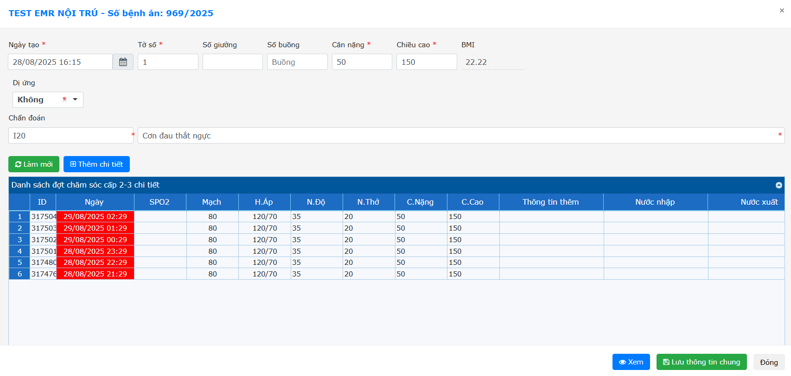  
Nhấn chọn **Kết thúc** khi đã đủ 3 hoặc 6 cột chi tiết chăm sóc.  
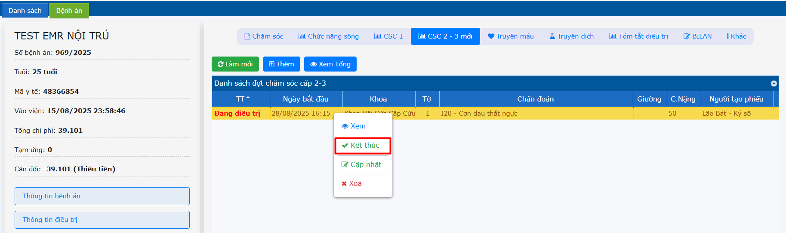  
Để xem tổng tờ chăm sóc -> Click chọn hàng chăm sóc cần xem -> Nhấn chọn **Xem tổng**.  
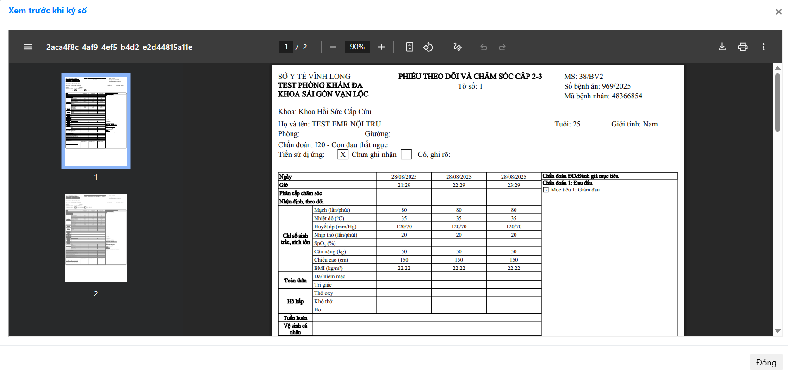  
**Để có mẫu chung để sử dụng lại cho những lần sau:**  
Sau khi nhập đủ 1 phiếu chăm sóc đầy đủ thông tin chi tiết lưu lại xong → nhấn phải chuột chọn **Cập nhật**  
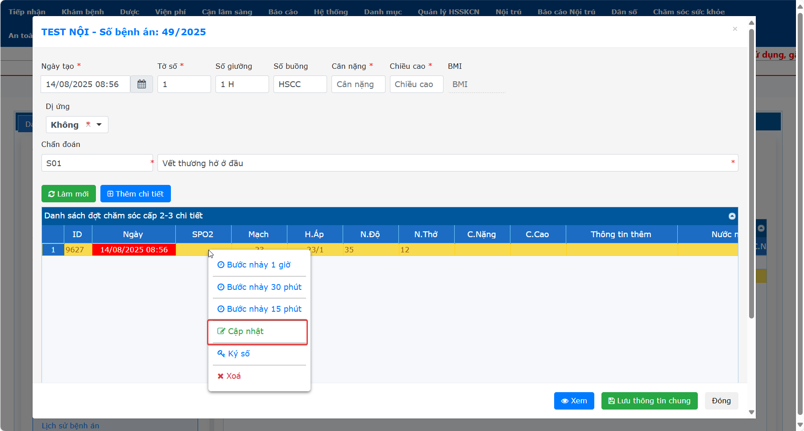  
Chọn lưu **Lưu mẫu**  
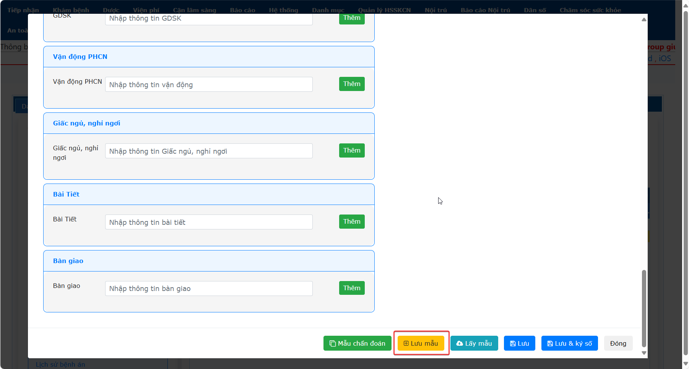  
Những lần sau khi tạo tờ chăm sóc tổng cần lấy lại dữ liệu con sẽ chọn **Lấy mẫu** để lấy lại dữ liệu (có thể điều chỉnh lại trước khi lưu).  
   
**Lưu ý:** Lấy mẫu Cho mỗi lần tạo tờ chăm sóc tổng, Mẫu chăm sóc sẽ hiện theo khoa.

  

