# 2.4 Thông tin chăm sóc
**2.4.2 Chăm sóc Cấp 1**     
Ở Tab CSC1, nhấn **Thêm** để tạo phiếu chăm sóc cấp 1 mới.  
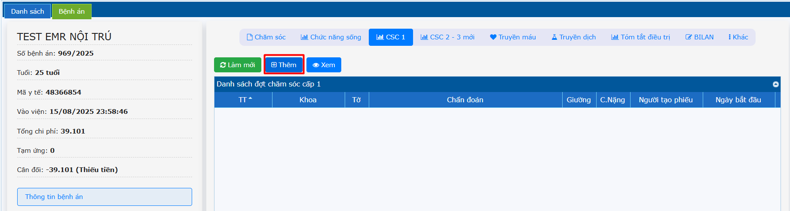  
Chọn ngày bắt đầu -> Nhấn **Tạo**.  
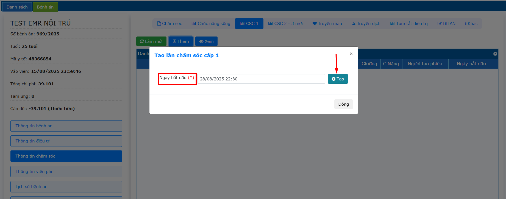  
Tương tự phiếu CSC 2-3, Nhấn chọn **Thêm chi tiết**  
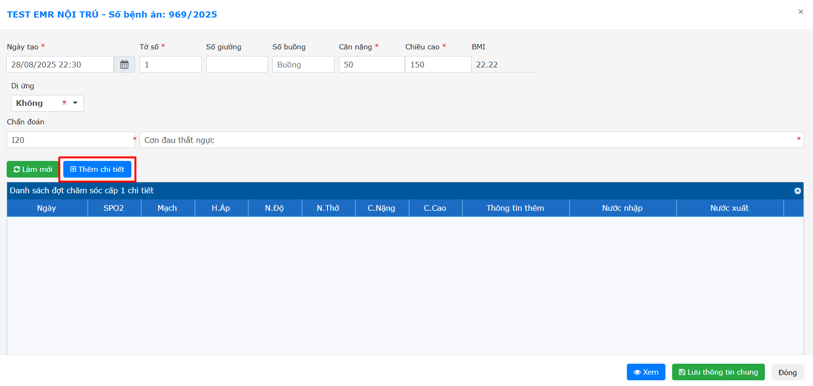  
Nhập chỉ số sinh hiệu, nhấn chọn các thông tin.  
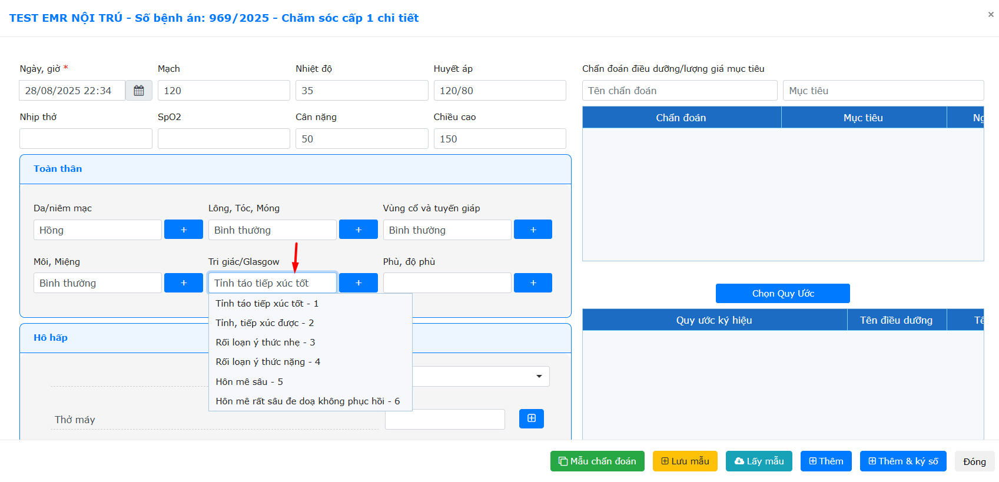  
Nhấn chọn thông tin -> Nhấn **Thêm** -> Điều các thông tin chi tiết.  
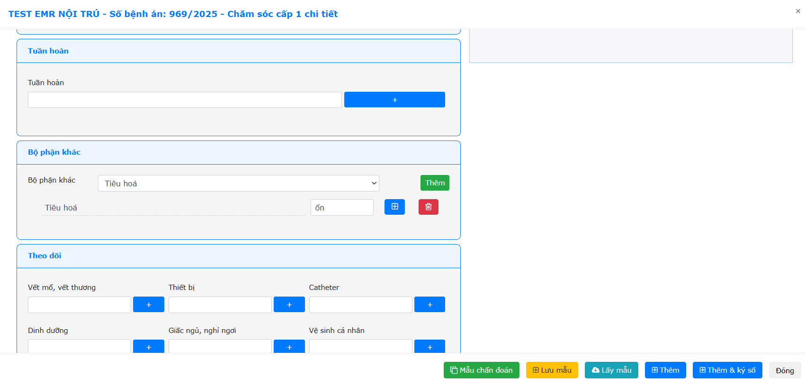  
Nhập chuẩn đoán và mục tiêu (Nếu có), 1 chuẩn đoán có thể có 1 hoặc 2 mục tiêu.  
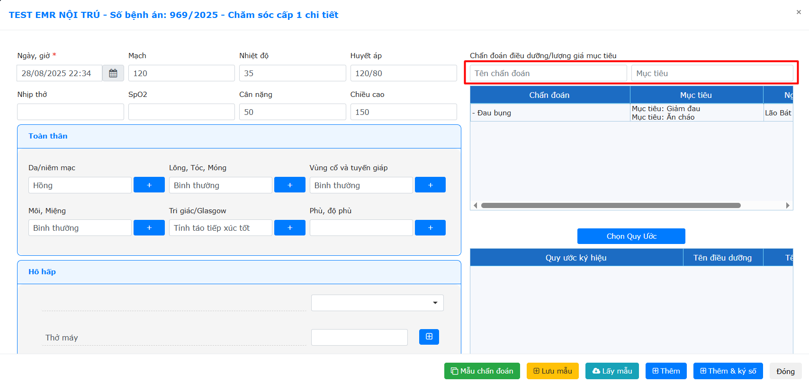  
Chọn quy ước  
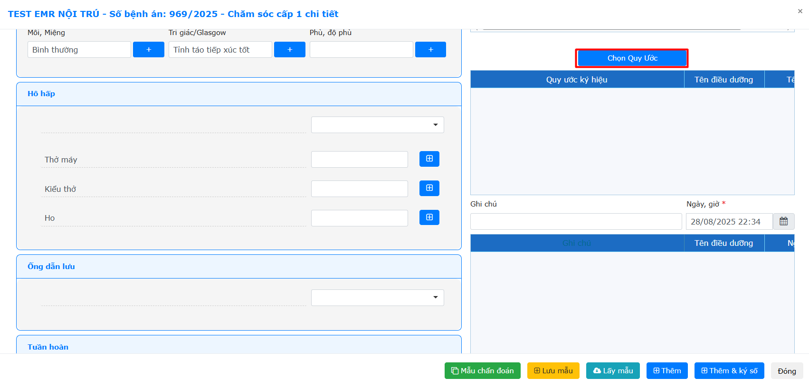  
Nhập ghi chú và ngày giờ (Nếu có) -> Nhấn **Thêm** hoặc **Thêm và ký số**  
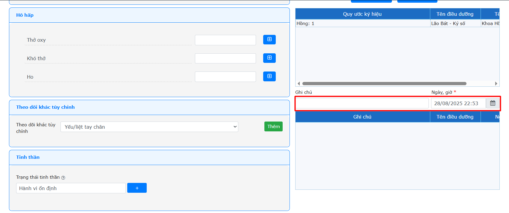  
Tương tự Phiếu CSC 2-3, Phiếu CSC1 có thể copy dữ liệu chi tiết và tự tính thời gian, hệ thống có chức năng **Bước nhảy 1 giờ**, **Bước nhảy 30p**, **Bước nhảy 15p**.  
Sau khi thêm xong các cột chi tiết cho phiếu CSC1 -> Nhấn **Lưu thông tin chung** để lưu dữ liệu.  
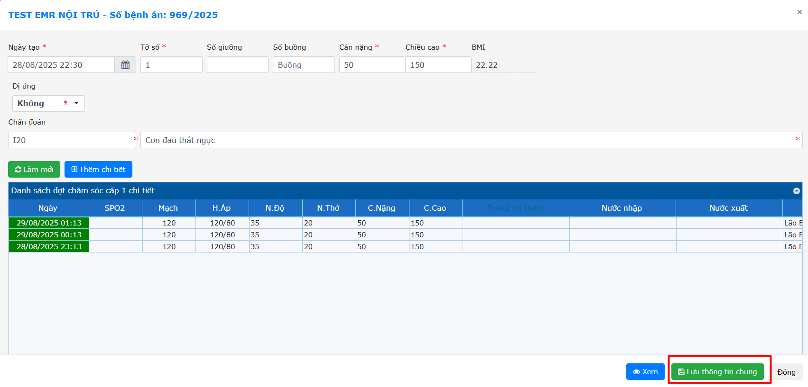  
Để xem phiếu CSC1, nhấn chuột vào phiếu cần xem -> Chọn **Xem**  
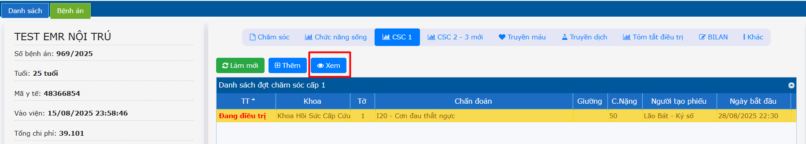  
Khi điều dưỡng đã nhập đủ các cột chi tiết cho phiếu CSC1 -> nhấn phải chuột vào phiếu -> Nhấn **Kết thúc**.  
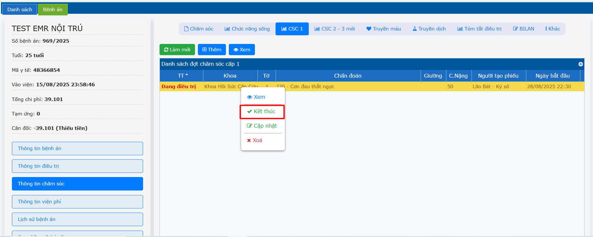  

