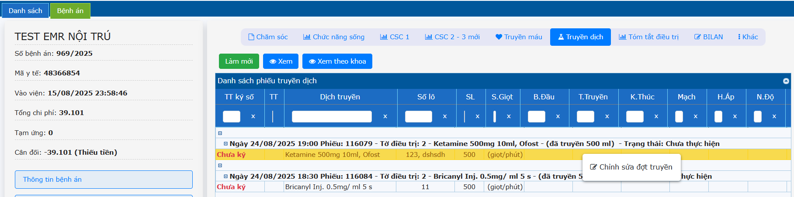
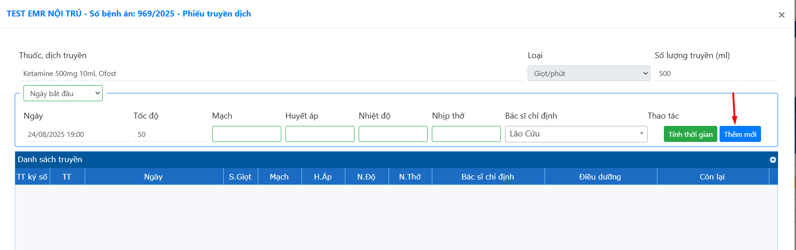
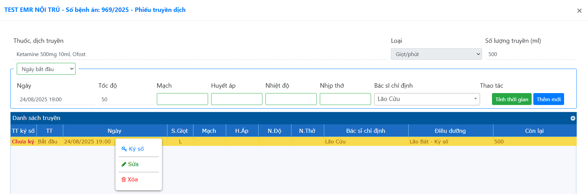
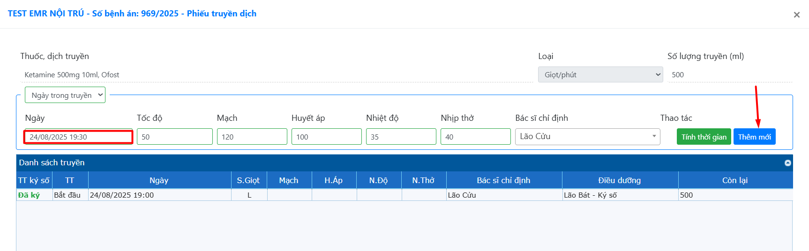
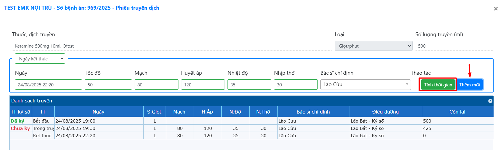
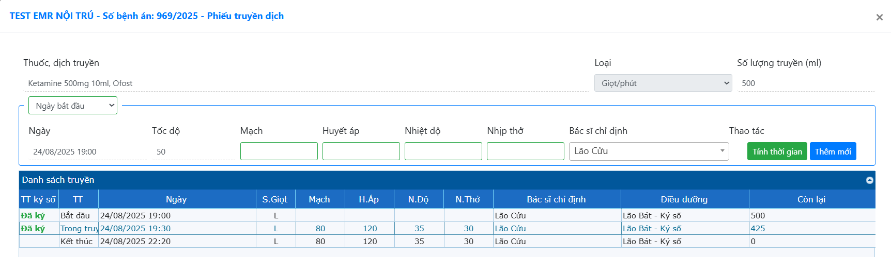
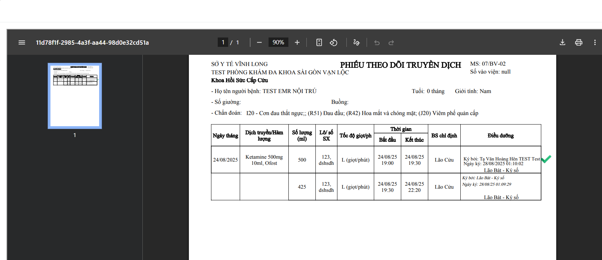

# 2.4 Thông tin chăm sóc
**2.4.3 Truyền dịch**     
Khi Bác sĩ đã cho chỉ định truyền dịch ở tờ điều trị, Tab Truyền dịch của điều dưỡng sẽ hiện thông tin thuốc cần truyền.  
Để chỉnh sửa đợt truyền -> Chuột phải vào tên thuốc -> Chọn **Chỉnh sửa đợt truyền**  
  
**Ngày bắt đầu truyền dịch: KÝ SỐ.**  
Được lấy từ thời gian chỉ định của bác sĩ -> không thể chỉnh giờ ngày bắt đầu thực hiện truyền dịch, tốc độ và số ml.  
Nhập đầy đủ thông tin chỉ số sinh hiệu -> Nhấn chọn **Thêm mới**  
  
Nhấn phải chuột vào dòng trạng thái bắt đầu -> Chọn **Ký số**  
  
**Ngày trong truyền:  KÝ SỐ**  
Trong quá trình truyền, bệnh nhân có chuyển biến mới, bác sĩ tạo tờ điều trị mới chỉ định y lệnh là 19h30 cần tăng tốc độ truyền dịch 50 giọt/phút.  
Chọn **Ngày trong truyền** -> Nhập lại Ngày giờ theo chỉ định bác sĩ là 19h30 -> Nhập chỉ số sinh hiệu -> Nhấn chọn **Thêm mới**  
  
**Ngày kết thúc:**  
Chọn **Tính thời gian** hệ thống tự động cập nhậu giờ kết thúc dựa trên số lượng ml truyền và tốc dộ.  
  
Ngày kết thúc sau khi thêm xong.  
  
Hiển thị phiếu theo dõi truyền dịch.  
  
