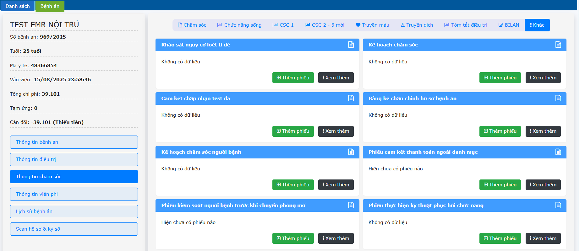
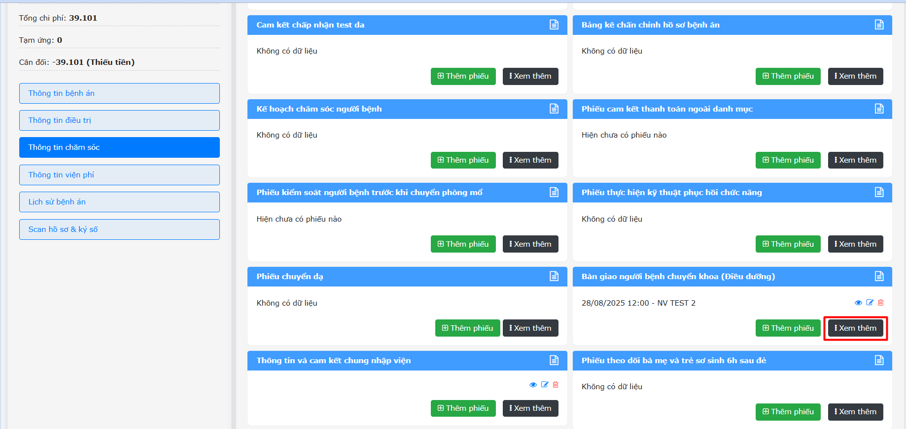
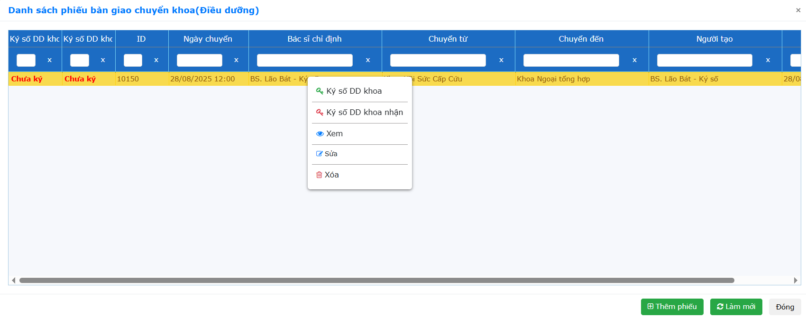
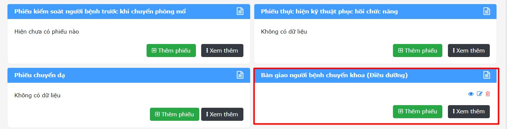
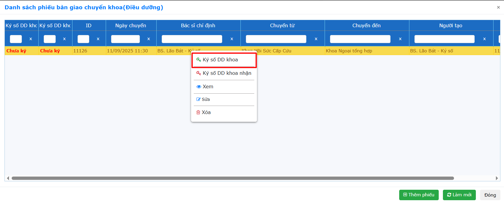
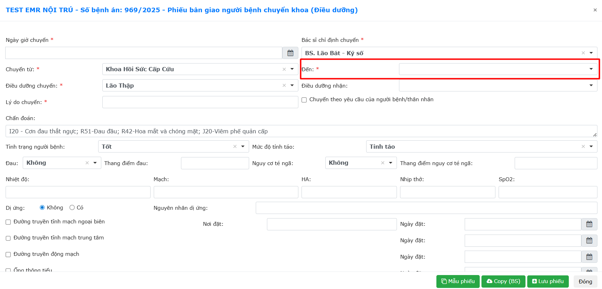
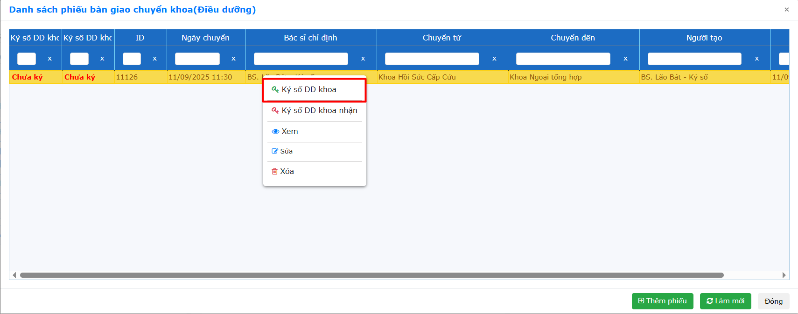
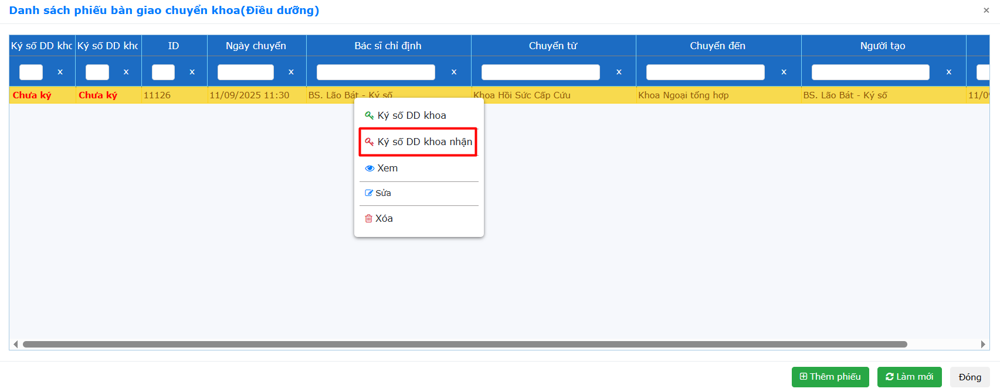

# 2.4 Thông tin chăm sóc
**2.4.4 Khác**     
Ở phần này, ngoài các phiếu chăm sóc của điều dưỡng sẽ có các phiếu theo 32/2023/TT-BYT ngày 31/12/2023. Ví dụ: Phiếu bàn giao người bệnh (điều dưỡng).  
  
Đối với các phiếu này, Nhấn chọn **Thêm phiếu** -> Nhập đầy đủ thông tin -> Nhấn **Lưu**.  Để xem lại phiếu nhấn **Xem thêm**.  
  
Nhấn phải chuột **Ký số** đối với các phiếu.  
  
**Lưu ý:** Các phiếu được tạo này chỉ được chỉnh sửa khi là tài khoản người tạo phiếu đó, các tài khoản còn lại chỉ có quyền xem hoặc ký số.  
**PHIẾU BÀN GIAO NGƯỜI BỆNH CHUYỂN KHOA (ĐIỀU DƯỠNG)**  
Ở danh mục Khác, Nhấn **Thêm phiếu** tại Phiếu bàn giao người bệnh chuyển khoa (Điều dưỡng).   
  
**- Trường hợp 1:** Điều dưỡng khoa giao đã chọn Điều dưỡng khoa nhận -> Điều dưỡng khoa nhận chỉ cần vào phiếu bàn giao điều dưỡng -> Ký số.  
**+ Điều dưỡng bàn giao:**  Nhập thông tin (có chọn tên điều dưỡng nhận) -> Nhấn **Lưu phiếu**. Nhấn phải chuột vào phiếu -> Nhấn chọn **Ký số DD khoa**.  
  
**+ Điều dưỡng nhận:** Đăng nhập vào tài khoản điều dưỡng nhận đã được chỉ định bàn giao -> Chuột phải vào phiếu -> **Ký số DD khoa nhận**.  
  
**Trường hợp 2:** Điều dưỡng khoa giao chưa chọn Điều dưỡng khoa nhận (Do không biết điều dưỡng nào hiện tại đang trực ở khoa cần chuyển).     
**+ Điều dưỡng bàn giao:** Nhập thông tin (không chọn điều dưỡng nhận) -> Nhấn **Lưu phiếu**.  
  
Nhấn phải chuột vào phiếu -> Nhấn chọn **Ký số DD khoa**.  
  
**+ Điều dưỡng nhận:**  Vào phiếu bàn giao -> Nhấp chuột phải vào phiếu -> Sửa -> Chọn tên Điều dưỡng nhận -> Lưu.  
Nhấn phải chuột vào phiếu -> Ký số Điều dưỡng nhận.  
  
