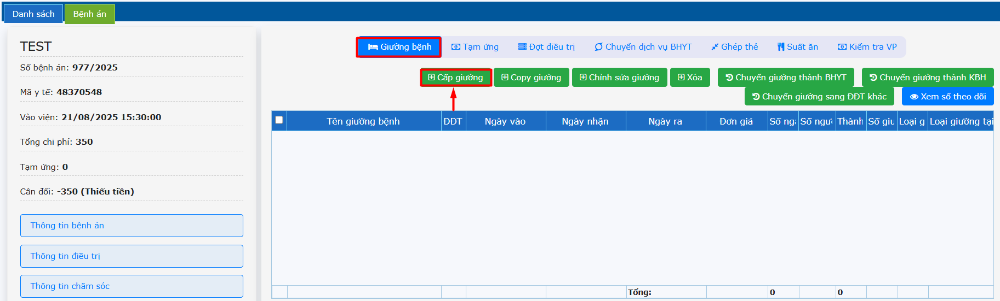
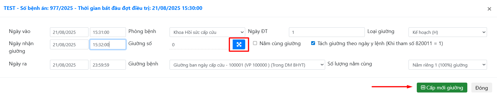
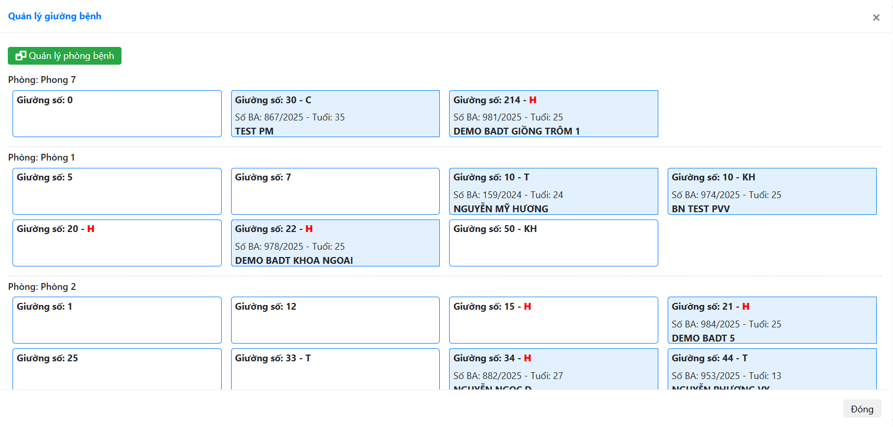
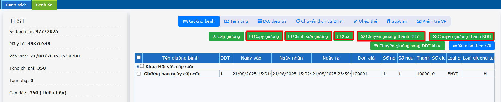
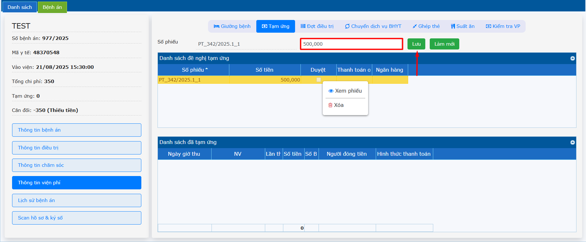
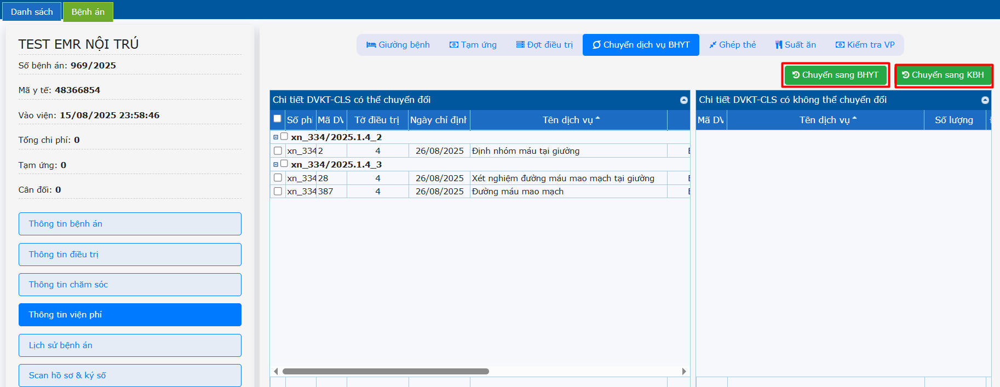
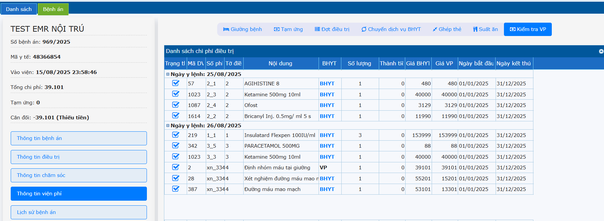
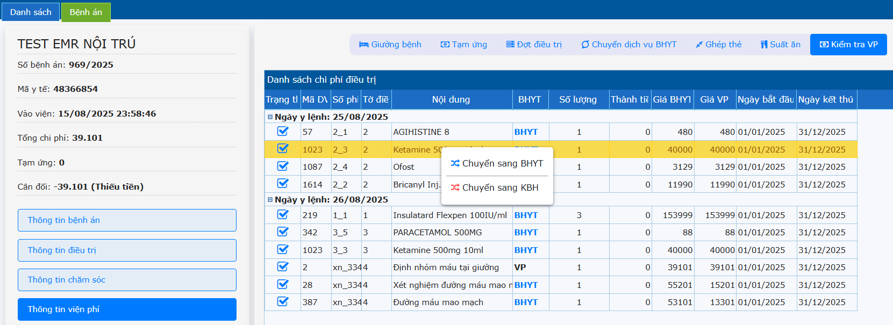

# 2.5 Thông tin viện phí
**2.5.1 Giường bệnh:**  
Một số lưu ý:  
- Cấp giường mới sau thời gian vào viện 1 phút.  
- Ngày nhận giường sau giờ vào viện ít nhất 1 phút (tránh bảo hiểm xuất toán).  
- Sử dụng tài khoản bác sĩ trực để cấp ngày giường đó.  
- Đối với ngày đầu tiên: Ngày vào sẽ lấy theo ngày giờ lúc vào viện.  
- Đối với các ngày tiếp theo: Ngày vào sẽ là sau ngày giờ kết thúc của ngày trước đó.  
- Thời gian ngày vào ngày ra cấp hàng ngày có thể tùy thuộc vào quy trình của đơn vị, có thể cấp trong ngày 00:00:00 đến 23:59:59 hoặc cấp theo lịch trực của bác sĩ 07:00:00 hôm nay đến 07:00:00 hôm sau, ...  
Ở tab **Giường bệnh** để cấp giường cho người bệnh -> Nhấn chọn **Cấp giường** -> Nhập đầy đủ thông tin.  
  
  
**Giường số:** hệ thống bổ sung thêm sơ đồ giường.  
Nhấp chọn vào biểu tượng -> nhấn chọn giường cần cấp cho người bệnh -> **Cấp mới giường**.  
   
Giao diện sao khi thêm mới giường thành công.  
  
**Copy giường**: Để copy dữ liệu ngày giường đó đồng thời đổi ngày thành ngày tiếp theo. Chỉnh sửa giường: Khi cấp giường cập nhật thông tin sai, Check chọn giường cần sửa -> Sửa thông tin -> Nhấn **Cập nhật**.  
**Xóa:** Check chọn giường -> Xóa.  
**Chuyển giường thành BHYT:** Check chọn giường cần chuyển -> **Chuyển giường thành BHYT**.  
**Chuyển giường thành KBH:** Check chọn giường cần chuyển -> **Chuyển giường thành KBH**.  
**Xem sổ theo dõi:** Theo dõi ngày giường bệnh của bệnh nhân trong tháng.  
**2.5.2 Tạm ứng**  
Ở tab **Tạm ứng** -> Nhập số tiền tạm ứng -> Nhấn **Lưu**.  
Để xem và in phiếu tạm ứng: Chuột phải chuột vào phiếu -> Nhấn chọn **Xem phiếu**.  
  
**2.5.3 Chuyển dịch vụ BHYT**  
Để chuyển các dịch vụ sang có BHYT hoặc KBH. Check chọn chỉ định cần chuyển -> Chọn **Chuyển sang BHYT** hoặc **Chuyển sang KBH**.  
  
**2.5.4 Kiểm tra VP**  
Ở tab **Kiểm tra VP** hiển thị chi phí điều trị của người bệnh bao gồm cận lâm sàng, thuốc/ vật tư, giường, …  
  
Đối với loại thuốc/vật tư, có thể chuyển đổi BHYT hoặc KBH. Nhấn phải chuột vào loại thuốc/ vật tư cần chuyển -> **Chuyển sang BHYT** hoặc **Chuyển sang KBH**.  
  