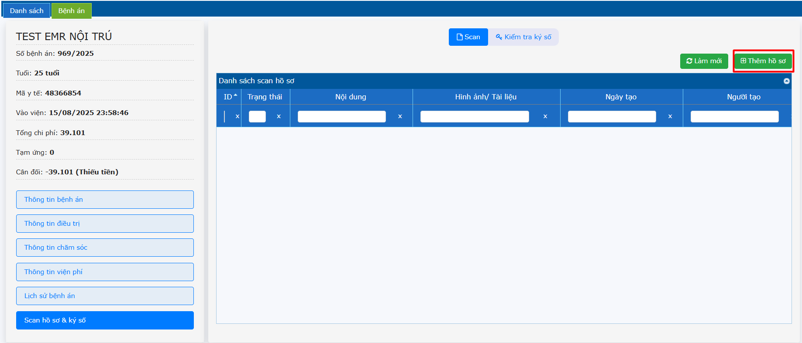
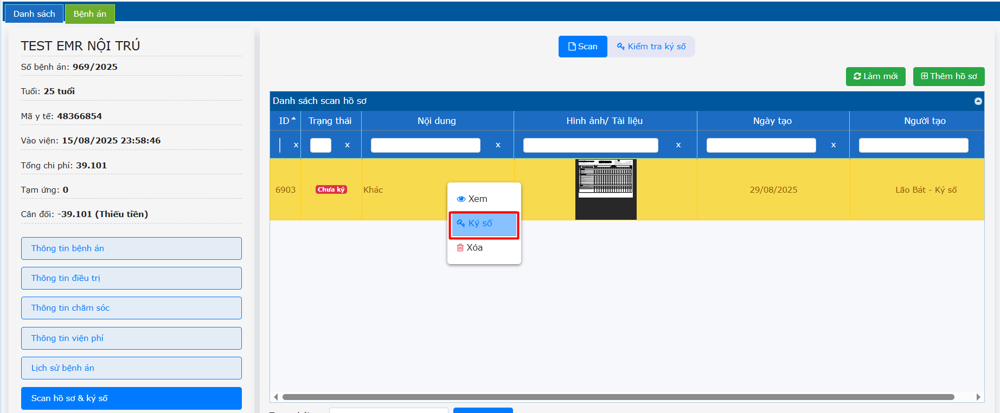
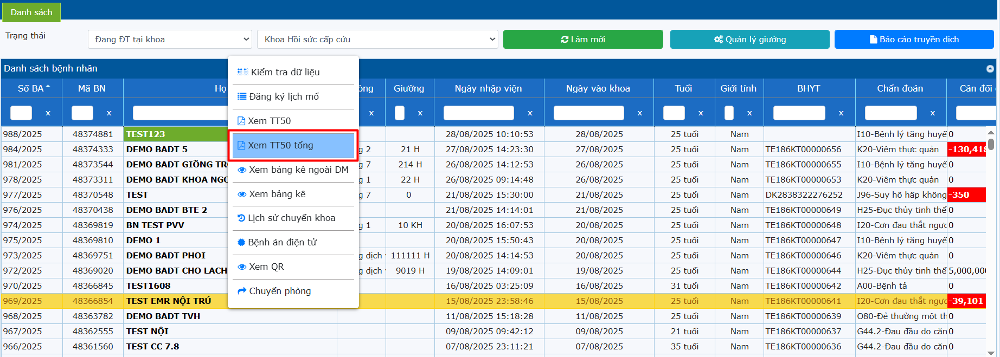
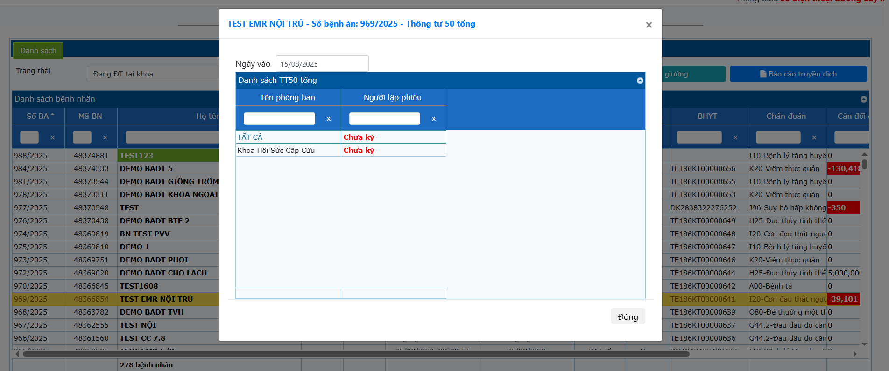
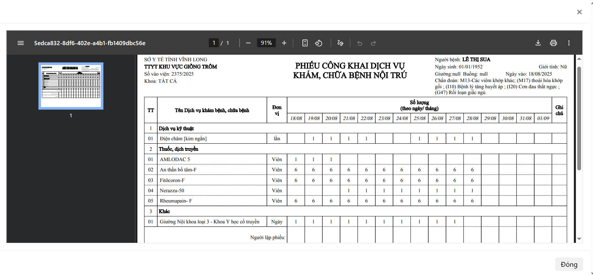

# 2.7 Scan hồ sơ và ký số TT50
**2.7.1 Scan hồ sơ và ký số**  
Một số phiếu đặc thù trên phần mềm không có hoặc khi người bệnh đến khám bệnh, chữa bệnh mang theo hồ sơ đã được khám từ cơ sở khác đến, cần lưu trữ những hồ sơ đó vào hồ sơ bệnh án, nhân viên y tế có thể scan hồ sơ và ký số.  
Nhấn chọn **Thêm hồ sơ** -> Upload file scan -> Nhấn **Lưu**.  
  
Nhấn phải chuột vào file scan cần ký -> Nhấn chọn **Ký số**.  
  
**2.7.2 Xem và ký số TT50**  
Ở trang danh sách bệnh nhân -> Nhấn chuột phải vào tên người bệnh -> Chọn Xem TT50 tổng.  
  
Nhấn phải chuột -> ký số người lập phiếu.  
  
Bảng công khai dịch vụ tổng hiển thị.  
  
Đối với bảng công khai dịch vụ, nhân viên y tế in bảng công khai -> người nhà ký, sau đó kí số scan.

