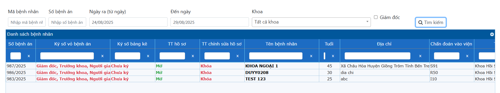
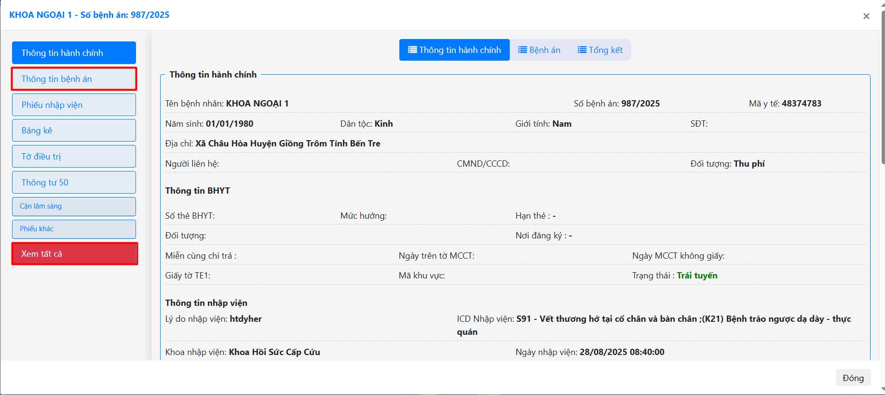
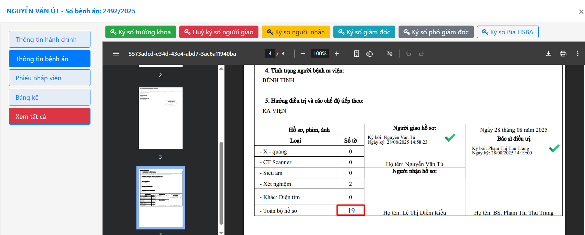
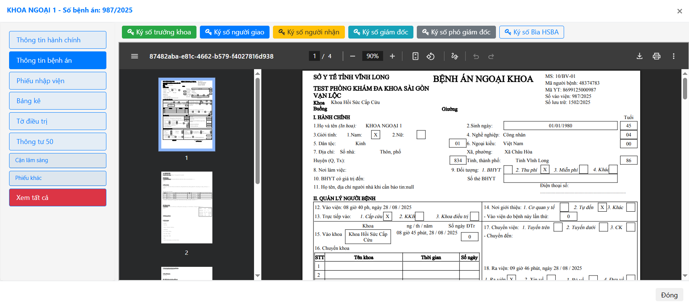

# 2.8 EMR ký số bảng kê
Sau khi khoa đã thực hiện cho người bệnh ra viện hoặc chuyến tuyến, hồ sơ bệnh án được chuyển vào **EMR-Ký số bảng kê**. (Menu Nội trú -> EMR-Ký số bảng kê)  
Có thể tìm kiếm hồ sơ bệnh án theo: Mã bệnh nhân, Số bệnh án, Ngày ra viện, Khoa và hồ sơ nào giám đốc chưa ký (Dành cho Giám đốc).  
 
Nhấn đúp chuột trái vào tên bệnh án.  
 
Tab **Xem tất cả**: Người giao hồ sơ nhấn vào đây -> để hệ thống tự động đếm số tờ của hồ sơ bệnh án ở phần toàn bộ hồ sơ trang Tổng kết (Trang 3).  
 
Tab **Thông tin bệnh án**: Dành để kiểm tra thông tin và ký số người giao, ký số người nhận, ký số trưởng khoa, ký số giám đốc, ký số phó giám đốc.  
 
