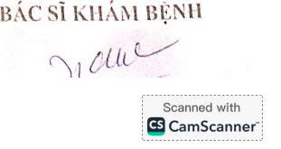

# 3. Tiện ích

**3.1. CamScanner: Máy quét tài liệu, giấy tờ ngay trên thiết bị di động**  

    
&nbsp;&nbsp;&nbsp;&nbsp;
**CamScanner** là ứng dụng giúp biến điện thoại trở thành máy quét cầm tay phục vụ cho việc quét, scan tài liệu, văn bản, giấy tờ.  
**Điểm nổi bật**  
&nbsp;&nbsp;&nbsp;&nbsp;
- Quét mọi loại tài liệu, giấy tờ mà không cần máy quét chuyên nghiệp.  
&nbsp;&nbsp;&nbsp;&nbsp;
- Chia sẻ tài liệu dạng file PDF qua email, zalo, ...  
&nbsp;&nbsp;&nbsp;&nbsp;
- Đồng bộ hóa tài liệu nhanh qua các thiết bị điện thoại, máy tính, ...  
Đăng ký tài khoản sử dụng email của TVU sẽ không hiển thị bản quyền quyền trên tài liệu.  
  

Như vậy khi áp dụng **CamScanner** nhân viên y tế ở khoa lâm sàng có thể sử dụng SmartPhone để scan tài liệu và lên máy tính tải về upload lên phần mềm HIS.
