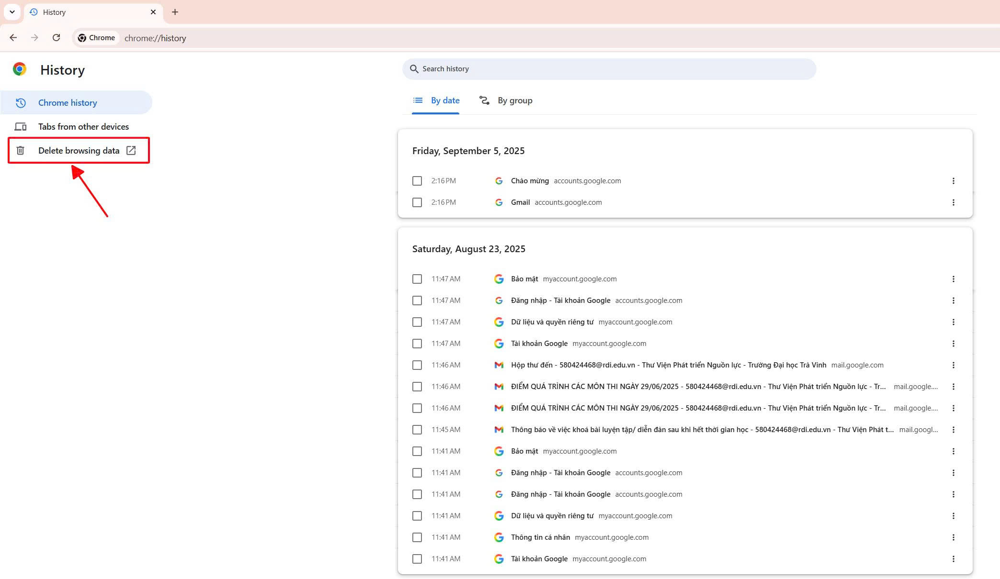
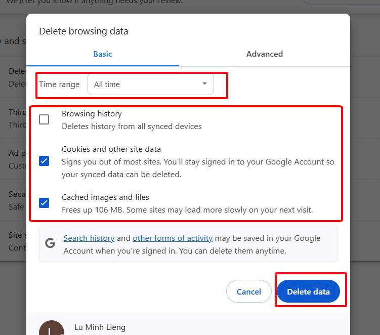
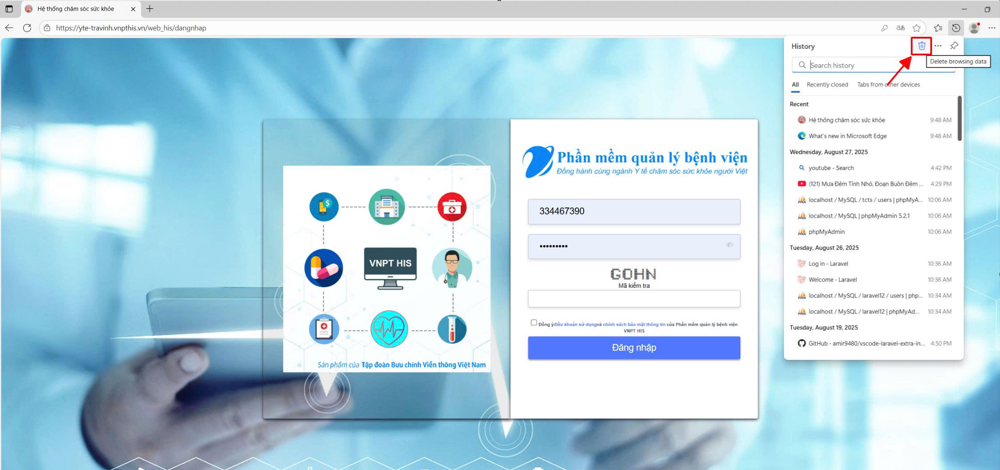
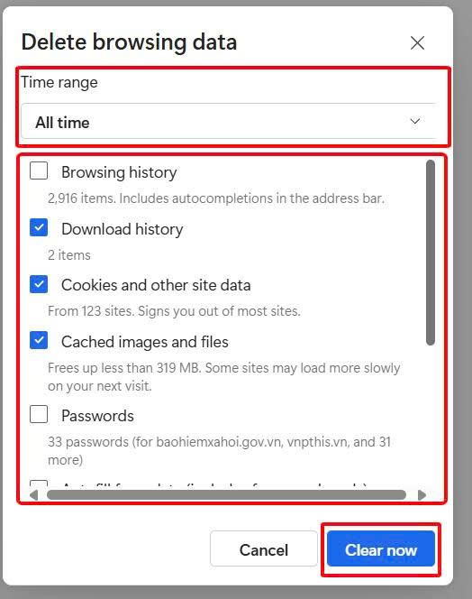
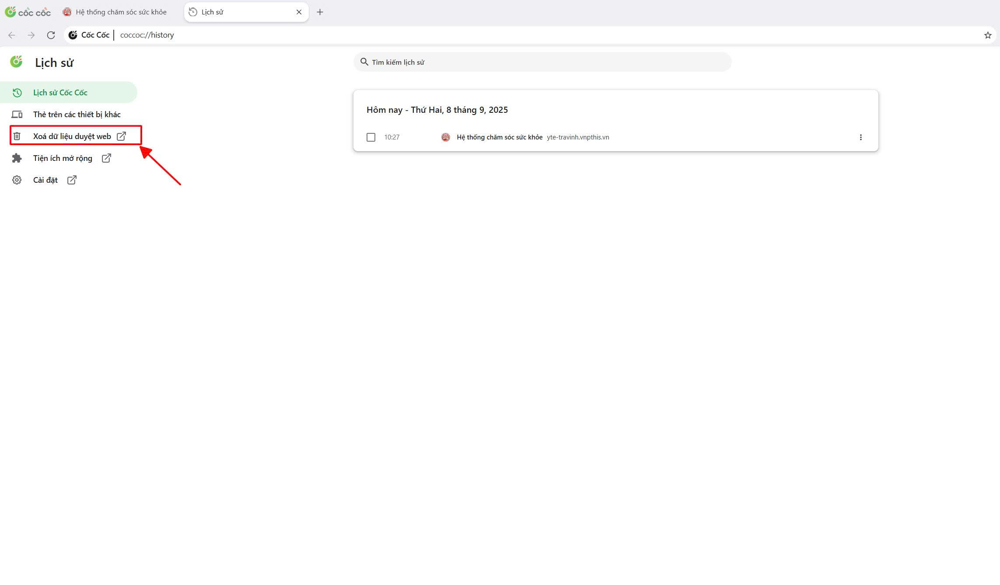
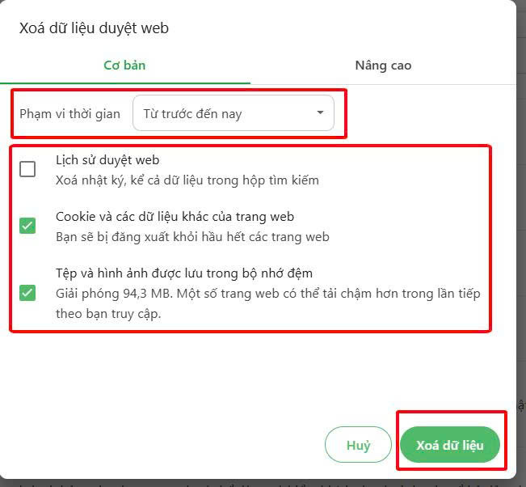

# 3. Tiện ích

**3.2. Làm mới phần mềm (Xóa dữ liệu duyệt web)**  

&nbsp;&nbsp;&nbsp;&nbsp;Phần mềm khám bệnh, chữa bệnh của bệnh viện (HIS, LIS, RIS/PACS) trên nền tảng web app, nên trình duyệt sẽ tự động sử dụng bộ nhớ cache để lưu trữ dữ liệu tạm thời nhằm tăng tốc độ tải trang, giảm tải cho máy chủ và tiết kiệm băng thông mạng. Cache cũ có thể chứa phiên bản lỗi thời của trang web, một số lỗi hiển thị hoặc hoạt động của trang web. Vì vậy, nhân viên y tế cần xóa cache hằng ngày để tải nội dung mới nhất.  
**Cách xóa cache trình duyệt**  
    &nbsp;&nbsp;&nbsp;&nbsp;
**- Trình duyệt Google Chrome:**  Nhấn tổ hợp phím **Ctrl + H** trình duyệt sẽ hiển thị giao diện **History** -> nhấp chọn **Delete browsing data** để mở hộp thoại **Delete browsing data**.  
  

Ở mục **Time range** chọn là **all time**, các ô checkbox chọn cả 3 hoặc để lại phần history cuối cùng là nhấn nút **Delete data** để xóa toàn bộ dữ liệu web từ trước đến hiện tại.  
  

&nbsp;&nbsp;&nbsp;&nbsp;
**- Trình duyệt Microsoft Edge:**  Nhấn tổ hợp phím **Ctrl + H** trình duyệt sẽ mở hộp giao diện **History** -> nhấp chọn **icon Sọt rác** để mở hộp thoại **Delete browsing data**.  
   

Ở mục **Time range** chọn là **All time**, các ô checkbox chọn tất cả hoặc để lại phần history cuối cùng là nhấn nút **Clear now** để xóa toàn bộ dữ liệu web từ trước đến hiện tại.  
  

&nbsp;&nbsp;&nbsp;&nbsp;
**- Trình duyệt Cốc cốc:**  Nhấn tổ hợp phím **Ctrl + H** trình duyệt sẽ hiển thị giao diện **Lịch sử** -> nhấp chọn **Xóa dữ liệu web** để mở hộp thoại **Xóa dữ liệu web**.  
  

Ở mục **Phạm vi thời gian** chọn là **Từ trước đến nay**, các ô checkbox chọn tất cả hoặc để lại phần Lịch sử duyệt web cuối cùng là nhấn nút **Xóa dữ liệu** để xóa toàn bộ dữ liệu web từ trước đến hiện tại.  
  

