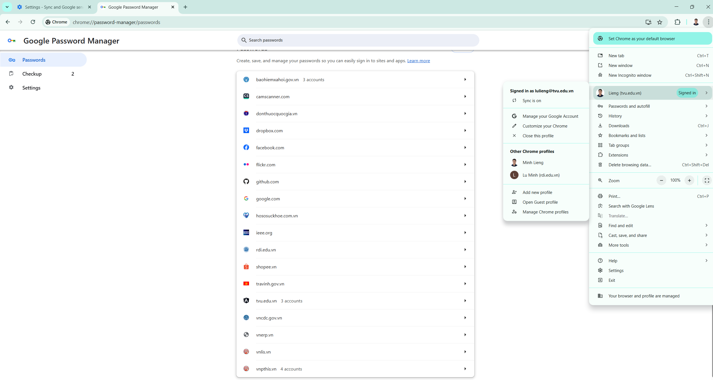
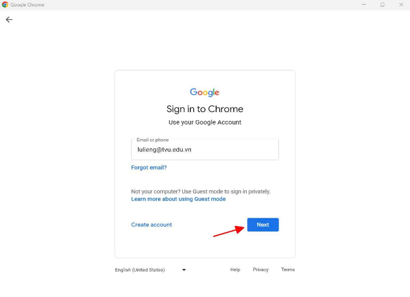
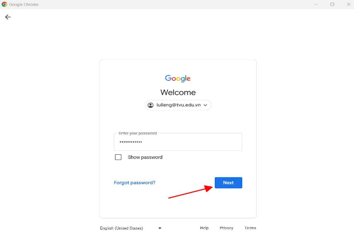
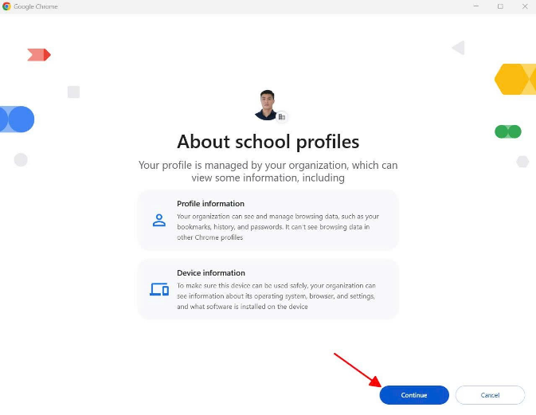
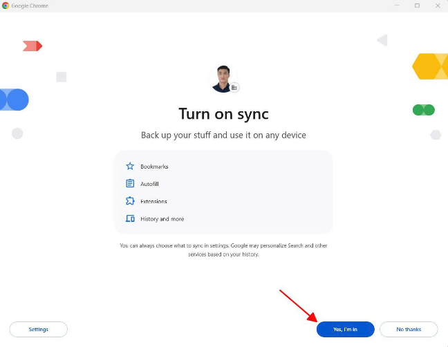
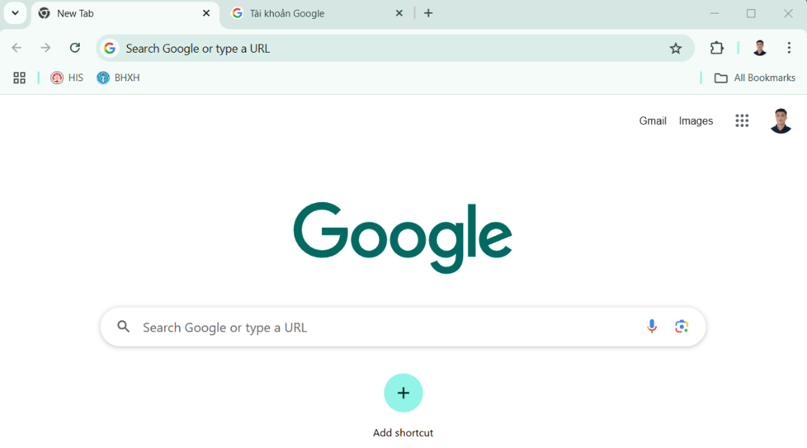
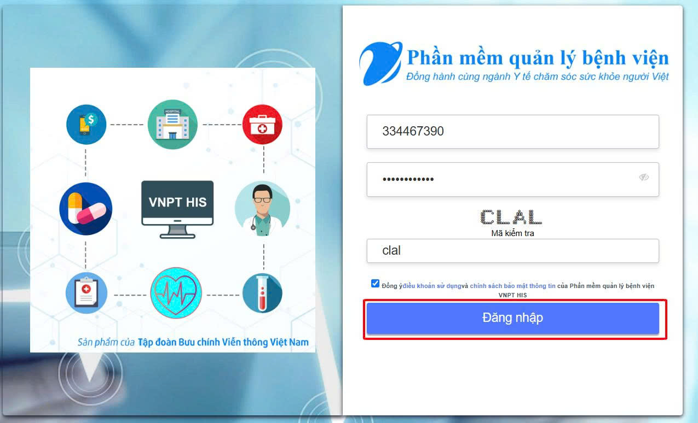
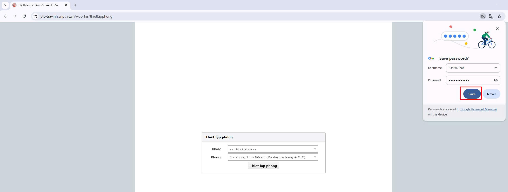

# 3. Tiện ích
**3.3. Bảo mật tài khoản khám bệnh, chữa bệnh của nhân viên y tế**  
Tôi xin giới thiệu ứng dụng tính năng đồng bộ (Sync) trên Google Chrome, Tính năng cho phép chúng ta lưu và truy cập dữ liệu duyệt web (mật khẩu, lịch sử duyệt web, đánh dấu trang, ...) trên nhiều thiết bị khác nhau. Khi bật đồng bộ, dữ liệu của bạn sẽ được lưu trữ an toàn trên tài khoản Google và có thể truy cập được từ bất kỳ thiết bị nào bạn đăng nhập vào Google Chrome.  
  
**Các bước thực hiện:**  
**Bước 1: Đăng nhập tài khoản Google** Mở ứng dụng Google Chrome và đăng nhập tài khoản Google. Nhập email và nhấp nút Next -> Nhập mật khẩu và nhấp nút Next.  
  
  
Tiếp tục nhấp Continue và nhấp Yes, I’m In để bậc tính năng đồng bộ.  
  
  
Giao diện trình duyệt Google Chrome với profile tài khoản vừa mới đăng nhập.  
  
**Bước 2: Truy cập phần mềm KCB** Truy cập phần mềm KCB HIS, nhập tài khoản, mật khẩu, mã kiểm tra -> nhấn **Đăng nhập**.  
  
Sau khi đăng nhập nhấn **Save** để tài khoản Google lưu tài khoản và mật khẩu tài khoản HIS.  
  
Các lần sau khi truy cập vào phần mềm KCB HIS thì trình duyệt sẽ tự động điền tài khoản, mật khẩu. Tài khoản các hệ thống khác cũng thực hiện tương tự.  
Ví dụ tôi sử dụng tài khoản TVU để đăng nhập, lưu tài khoản, mật khẩu của nhiều dịch vụ trong đó có hệ thống His và cổng giám định BHXH để trình duyệt tự động điền tài khoản, mật khẩu mỗi lần tôi đăng nhập. Tiếp theo, tôi bật tính năng Sync để đồng bộ dữ liệu, khi tôi sử dụng máy tính khác hoặc điện thoại di động miễn sao tôi sử dụng trình duyệt Google Chrome và đăng nhập tài khoản TVU thì toàn bộ dữ liệu sẽ được đồng bộ, ngoài ra còn có thể đồng bộ lịch sử duyệt web, đánh dấu trang, …. Như vậy dữ liệu làm việc trên trình duyệt Google Chrome của tôi sẽ liên tục.  
Khi kết thúc mỗi phiên làm việc tôi Đăng xuất để tránh bị rò rỉ dữ liệu.  
